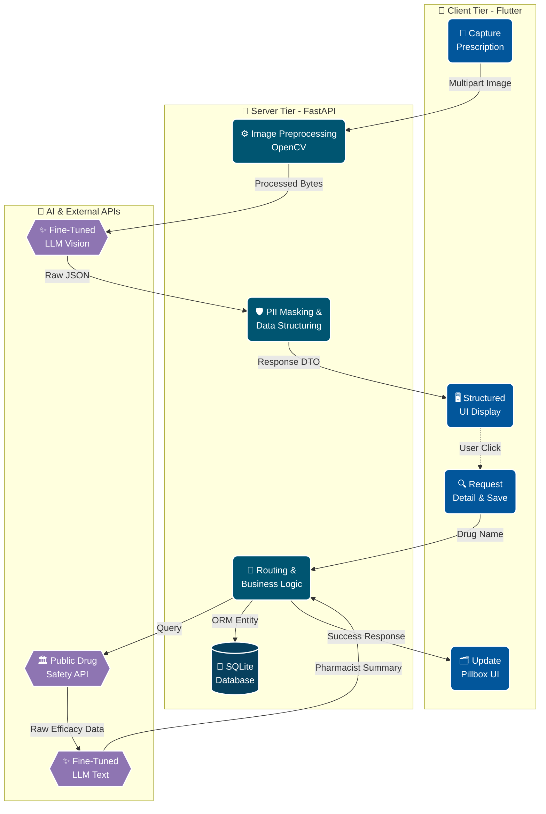
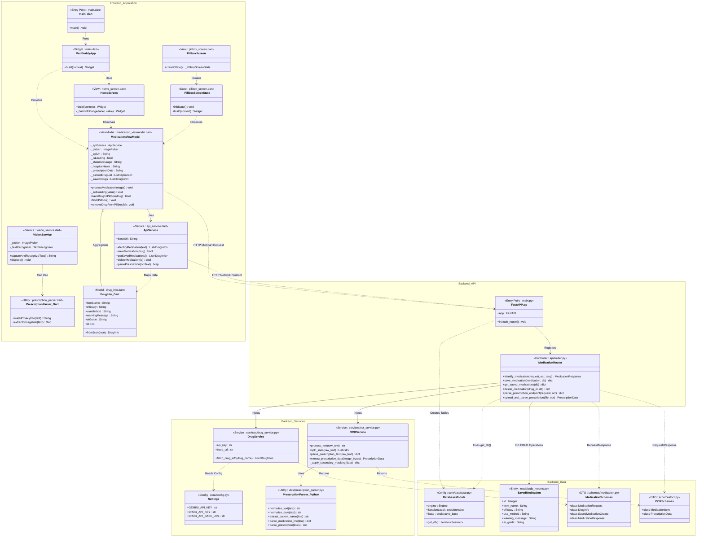

[](https://github.com/1window2/MedBuddy/actions/workflows/github-code-scanning/codeql) [](https://github.com/1window2/MedBuddy/actions/workflows/main.yml)

# 💊 MedBuddy
> **AI-Powered Medication Management System** <br/>
> An intelligent platform that digitizes prescriptions via OCR and fine-tuned LLMs, providing a personalized AI pharmacist for safe medication management.
<br/>

## 🌟 Key Features

* **📸 AI Vision Prescription Parsing**
  * Simply snap a photo of a prescription or pill envelope. Our AI instantly extracts structured data (hospital name, prescription date, medication names, and dosage).
  * Automatically masks Personally Identifiable Information (PII) to ensure data privacy.
* **👩‍⚕️ Personalized AI Pharmacist**
  * Leverages public health data to translate complex medical jargon into friendly, easy-to-understand instructions.
* **🗂️ Smart Pillbox Management**
  * Easily track and manage your current medications, their efficacy, and important precautions in one place.

<br/>

## 🛠 Tech Stack

### Frontend


### Backend


### AI & API


<br/>

## ⚙️ System Architecture



<details>
<summary><b><size=40>📊Class Diagram</b></size></summary>


</details>
<br/>

## 🚀 Getting Started

### 1. Backend Setup
```bash
$ cd backend
$ pip install -r requirements.txt
$ uvicorn main:app --reload
```

### 2. Frontend Setup
```bash
$ cd frontend
$ flutter pub get
$ flutter run
```

<br/>

## 👥 Contributors

| Profile | Name | Role | GitHub |
| :---: | :---: | :---: | :---: |
|  | **1window2** | Lead Full-Stack Developer & AI Pipeline Architecture | [@1window2](https://github.com/1window2) |
|  | **tmdgusdl9647** | Backend Developer & AI Logic | [@tmdgusdl9647](https://github.com/tmdgusdl9647) |
|  | **jeeon0318** | Backend Developer & Compliance Specialist | [@jeeon0318](https://github.com/jeeon0318) |
|  | **onlyone130** | Frontend Designer & UI/UX Lead | [@onlyone130](https://github.com/onlyone130) |

<br/>
