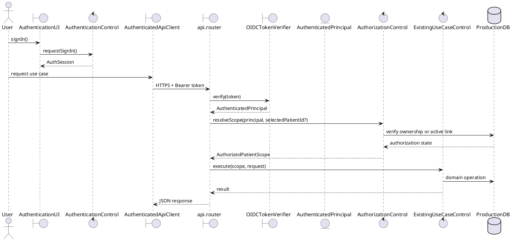

# MedBuddy Beta Security Architecture

## Decision Status

- Status: accepted for beta implementation
- Applies to: Android beta and FastAPI production deployment
- Replaces: alpha hash-based identity as an authorization mechanism
- Preserves: existing Boundary-Control-Entity use-case controls and API routes

## Decision

Use a managed OpenID Connect identity provider. The initial Android adapter may
use Firebase Authentication, but application code must depend on the OIDC token
contract rather than Firebase-specific user objects.

The Flutter client obtains an ID token and sends it as an `Authorization:
Bearer` header. FastAPI verifies the token at the API boundary, creates an
`AuthenticatedPrincipal`, and passes that principal to authorization logic.
Controls receive an already-authorized patient scope; they do not trust a role,
patient hash, or caregiver hash supplied by the client.

Self-hosted password storage is rejected for the first beta because it adds
credential hashing, reset, verification, abuse prevention, and account recovery
responsibilities without improving MedBuddy's medication domain.

## Planned BCE Types

| Layer | Type | Responsibility |
| --- | --- | --- |
| Frontend boundary | `AuthenticationUI` | Sign-in, sign-out, and recoverable authentication state. |
| Frontend control | `AuthenticationControl` | Coordinate the identity SDK and publish `AuthSession`. |
| Frontend external boundary | `AuthenticatedApiClient` | Attach fresh bearer tokens and centralize API timeout/error handling. |
| Frontend entity | `AuthSession` | Immutable account/session state exposed to the view model. |
| Backend boundary | `OIDCTokenVerifier` | Verify signature, issuer, audience, expiry, and subject. |
| Backend entity | `AuthenticatedPrincipal` | Verified subject and server-owned application role. |
| Backend control | `AuthorizationControl` | Resolve owned patient scope and validate active caregiver links. |
| Backend composition root | `api.dependencies` | Construct the principal and inject authorized controls. |

These names become the implementation contract when the security work begins.
Authentication must not be embedded separately in every existing use-case
control.

## Target Request Flow

## Authorization Rules

1. A patient may read or mutate only records owned by the account's patient
   profile.
2. A caregiver may select only a patient connected by an active
   `PatientCaregiverLink`.
3. Link codes are short-lived enrollment capabilities, not login credentials.
4. Revoking a link must immediately deny caregiver medication, schedule,
   notification, and recommendation access.
5. Resource identifiers are always checked against the authorized scope before
   read, update, or delete operations.
6. Release mode has no `local_patient`, anonymous, query-role, or header-role
   fallback.

## Migration Without Pipeline Breakage

1. Add account/profile tables and immutable provider subject identifiers using
   versioned migrations. Keep current hashes temporarily as migration aliases.
2. Add `OIDCTokenVerifier`, `AuthenticatedPrincipal`, and
   `AuthorizationControl` at `api.dependencies`; do not change domain behavior.
3. Introduce authenticated integration tests while alpha compatibility remains
   enabled only in a development configuration.
4. Change controls to accept an authorized scope from dependencies. A requested
   linked-patient identifier remains data, never authority.
5. Backfill ownership for existing test/demo rows, then make ownership fields
   non-null.
6. Remove alpha identity fallbacks and fail application startup when production
   auth configuration is incomplete.

## HTTPS and Deployment

The deployment must provide:

- TLS termination with automatic certificate renewal and HTTP-to-HTTPS redirect.
- A private application-to-database network path.
- A managed PostgreSQL database with connection pooling, backups, and tested
  restore. SQLite remains valid only for local/demo execution and isolated
  reference catalogs.
- The pill reference catalog may use a disposable per-instance SQLite cache
  only when cold-start refresh is bounded and failure falls back to an
  immutable snapshot. Otherwise, store the catalog in PostgreSQL or an
  object-backed versioned snapshot; do not assume container-local files are
  durable.
- Versioned migrations, preferably Alembic, executed as a controlled release
  step rather than implicitly by every web worker.
- Secrets from a secret manager or protected deployment environment, never
  repository files or Flutter compile-time constants.
- Bounded workers, request/body limits, timeouts, redacted logs, health probes,
  and metrics for external API latency/failure.

A managed container runtime with an HTTPS load balancer and managed PostgreSQL
is the preferred topology. Cloud Run plus Cloud SQL aligns with the current
Google/Firebase integrations, but the interfaces above keep the domain layer
provider-independent.

## Android Release Signing and Network Policy

- Use Play App Signing for store distribution and protect the upload key.
- Keep the keystore and `key.properties` ignored and outside source control.
- Store CI signing material in a protected GitHub Environment; expose it only
  to tag/release jobs, never pull-request jobs.
- Pull requests compile a release-mode APK without production signing secrets.
- Release jobs verify certificate fingerprints and archive checksums/provenance.
- The release manifest/network security configuration permits HTTPS only.
- Development clear-text access, if retained, must live in a debug-only Android
  manifest overlay.

## Delivery Order to July 31

1. Identity provider project and local emulator/test setup.
2. Database/account migration and backend principal verification.
3. Server-derived authorization for every route and denial integration tests.
4. Frontend authentication/session integration and authenticated API client.
5. HTTPS deployment, production database, migrations, secrets, and monitoring.
6. Android release network policy, signing pipeline, and signed-device smoke
   test.
