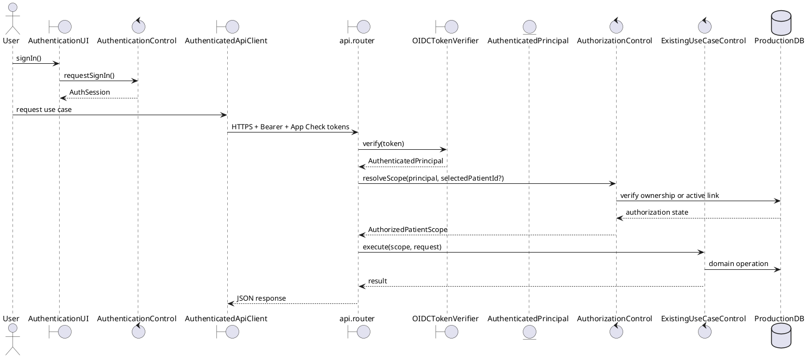

# MedBuddy Beta Security Architecture

## Decision Status

- Status: production infrastructure provisioned and public HTTPS smoke-tested; authenticated Android device and final signed-release validation remain
- Applies to: Android beta and FastAPI production deployment
- Replaces: alpha hash-based identity as an authorization mechanism
- Preserves: existing Boundary-Control-Entity use-case controls and API routes

## Decision

Use a managed OpenID Connect identity provider. The initial Android adapter may
use Firebase Authentication, but application code must depend on the OIDC token
contract rather than Firebase-specific user objects.

The Flutter client obtains an ID token and sends it as an `Authorization:
Bearer` header. FastAPI verifies the token at the API boundary, creates an
`AuthenticatedPrincipal`, and passes that principal to authorization logic.
Controls receive an already-authorized patient scope; they do not trust a role,
patient hash, or caregiver hash supplied by the client.

Self-hosted password storage is rejected for the first beta because it adds
credential hashing, reset, verification, abuse prevention, and account recovery
responsibilities without improving MedBuddy's medication domain.

## Implemented BCE Types

| Layer | Type | Responsibility |
| --- | --- | --- |
| Frontend boundary | `AuthenticationGate` | Keep the Navigator root stable while replacing bootstrap, signed-out, and authenticated content from observable session state. |
| Frontend boundary | `AuthenticationUI` | Sign-in, email verification, password recovery, sign-out, and recoverable authentication state. |
| Frontend control | `AuthenticationControl` | Coordinate the identity SDK and publish `AuthSession`. |
| Frontend external boundary | `AuthenticatedApiClient` | Attach fresh bearer tokens to the existing HTTP control calls. |
| Frontend external boundary | `FirebaseRuntimeService` | Initialize Firebase and Android App Check once in foreground and background isolates. |
| Frontend privacy boundary | `PrescriptionLocalOcrService` | Perform Korean OCR on the device, remove sensitive lines, and return privacy-filtered text plus preview regions. |
| Frontend external boundary | `PushNotificationService` | Register, refresh, and deactivate the authenticated device's FCM token and display foreground pushes. |
| Frontend entity | `AuthSession` | Immutable account/session state exposed to the view model. |
| Backend boundary | `OIDCTokenVerifier` | Verify signature, issuer, audience, expiry, and subject. |
| Backend boundary | `AppCheckTokenVerifier` | Verify first-party Android attestation independently of user identity. |
| Backend boundary module | `boundaries.firebase_admin_boundary` | Own the process-wide Firebase Admin application shared by auth, attestation, and FCM adapters through `get_firebase_admin_app()`. |
| Backend external boundary | `PushNotificationBoundary` | Isolate Firebase Admin multicast delivery from caregiver controls. |
| Backend entity | `AuthenticatedPrincipal` | Verified subject and deterministic server-owned application identity. |
| Backend control | `AuthorizationControl` | Resolve owned patient scope and validate active caregiver links. |
| Backend control | `ManagePushToken` | Register or disable device tokens within the authenticated user scope. |
| Backend control | `DispatchCaregiverAlert` | Send newly completed-dose events only to linked caregivers who enabled that slot. |
| Backend composition root | `api.dependencies` | Construct the principal and inject authorized controls. |
| Backend dependency policy | `get_recently_authenticated_principal` | Require a recent `auth_time` for irreversible credential-backed account deletion; anonymous guests have an explicit exception. |
| Backend dependency policy | `_lock_account_operation` | Serialize every authenticated account request with deletion using a transaction-scoped PostgreSQL advisory lock or a local SQLite write transaction. |
| Backend external boundary | `FirebaseIdentityDeletionBoundary` | Delete only the verified Firebase subject through Admin SDK and treat already-absent identities as idempotent success. |
| Backend control | `ManageAccount` | Persist deletion tombstones, purge account-owned data, and complete retryable external identity deletion. |

These names are the implementation contract. Authentication is centralized at
the API and application composition boundaries rather than embedded separately
in every existing use-case control.

Authentication bootstrap and identity operations use bounded waits. A Firebase
or App Check startup failure leaves the application signed out and offers an
explicit secure-startup retry. If Firebase identity succeeds but the HTTPS
backend handshake fails, AuthenticationControl retains the Firebase identity
and exposes a backend-session-only retry. Neither recovery path creates a local
release-mode identity or bypasses bearer-token and App Check enforcement.

## Prescription Privacy Boundary

Prescription analysis uses a different privacy boundary from loose-pill
identification:

1. Flutter runs Korean OCR locally with Google ML Kit. App-owned camera
   captures remain only for the active preview and are deleted after in-flight
   OCR finishes when the flow is cleared or disposed; gallery originals are
   never deleted by MedBuddy.
2. `PrescriptionLocalOcrService` removes patient-identifying lines and masks
   inline resident numbers, phone numbers, and email addresses.
3. The preview displays recognized regions, hides sensitive regions, and lets
   the user correct medication names and confirm the prescription date and
   schedule slots.
4. Only the resulting privacy-filtered text is sent to
   `/analyze-prescription-text`; the backend and Gemini text recovery do not
   receive the original prescription image through this flow.

The local filter is a best-effort data-minimization control, not a guarantee
that every identifier will be detected. User-facing notices and release privacy
review must disclose that privacy-filtered text can still be processed by an
external model. Loose-pill photos remain a separate external
visible-attribute-extraction flow and must not be persisted or logged.

## Target Request Flow

```plantuml
@startuml MedBuddy_Beta_Authenticated_Request
actor User
boundary AuthenticationUI
control AuthenticationControl
boundary AuthenticatedApiClient
boundary "api.router" as Router
boundary OIDCTokenVerifier
entity AuthenticatedPrincipal
control AuthorizationControl
control ExistingUseCaseControl
database ProductionDB

User -> AuthenticationUI : signIn()
AuthenticationUI -> AuthenticationControl : requestSignIn()
AuthenticationControl --> AuthenticationUI : AuthSession

User -> AuthenticatedApiClient : request use case
AuthenticatedApiClient -> Router : HTTPS + Bearer + App Check tokens
Router -> OIDCTokenVerifier : verify(token)
OIDCTokenVerifier --> Router : AuthenticatedPrincipal
Router -> AuthorizationControl : resolveScope(principal, selectedPatientId?)
AuthorizationControl -> ProductionDB : verify ownership or active link
ProductionDB --> AuthorizationControl : authorization state
AuthorizationControl --> Router : AuthorizedPatientScope
Router -> ExistingUseCaseControl : execute(scope, request)
ExistingUseCaseControl -> ProductionDB : domain operation
ExistingUseCaseControl --> Router : result
Router --> AuthenticatedApiClient : JSON response
@enduml
```

## Authorization Rules

1. A patient may read or mutate only records owned by the account's patient
   profile.
2. A caregiver may select only a patient connected by an active
   `PatientCaregiverLink`.
3. Link codes are short-lived enrollment capabilities, not login credentials.
4. Revoking a link must immediately deny caregiver medication, schedule,
   notification, and recommendation access.
5. Resource identifiers are always checked against the authorized scope before
   read, update, or delete operations.
6. Release mode has no unauthenticated `local_patient`, query-role, or
   header-role fallback. Firebase anonymous identities are accepted only when
   the backend explicitly enables that authenticated provider.

## Irreversible Account Deletion

Permanent deletion is a server-managed, retryable saga:

1. Credential-backed users must present a Firebase token whose `auth_time` is
   no older than `ACCOUNT_DELETION_REAUTH_MAX_AGE_SECONDS` (300 seconds by
   default). The Flutter control reauthenticates stale Google sessions; other
   credential providers require an explicit sign-out and sign-in.
2. Anonymous guests are explicitly exempt from credential step-up because
   Firebase anonymous accounts have no reusable credential. Their current ID
   token is still verified and force-refreshed.
3. Every authenticated request acquires the same account-scoped database
   transaction lock before account registration. Deletion therefore waits for
   in-flight writes, writes a tombstone, purges owned data, and commits before
   the external identity call.
4. Once tombstoned, ordinary requests fail with `410 Gone`; only the deletion
   endpoint may retry. Firebase `user-not-found` is idempotent success, while
   transient provider failure returns `503 Retry-After` without reopening writes.
5. After server success, Flutter clears its in-memory medical session before
   provider sign-out. A sign-out failure remains visible and cannot resurrect
   the deleted subject inside the running application.

## Caregiver Notification Delivery

Caregiver settings are persisted independently for morning, lunch, evening,
and bedtime. Each slot supports disabled, newly completed-dose, or
missed-deadline behavior.

In Firebase mode, `PushNotificationService` registers the authenticated
Android device token and follows Firebase token refresh. A patient's
incomplete-to-complete transition invokes `DispatchCaregiverAlert`, which
checks the active link and slot preference before sending FCM. Tokens rejected
as unregistered or sender-mismatched are disabled instead of retried
indefinitely. Push startup and token registration are tracked as lifecycle
operations, so signing out waits for any in-flight registration before it
requests deactivation of the current token.

Missed-deadline evaluation currently remains in the Android Workmanager
monitor. Its background isolate initializes Firebase before making
authenticated API requests. In local demo mode,
`DisabledPushNotificationBoundary` prevents remote delivery and the same
monitor polls for both completion and missed-deadline changes. A production
beta still requires server-scheduled missed-deadline delivery and two-device
FCM smoke testing.

## Patient Reminder Privacy and Continuity

Patient medication reminders use a rolling 14-day local reservation window so
the application stays below device/OEM pending-alarm limits. An authenticated
Android Workmanager task runs twice daily, reloads the current reminder
settings and today's active medication courses, and replenishes that window.
Each refresh remains bounded by the prescription course end. A transient
network/authentication failure asks Workmanager to retry and leaves the already
scheduled window intact.

Session exit is a privacy boundary. Ordinary sign-out cancels the replenishment
task and every pending `schedule:` local notification before provider sign-out;
the server-side reminder preference remains available for a later sign-in.
Permanent account deletion performs the same local cleanup before the backend
deletion request. Caregiver alerts and unrelated notification categories are
not removed by patient-reminder cleanup.

## Migration Without Pipeline Breakage

1. Derive an opaque, stable MedBuddy identity from the verified provider issuer
   and subject. Add a profile table later only when the product has profile data
   that cannot be represented by the external identity and existing settings.
2. Add `OIDCTokenVerifier`, `AuthenticatedPrincipal`, and
   `AuthorizationControl` at `api.dependencies`; do not change domain behavior.
3. Introduce authenticated integration tests while alpha compatibility remains
   enabled only in a development configuration.
4. Change controls to accept an authorized scope from dependencies. A requested
   linked-patient identifier remains data, never authority.
5. Start the production PostgreSQL database with versioned migrations. Local
   `local_patient` demo rows remain development data and are not migrated into
   authenticated production ownership.
6. Remove alpha identity fallbacks and fail application startup when production
   auth configuration is incomplete.

## HTTPS and Deployment

The production beta runs on one dedicated team-controlled Ubuntu host behind
Cloudflare Tunnel.

- Cloudflare is the authoritative DNS provider for `medbuddy.pp.ua`.
- The public API hostname is `https://api.medbuddy.pp.ua`.
- The named tunnel `medbuddy-production` forwards the API hostname to
  `http://backend:8080` on the private Docker network.
- No inbound router port forwarding is required.
- Tailscale Funnel and direct-public Caddy ingress are not part of the
  production topology.
- PostgreSQL and Redis remain private Docker services with no public host ports.
- FastAPI port `8000` is bound only to host loopback for local diagnostics.
- Cloudflare provides edge TLS, API cache bypass, route filtering, DDoS
  mitigation, and an outer burst rate limit.
- FastAPI remains responsible for Firebase Authentication, Firebase App Check,
  authorization, Redis-backed application quotas, request validation, and
  domain controls.
- Production configuration is split between ignored `deploy/.env` and
  `deploy/backend.env` files, while Firebase Admin and Cloudflare Tunnel
  credentials remain outside the repository.
- The versioned Alembic migration chain runs before the API starts accepting
  traffic, and readiness checks cover the database revision, Firebase
  verification, App Check, and Redis.

## Client Egress and Resource-Safety Policy

- `ApiConfig` defaults to the production HTTPS endpoint
  `https://api.medbuddy.pp.ua/api/v1/medication` and requires a public HTTPS
  backend in debug, profile, and release modes.
- The Android debug manifest retains Internet access for ADB, breakpoints, and
  Flutter hot reload but does not enable clear-text HTTP or trusted-LAN API
  access.
- Medication images are external content. Flutter loads them only from the
  documented `https://nedrug.mfds.go.kr` public-data host, and revalidates the
  value immediately before every `Image.network` call.
- Prescription image processing rejects decoded dimensions above 24 megapixels
  from the image header and uses a dedicated single-worker executor before
  OpenCV allocation. Multipart byte limits remain a separate outer control.
- Search-keyword expansion, frequency parsing, model fallback caches, and save
  actions have explicit bounds or serialization. Completed-only dose records
  cannot redefine the expected daily schedule.
- Pull-request CI uses deterministic fake API keys. Public issue templates
  accept only synthetic or fully redacted examples and route vulnerabilities or
  real-data masking failures to the private `SECURITY.md` process.

## Android Release Signing and Network Policy

- Use Play App Signing for store distribution and protect the upload key.
- Keep the keystore and `key.properties` ignored and outside source control.
- Store CI signing material in a protected GitHub Environment; expose it only
  to the exact protected `main` and `beta/v0.1.0` branches after an explicit
  environment approval, never pull-request or wildcard-ref jobs.
- Pull requests compile a release-mode APK without production signing secrets.
- Release jobs verify certificate fingerprints and archive checksums/provenance.
- The release manifest/network security configuration permits HTTPS only.
- Debug builds retain Internet permission for Flutter tooling, but clear-text
  HTTP access is not enabled in the Android manifest.

## Delivery Order to July 31

1. Identity provider project and local emulator/test setup.
2. Database/account migration and backend principal verification.
3. Server-derived authorization for every route and denial integration tests.
4. Frontend authentication/session integration and authenticated API client.
5. HTTPS deployment, production database, migrations, secrets, and monitoring.
6. Android release network policy, signing pipeline, and signed-device smoke
   test.

## Implemented Beta Configuration

The source implements authentication adapters, authorization controls,
the dedicated production container configuration, Cloudflare Tunnel ingress,
disabled historical GCP workflows, and signed-build safeguards for delivery
items 1-6. Public HTTPS and readiness smoke testing are complete. Runtime
monitoring, least-privilege Firebase IAM assignment, backup/restore rehearsal,
authenticated Android device testing, and final signed-device validation remain
operational release gates rather than separate application features or
authentication paths.

### Firebase

1. Keep one Firebase Android application for `com.medbuddy.app`. Enable
   Email/Password, Google, and Anonymous providers with their abuse controls.
   Phone remains disabled for the no-billing beta.
2. Backend production uses `AUTH_MODE=firebase`, `FIREBASE_PROJECT_ID`, and a
   minimum-permission Firebase Admin credential mounted read-only from outside
   the repository on the dedicated production server.
3. Flutter release builds receive `MEDBUDDY_AUTH_MODE=firebase`, Firebase
   identifiers, and `MEDBUDDY_PHONE_AUTH_ENABLED=false` through protected build
   variables.
4. Email verification is required by default for password and Google identities.
   Anonymous identities have no email claim and require explicit backend opt-in
   through `FIREBASE_ALLOW_ANONYMOUS_AUTH`.
5. Phone sign-in and SMS MFA implementation is retained behind both the frontend
   `MEDBUDDY_PHONE_AUTH_ENABLED` and backend
   `FIREBASE_ALLOW_PHONE_AUTH` flags. The default beta hides the UI and rejects
   direct method calls because real SMS verification is a billed service.
6. Password recovery uses Firebase email reset links. Enable Firebase email
   enumeration protection and configure authorized action domains before beta
   distribution.
7. Revocation checks require the mounted service account to have only the
   minimum Firebase Authentication permission needed to read user state.
8. Firebase mode registers authenticated Android FCM tokens with the backend,
   refreshes them when Firebase rotates a token, and disables the current token
   during sign-out.
9. Newly completed-dose transitions are delivered through FCM. Missed-deadline
   checks remain an authenticated Workmanager task; periodic server maintenance
   runs inside the single production FastAPI process.

10. Permanent deletion requires a recent Firebase `auth_time` for credential-
    backed users. Keep `ACCOUNT_DELETION_REAUTH_MAX_AGE_SECONDS=300` unless a
    documented threat-model change justifies another bounded value.

11. Production FastAPI accepts only the public API hostname and documented
    loopback/container diagnostic hosts from `TRUSTED_HOSTS`; wildcard Host
    configuration is rejected.

### Android Firebase Registration

Register the SHA-1 and SHA-256 fingerprints for each contributor's own debug
certificate while testing Google sign-in and App Check. Do not copy a
machine-specific debug fingerprint into tracked project documentation or
configuration. Register the release/upload SHA-1 and SHA-256 separately after
the protected release keystore is created. Download a refreshed
`google-services.json` after registering fingerprints and enabling Google
sign-in; keep the real file out of Git.

Firebase configuration identifiers are not authorization secrets. Firebase
Admin, API, database, and signing credentials stay outside the repository in
mounted host secret files or protected GitHub Environments. They must never be
stored in the Compose file or Flutter compile-time constants.

### Production FastAPI, PostgreSQL, Redis, and Cloudflare Tunnel

`compose.self-hosted.yml` runs the production backend stack:

- PostgreSQL 16 with a persistent private volume.
- Redis with a memory bound and no published host port.
- One periodic catalog-refresh worker with atomic weekly synchronization,
  upstream-withdrawal pruning, and bounded retry backoff.
- One FastAPI container with production fail-closed settings.
- One `cloudflared` container providing the only public ingress path.

The host keeps Docker interpolation values in ignored `deploy/.env` and backend
runtime values in ignored `deploy/backend.env`. A Firebase Admin credential and
Cloudflare Tunnel token remain outside the repository and are mounted read-only
into the required containers.

The one-shot bootstrap waits for PostgreSQL, runs `alembic upgrade head`, and
seeds all empty medication catalogs before the backend starts. The periodic
worker then refreshes all three datasets atomically without the empty-only
shortcut. Complete basic and approval refreshes mark observed rows with a
generation token and remove rows not returned by MFDS in the same transaction;
failed or page-limited jobs cannot publish that pruning. FastAPI port `8000` is exposed only on host loopback for
local diagnostics. Public traffic reaches the backend only through
`https://api.medbuddy.pp.ua` -> Cloudflare -> `medbuddy-production` ->
`http://backend:8080`.

The historical GCP deployment, catalog-sync, and maintenance workflows retain
their source but every job has `if: false`. They cannot provision or invoke
Cloud Run, Cloud SQL, Redis, VPC, Artifact Registry, or Secret Manager resources.

The current ordered Alembic chain records the beta data boundary:

| Revision | Purpose |
| --- | --- |
| `a4f66c9a7d0b` | Establish the current baseline application schema. |
| `c91f3a2b7d44` | Add per-slot caregiver alert settings and missed-dose deadline fields. |
| `d74a8e52f1c0` | Add authenticated FCM device-token storage and active-token lookup. |
| `e82bc4d1a930` | Persist user-confirmed schedule slots on saved medications. |
| `f93ac76b2e11` | Strengthen account lifecycle and relationship integrity. |
| `0bc4a8d9e210` | Move the loose-pill reference catalog into the shared database. |
| `b71d8c2e4f10` | Add account-deletion tombstone and external-identity completion timestamps. |
| `9d2f6c1a8b30` | Add atomic full-refresh generation markers for public medication catalogs. |

The public HTTPS endpoint reaches FastAPI without host-level user authentication
because Firebase client tokens are application credentials. FastAPI still
authenticates every application route. `/health` and `/ready` are intentionally
anonymous: the former reports process liveness, while the latter returns only a
binary readiness result after checking database connectivity and Alembic
revision, OIDC and App Check verifier initialization, and Redis connectivity.
The single API container, database pool, request limits, and image-processing
semaphores keep prescription-text and loose-pill image requests from multiplying
resource use without limit.

### Android Signing

The `beta-android` GitHub Environment supplies
`FIREBASE_GOOGLE_SERVICES_JSON_BASE64`, `ANDROID_KEYSTORE_BASE64`,
`ANDROID_KEYSTORE_PASSWORD`, `ANDROID_KEY_ALIAS`, and `ANDROID_KEY_PASSWORD` as
secrets. It supplies `ANDROID_SIGNING_CERT_SHA256`,
`ANDROID_SIGNING_CERT_SHA1`, `MEDBUDDY_API_BASE_URL`, `FIREBASE_API_KEY`, `FIREBASE_APP_ID`,
`FIREBASE_MESSAGING_SENDER_ID`, and `FIREBASE_PROJECT_ID` as environment
variables for Flutter compile-time configuration. Firebase API/app identifiers
and certificate fingerprints are identifiers rather than credentials; the
environment requires owner approval and exact custom deployment policies for
only `main` and `beta/v0.1.0`. The workflow repeats that exact-ref gate before
repository build code can receive signing material. Arbitrary `beta/*` branches
and version-like tags cannot access the environment. The protected environment
also prevents accidental cross-project builds rather than treating public
Firebase identifiers as authorization secrets.
The signed-build workflow sets `MEDBUDDY_REQUIRE_RELEASE_SIGNING=true`, verifies
the upload certificate fingerprint and cross-checks the restored Firebase
Android configuration before building. It builds both APK and AAB outputs and
publishes SHA-256 checksum files. Play distribution should use Play App Signing
and retain the protected key as the upload key.
