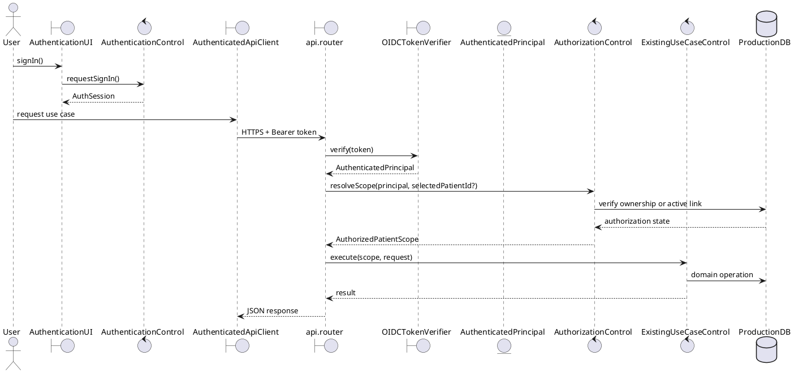

# MedBuddy Beta Security Architecture

## Decision Status

- Status: implemented in source; infrastructure provisioning and smoke testing pending
- Applies to: Android beta and FastAPI production deployment
- Replaces: alpha hash-based identity as an authorization mechanism
- Preserves: existing Boundary-Control-Entity use-case controls and API routes

## Decision

Use a managed OpenID Connect identity provider. The initial Android adapter may
use Firebase Authentication, but application code must depend on the OIDC token
contract rather than Firebase-specific user objects.

The Flutter client obtains an ID token and sends it as an `Authorization:
Bearer` header. FastAPI verifies the token at the API boundary, creates an
`AuthenticatedPrincipal`, and passes that principal to authorization logic.
Controls receive an already-authorized patient scope; they do not trust a role,
patient hash, or caregiver hash supplied by the client.

Self-hosted password storage is rejected for the first beta because it adds
credential hashing, reset, verification, abuse prevention, and account recovery
responsibilities without improving MedBuddy's medication domain.

## Implemented BCE Types

| Layer | Type | Responsibility |
| --- | --- | --- |
| Frontend boundary | `AuthenticationUI` | Sign-in, email verification, password recovery, sign-out, and recoverable authentication state. |
| Frontend control | `AuthenticationControl` | Coordinate the identity SDK and publish `AuthSession`. |
| Frontend external boundary | `AuthenticatedApiClient` | Attach fresh bearer tokens to the existing HTTP control calls. |
| Frontend entity | `AuthSession` | Immutable account/session state exposed to the view model. |
| Backend boundary | `OIDCTokenVerifier` | Verify signature, issuer, audience, expiry, and subject. |
| Backend entity | `AuthenticatedPrincipal` | Verified subject and deterministic server-owned application identity. |
| Backend control | `AuthorizationControl` | Resolve owned patient scope and validate active caregiver links. |
| Backend composition root | `api.dependencies` | Construct the principal and inject authorized controls. |

These names are the implementation contract. Authentication is centralized at
the API and application composition boundaries rather than embedded separately
in every existing use-case control.

## Target Request Flow

```plantuml
@startuml MedBuddy_Beta_Authenticated_Request
actor User
boundary AuthenticationUI
control AuthenticationControl
boundary AuthenticatedApiClient
boundary "api.router" as Router
boundary OIDCTokenVerifier
entity AuthenticatedPrincipal
control AuthorizationControl
control ExistingUseCaseControl
database ProductionDB

User -> AuthenticationUI : signIn()
AuthenticationUI -> AuthenticationControl : requestSignIn()
AuthenticationControl --> AuthenticationUI : AuthSession

User -> AuthenticatedApiClient : request use case
AuthenticatedApiClient -> Router : HTTPS + Bearer token
Router -> OIDCTokenVerifier : verify(token)
OIDCTokenVerifier --> Router : AuthenticatedPrincipal
Router -> AuthorizationControl : resolveScope(principal, selectedPatientId?)
AuthorizationControl -> ProductionDB : verify ownership or active link
ProductionDB --> AuthorizationControl : authorization state
AuthorizationControl --> Router : AuthorizedPatientScope
Router -> ExistingUseCaseControl : execute(scope, request)
ExistingUseCaseControl -> ProductionDB : domain operation
ExistingUseCaseControl --> Router : result
Router --> AuthenticatedApiClient : JSON response
@enduml
```

## Authorization Rules

1. A patient may read or mutate only records owned by the account's patient
   profile.
2. A caregiver may select only a patient connected by an active
   `PatientCaregiverLink`.
3. Link codes are short-lived enrollment capabilities, not login credentials.
4. Revoking a link must immediately deny caregiver medication, schedule,
   notification, and recommendation access.
5. Resource identifiers are always checked against the authorized scope before
   read, update, or delete operations.
6. Release mode has no unauthenticated `local_patient`, query-role, or
   header-role fallback. Firebase anonymous identities are accepted only when
   the backend explicitly enables that authenticated provider.

## Migration Without Pipeline Breakage

1. Derive an opaque, stable MedBuddy identity from the verified provider issuer
   and subject. Add a profile table later only when the product has profile data
   that cannot be represented by the external identity and existing settings.
2. Add `OIDCTokenVerifier`, `AuthenticatedPrincipal`, and
   `AuthorizationControl` at `api.dependencies`; do not change domain behavior.
3. Introduce authenticated integration tests while alpha compatibility remains
   enabled only in a development configuration.
4. Change controls to accept an authorized scope from dependencies. A requested
   linked-patient identifier remains data, never authority.
5. Start the production PostgreSQL database with versioned migrations. Local
   `local_patient` demo rows remain development data and are not migrated into
   authenticated production ownership.
6. Remove alpha identity fallbacks and fail application startup when production
   auth configuration is incomplete.

## HTTPS and Deployment

The deployment must provide:

- TLS termination with automatic certificate renewal and HTTP-to-HTTPS redirect.
- A private application-to-database network path.
- A managed PostgreSQL database with connection pooling, backups, and tested
  restore. SQLite remains valid only for local/demo execution and isolated
  reference catalogs.
- The pill reference catalog may use a disposable per-instance SQLite cache
  only when cold-start refresh is bounded and failure falls back to an
  immutable snapshot. Otherwise, store the catalog in PostgreSQL or an
  object-backed versioned snapshot; do not assume container-local files are
  durable.
- Versioned migrations, preferably Alembic, executed as a controlled release
  step rather than implicitly by every web worker.
- Secrets from a secret manager or protected deployment environment, never
  repository files or Flutter compile-time constants.
- Bounded workers, request/body limits, timeouts, redacted logs, health probes,
  and metrics for external API latency/failure.

A managed container runtime with an HTTPS load balancer and managed PostgreSQL
is the preferred topology. Cloud Run plus Cloud SQL aligns with the current
Google/Firebase integrations, but the interfaces above keep the domain layer
provider-independent.

## Android Release Signing and Network Policy

- Use Play App Signing for store distribution and protect the upload key.
- Keep the keystore and `key.properties` ignored and outside source control.
- Store CI signing material in a protected GitHub Environment; expose it only
  to tag/release jobs, never pull-request jobs.
- Pull requests compile a release-mode APK without production signing secrets.
- Release jobs verify certificate fingerprints and archive checksums/provenance.
- The release manifest/network security configuration permits HTTPS only.
- Development clear-text access, if retained, must live in a debug-only Android
  manifest overlay.

## Delivery Order to July 31

1. Identity provider project and local emulator/test setup.
2. Database/account migration and backend principal verification.
3. Server-derived authorization for every route and denial integration tests.
4. Frontend authentication/session integration and authenticated API client.
5. HTTPS deployment, production database, migrations, secrets, and monitoring.
6. Android release network policy, signing pipeline, and signed-device smoke
   test.

## Implemented Beta Configuration

The source now implements the application portions of delivery items 2-6 and
the Firebase client adapter for item 1. Firebase/GCP resources, protected
environments, production secrets, and signed-device smoke testing remain
operational release gates, not a second authentication path.

### Firebase

1. Create one Firebase Android application for `com.medbuddy.app`. Enable
   Email/Password, Google, Phone, and Anonymous providers only after their
   corresponding application flows and abuse controls are enabled.
2. Backend production uses `AUTH_MODE=firebase`, `FIREBASE_PROJECT_ID`, and
   Application Default Credentials from the Cloud Run runtime service account.
3. Flutter release builds receive `MEDBUDDY_AUTH_MODE=firebase` plus the Firebase
   API key, app ID, sender ID, and project ID through protected build variables.
4. Email verification is required by default for password and Google first
   factors. Phone and anonymous identities have no email claim and therefore
   require explicit backend opt-in through `FIREBASE_ALLOW_PHONE_AUTH` and
   `FIREBASE_ALLOW_ANONYMOUS_AUTH`.
5. SMS MFA is offered only to verified email or Google accounts. Firebase does
   not support phone or anonymous sign-in as the first factor for MFA. Enabling
   SMS MFA requires Firebase Authentication with Identity Platform and phone
   verification is a billed service; billing activation is an owner-operated
   release decision, not an automated setup step.
6. Password recovery uses Firebase email reset links. Enable Firebase email
   enumeration protection and configure authorized action domains before beta
   distribution.
7. Revocation checks are enabled in the deployment workflow; the runtime
   service account therefore needs the minimum Firebase Authentication
   permissions required to read user state.

### Android Firebase Registration

Register both debug fingerprints while testing phone and Google sign-in:

- Debug SHA-1: `9C:E0:30:DB:15:5B:54:F3:A7:8A:E7:CA:C6:6B:46:73:B5:40:E0:25`
- Debug SHA-256: `78:AF:ED:C9:BE:90:3B:15:B6:18:1B:C5:09:08:A6:92:D6:41:9D:D0:C9:91:6F:3E:70:63:27:76:B8:B1:F8:D1`

These fingerprints identify the current local debug certificate and are not
secrets. Register the release/upload SHA-1 and SHA-256 separately after the
protected release keystore is created. Download a refreshed
`google-services.json` after registering fingerprints and enabling Google
sign-in; keep the real file out of Git.

Firebase configuration identifiers are not authorization secrets. Deployment
credentials, API credentials, database credentials, and signing material must
remain in Google Secret Manager or protected GitHub Environments.

### Cloud Run and Cloud SQL

`deploy-backend.yml` expects these protected GitHub Environment variables:

- `GCP_PROJECT_ID`, `GCP_REGION`, `GCP_ARTIFACT_REPOSITORY`
- `GCP_CLOUD_RUN_SERVICE`, `GCP_MIGRATION_JOB`
- `GCP_RUNTIME_SERVICE_ACCOUNT`, `GCP_DEPLOY_SERVICE_ACCOUNT`
- `GCP_WORKLOAD_IDENTITY_PROVIDER`, `GCP_CLOUD_SQL_CONNECTION`
- `FIREBASE_PROJECT_ID`

Google Secret Manager must contain `medbuddy-database-url`,
`medbuddy-gemini-api-key`, and `medbuddy-public-data-api-key`. The database URL
uses SQLAlchemy's `postgresql+psycopg` scheme and the Cloud SQL Unix socket. The
workflow builds one immutable image, runs `alembic upgrade head` as a Cloud Run
Job, and deploys that same image only after migration succeeds.

The Cloud Run network endpoint permits unauthenticated invocation because a
Firebase client token is not a Cloud Run IAM token. FastAPI still authenticates
every application route. `/health` and `/ready` are intentionally anonymous:
the former reports process liveness, while the latter returns only a binary
readiness result after checking database connectivity and verifier
initialization. Production database pools and Cloud Run concurrency are bounded
so image-processing requests cannot multiply connections without limit.

### Android Signing

The `beta-android` GitHub Environment supplies
`FIREBASE_GOOGLE_SERVICES_JSON_BASE64`, `ANDROID_KEYSTORE_BASE64`,
`ANDROID_KEYSTORE_PASSWORD`, `ANDROID_KEY_ALIAS`, and `ANDROID_KEY_PASSWORD` as
secrets. It supplies `ANDROID_SIGNING_CERT_SHA256`,
`ANDROID_SIGNING_CERT_SHA1`, `MEDBUDDY_API_BASE_URL`, `FIREBASE_API_KEY`, `FIREBASE_APP_ID`,
`FIREBASE_MESSAGING_SENDER_ID`, and `FIREBASE_PROJECT_ID` as environment
variables for Flutter compile-time configuration. Firebase API/app identifiers
and certificate fingerprints are identifiers rather than credentials; the
protected environment prevents accidental cross-project builds rather than
treating those values as authorization secrets.
The signed-build workflow sets `MEDBUDDY_REQUIRE_RELEASE_SIGNING=true`, verifies
the upload certificate fingerprint and cross-checks the restored Firebase
Android configuration before building. It builds both APK and AAB outputs and
publishes SHA-256 checksum files. Play distribution should use Play App Signing
and retain the protected key as the upload key.
