# MedBuddy Class Diagram

이 문서는 README의 초기 Class/Sequence Diagram, `docs/temp/SequenceDiagram_1window2.md`, `docs/temp/CommunicationDiagrams_jeeon0318.md`, 현재 Figma 화면 흐름, 실제 Flutter/FastAPI 코드 구조를 대조하여 새로 정리한 MedBuddy 분석/설계 Class Diagram이다.

## 1. 판단 기준

- Class Diagram은 시스템의 정적 구조를 보여야 하므로, 단순한 파일 목록이 아니라 책임, 속성, 연산, 관계를 기준으로 클래스를 도출한다.
- 강의 자료 기준으로 Use Case만으로는 분석 클래스 도출이 부족하며, Sequence Diagram과 Communication Diagram의 메시지 송수신 객체를 Boundary, Control, Entity로 분류해야 한다.
- 현재 구현 클래스와 목표 설계 클래스를 무비판적으로 합치면 문서가 거짓말을 하게 된다. 따라서 아래 다이어그램은 아직 구현 근거가 부족한 클래스를 `planned` 스테레오타입으로 표시하고, 별도 표시가 없는 클래스는 현재 구현 또는 현재 시퀀스의 직접 근거가 있는 클래스로 본다.
- `간병인`은 제외하고, 사용자 Actor는 `Patient`와 `Guardian`만 둔다.
- Figma의 화면 흐름은 `촬영 -> 분석중 -> 분석 완료 -> 결과 확인 -> 저장/조회/연동/설정`으로 이어진다. 따라서 UI Boundary는 화면 단위로 분리한다.
- README의 초기 Class Diagram은 실제 코드 파일을 잘 나열하지만, 일정, 보호자 연동, 알림, 사용자 설정 같은 목표 기능의 도메인 클래스가 부족하다.
- 동료 Communication Diagram은 클래스 후보를 잘 드러내지만, `Caregiver` 명명은 현재 범위와 맞지 않으므로 모두 `Guardian`으로 정리한다.

## 2. 주요 클래스 도출 논거

| 클래스 | 분류 | 생성 논거 |
| --- | --- | --- |
| `PrescriptionInputUI`, `PrescriptionResultUI` | Boundary | Figma와 Sequence Diagram에서 촬영, 분석중, 분석완료, 결과 카드 화면이 분리되어 나타난다. |
| `SavedMedicationUI`, `TodayMedicationUI`, `LinkUI`, `UserSettingUI` | Boundary | 저장 목록, 오늘 일정, 환자/보호자 연동, 환경설정 화면이 독립 화면으로 존재한다. |
| `MedicationAPIBoundary` | Boundary | Flutter와 FastAPI 사이의 HTTP API 경계다. 실제 코드에서는 `ApiService`, `MedicationViewModel`, `api/router.py`가 나누어 담당한다. |
| `PrescriptionAnalysisControl` | Control | 이미지 입력, OCR, Gemini Vision, 개인정보 마스킹, 후보 약물 생성 순서를 조정한다. |
| `MedicationSaveControl` | Control | 후보 약물명을 공공 API/Redis/LLM으로 보강하고 저장 트랜잭션을 조정한다. |
| `SavedMedicationControl` | Control | 환자/보호자 권한에 따라 저장 복약 정보 조회, 상세 확인, 삭제, 보호자 알림 설정을 조정한다. |
| `TodayMedicationControl` | Control | 오늘 복약 일정, 완료 체크, 알림, 건강 추천, TTS를 하나의 일정 중심 흐름으로 조정한다. |
| `PatientGuardianLinkControl` | Control | 환자 코드 생성, 보호자 등록, 연동 해제를 조정한다. |
| `UserSettingControl` | Control | 글씨 크기, 읽기 속도, 언어 설정 변경을 조정한다. |
| `MedicationCandidate` | Entity | 처방전 이미지에서 추출된 약 후보는 공공 DB로 검증된 약 상세 정보가 아니므로 `MedicationInfo`와 분리해야 한다. |
| `MedicationInfo` | Entity | 공공 의약품 API와 LLM 요약을 통해 보강된 약 상세 정보다. 캐시 가능하며 사용자 소유 정보가 아니다. |
| `SavedMedicationInfo` | Entity | 사용자가 약통에 저장한 약 정보다. `MedicationInfo`의 스냅샷이지만 사용자 소유, 삭제, 알림, 일정과 연결된다. |
| `MedicationSchedule`, `MedicationScheduleItem` | Entity | 복약 일정은 여러 약과 시간대의 반복 구조를 가지므로 별도 엔티티와 항목 클래스로 분리한다. |
| `MedicationAlarm`, `MedicationCompletion` | Entity | 알림 설정과 복약 완료 기록은 상태 변경 이력이므로 일정 항목에서 분리한다. |
| `PatientGuardianLink`, `PatientLinkCode`, `GuardianAlertSetting` | Entity | 보호자 연동과 알림 설정은 저장 복약 정보 조회 권한과 알림 발송 조건을 결정한다. |
| `UserSetting` | Entity | Figma 환경설정 화면과 Communication Diagram UC-14에서 글씨 크기, 읽기 속도, 언어가 독립 상태로 존재한다. |

## 3. Class Diagram

```plantuml
@startuml MedBuddy_Class_Diagram
left to right direction
skinparam classAttributeIconSize 0
hide circle

skinparam packageStyle rectangle
skinparam class {
  BackgroundColor<<boundary>> #EAF7FF
  BorderColor<<boundary>> #2B83BA
  BackgroundColor<<control>> #FFF4E6
  BorderColor<<control>> #F08C00
  BackgroundColor<<entity>> #F1F8E9
  BorderColor<<entity>> #5C940D
  BackgroundColor<<external>> #F8F0FC
  BorderColor<<external>> #862E9C
  BackgroundColor<<database>> #F1F3F5
  BorderColor<<database>> #495057
  BackgroundColor<<planned>> #FFF9DB
  BorderColor<<planned>> #FAB005
}

package "Actors / Domain Users" {
  abstract class User <<entity>> {
    +userHash: String
    +role: UserRole
    +displayName: String
  }

  class Patient <<entity>> {
    +createLinkCode(): PatientLinkCode
  }

  class Guardian <<entity>> {
    +registerPatient(code: String): PatientGuardianLink
  }

  enum UserRole {
    PATIENT
    GUARDIAN
  }

  User <|-- Patient
  User <|-- Guardian
  User --> UserRole
}

package "Boundary Classes" {
  class MainUI <<boundary>> {
    +displayMainScreen()
    +displayTodayMedicationSummary(summary)
  }

  class PrescriptionInputUI <<boundary>> {
    +displayCaptureScreen()
    +displayAnalyzingScreen()
    +displayAnalysisFailure(errorMessage)
  }

  class PrescriptionResultUI <<boundary>> {
    +displayAnalysisComplete(summary)
    +displayMedicationCards(result)
    +displayMedicationNotFound(medicineName)
    +displaySaveSuccess()
  }

  class SavedMedicationUI <<boundary>> {
    +displaySavedMedicationInfo(list)
    +displayDrugDetail(drugInfo)
    +displayDeleteConfirmPopup()
    +displayGuardianAlertState()
  }

  class TodayMedicationUI <<boundary, planned>> {
    +displayTodaySchedule(schedule)
    +displayHealthRecommendation(recommendation)
    +displayUpdatedProgress(progress)
  }

  class LinkUI <<boundary, planned>> {
    +displayLinkPage(linkList)
    +displayPatientCode(code, expiresAt)
    +displayLinkedInfo(link)
  }

  class UserSettingUI <<boundary, planned>> {
    +displayUserSettingPage(setting)
    +displayUpdatedPreview(setting)
  }

  class MedicationAPIBoundary <<boundary>> {
    +uploadPrescription(image): PrescriptionAnalysisResult
    +identifyMedication(text): List~MedicationInfo~
    +saveMedication(drugInfo): SavedMedicationInfo
    +getSavedMedications(): List~SavedMedicationInfo~
    +deleteMedication(savedMedicationId): Boolean
  }
}

package "Control Classes" {
  class PrescriptionAnalysisControl <<control>> {
    +startPrescriptionInput()
    +analyzePrescriptionImage(image)
    +maskSensitiveInfo(rawText): PrescriptionText
    +buildAnalysisResult(candidates): PrescriptionAnalysisResult
  }

  class MedicationSaveControl <<control>> {
    +requestMedicationDetailAndSave(candidate)
    +resolveDrugInfo(medicineName): List~MedicationInfo~
    +selectBestMatchedDrugInfo(list): MedicationInfo
    +saveSelectedMedication(info): SavedMedicationInfo
  }

  class SavedMedicationControl <<control>> {
    +requestSavedMedicationInfo(userHash, role)
    +requestDrugInfo(medicineName): MedicationInfo
    +deleteSavedMedication(patientHash, savedMedicationId)
    +updateGuardianAlertSetting(guardianHash, patientHash, option)
  }

  class TodayMedicationControl <<control, planned>> {
    +requestTodayMedicationSummary(userHash, role)
    +requestTodayMedicationSchedule(patientHash)
    +completeMedication(patientHash, medicineName, timeSlot)
    +requestHealthRecommendation(patientHash)
    +requestTTS(text)
    +requestAlarmToggle(patientHash, timeSlot)
  }

  class PatientGuardianLinkControl <<control, planned>> {
    +requestLinkPage(userHash)
    +createPatientCode(patientHash): PatientLinkCode
    +registerPatientCode(guardianHash, code): PatientGuardianLink
    +deletePatientGuardianLink(linkId)
  }

  class UserSettingControl <<control, planned>> {
    +requestUserSetting(userHash): UserSetting
    +updateFontSize(fontSize)
    +updateReadingSpeed(readingSpeed)
    +updateLanguage(language)
  }
}

package "Entity Classes" {
  class PrescriptionText <<entity>> {
    +rawText: String
    +medicationOnlyText: String
    +removeSensitiveInfoByRegex(): String
  }

  class MedicationCandidate <<entity>> {
    +drugName: String
    +dosagePerTime: String
    +dailyFrequency: String
    +totalDays: String
  }

  class MedicationCandidateList <<entity>> {
    -candidates: List~MedicationCandidate~
    +addCandidate(candidate)
    +isEmpty(): Boolean
    +findByName(drugName): MedicationCandidate
  }

  class PrescriptionAnalysisResult <<entity>> {
    +hospitalName: String
    +prescriptionDate: String
    +candidateCount: int
    +addMedicationCandidate(candidate)
  }

  class MedicationInfo <<entity>> {
    +itemSeq: String
    +itemName: String
    +efficacy: String
    +useMethod: String
    +warningMessage: String
    +imageUrl: String
    +source: String
    +aiGuide: String
    +attachAiGuide(aiGuide)
  }

  class SavedMedicationInfo <<entity>> {
    +savedMedicationId: int
    +patientHash: String
    +itemName: String
    +efficacy: String
    +useMethod: String
    +warningMessage: String
    +aiGuide: String
    +createdAt: DateTime
  }

  class MedicationSchedule <<entity, planned>> {
    +scheduleId: String
    +patientHash: String
    +scheduleDate: Date
    +buildTodaySchedule()
    +calculateProgress(): double
  }

  class MedicationScheduleItem <<entity, planned>> {
    +scheduleItemId: String
    +medicineName: String
    +timeSlot: String
    +dosage: String
    +isTaken: Boolean
  }

  class MedicationAlarm <<entity, planned>> {
    +alarmId: String
    +patientHash: String
    +timeSlot: String
    +alarmTime: Time
    +enabled: Boolean
    +enable()
    +disable()
  }

  class MedicationCompletion <<entity, planned>> {
    +completionId: String
    +patientHash: String
    +medicineName: String
    +timeSlot: String
    +completedAt: DateTime
  }

  class HealthRecommendation <<entity, planned>> {
    +recommendationId: String
    +patientHash: String
    +recommendationText: String
    +generatedAt: DateTime
  }

  class PatientLinkCode <<entity, planned>> {
    +code: String
    +patientHash: String
    +expiresAt: DateTime
    +isExpired(): Boolean
  }

  class PatientGuardianLink <<entity, planned>> {
    +linkId: String
    +patientHash: String
    +guardianHash: String
    +linkedAt: DateTime
    +status: LinkStatus
  }

  class GuardianAlertSetting <<entity, planned>> {
    +settingId: String
    +patientHash: String
    +guardianHash: String
    +enabled: Boolean
    +alertOption: String
    +enable()
    +disable()
  }

  class UserSetting <<entity, planned>> {
    +userHash: String
    +fontSize: FontSize
    +readingSpeed: ReadingSpeed
    +language: Language
  }

  enum LinkStatus {
    PENDING
    LINKED
    REVOKED
  }

  enum FontSize {
    SMALL
    MEDIUM
    LARGE
  }

  enum ReadingSpeed {
    SLOW
    NORMAL
    FAST
  }

  enum Language {
    KO
    EN
  }
}

package "External / Storage Boundaries" {
  class OCRServiceBoundary <<external>> {
    +extractPrescriptionData(image): PrescriptionAnalysisResult
    +processText(rawText): String
  }

  class ImageProcessingBoundary <<external>> {
    +preprocessPrescriptionImage(imageBytes): bytes
  }

  class GeminiVisionAPI <<external>> {
    +requestStructuredExtraction(image): JSON
  }

  class PublicDrugDataPortal <<external>> {
    +searchBasicDrugInfo(medicineName): JSON
    +searchAdvancedDrugInfo(medicineName): JSON
    +searchPillImage(medicineName, itemSeq): URL
  }

  class LLMService <<external>> {
    +generateFriendlyGuide(drugInfo): String
    +summarizeAdvancedDrugDocument(document): MedicationInfo
    +generateHealthRecommendation(context): String
  }

  class TTSService <<external, planned>> {
    +readDoseInstruction(text): AudioStream
  }

  class NotificationService <<external, planned>> {
    +registerMedicationAlarm(alarm)
    +cancelMedicationAlarm(alarm)
    +registerGuardianAlert(setting)
    +cancelGuardianAlert(setting)
  }

  class RedisCache <<database>> {
    +findDrugInfo(cacheKey): List~MedicationInfo~
    +saveDrugInfo(cacheKey, value, ttl)
  }

  class MedicationDB <<database>> {
    +insertSavedMedication(savedMedication)
    +findSavedMedicationList(patientHash)
    +deleteSavedMedication(patientHash, savedMedicationId)
    +findTodayMedicationSchedule(patientHash)
    +saveAlarmSetting(alarm)
    +insertMedicationCompletion(completion)
  }

  class LinkDB <<database, planned>> {
    +savePatientCode(code)
    +findValidPatientCode(code)
    +insertPatientGuardianLink(link)
    +deletePatientGuardianLink(linkId)
  }

  class LocalSettingStorage <<external, planned>> {
    +findUserSetting(userHash): UserSetting
    +saveUserSetting(setting)
  }
}

' Boundary -> Control
MainUI ..> TodayMedicationControl : requests summary
PrescriptionInputUI ..> PrescriptionAnalysisControl : submits image
PrescriptionResultUI ..> MedicationSaveControl : analyze and save
SavedMedicationUI ..> SavedMedicationControl : query/manage saved meds
TodayMedicationUI ..> TodayMedicationControl : schedule actions
LinkUI ..> PatientGuardianLinkControl : link actions
UserSettingUI ..> UserSettingControl : setting actions

' Frontend/backend API boundary
PrescriptionInputUI ..> MedicationAPIBoundary : HTTP multipart
PrescriptionResultUI ..> MedicationAPIBoundary : HTTP JSON
SavedMedicationUI ..> MedicationAPIBoundary : HTTP JSON
MedicationAPIBoundary ..> PrescriptionAnalysisControl
MedicationAPIBoundary ..> MedicationSaveControl
MedicationAPIBoundary ..> SavedMedicationControl

' Prescription analysis
PrescriptionAnalysisControl ..> OCRServiceBoundary
OCRServiceBoundary ..> ImageProcessingBoundary
OCRServiceBoundary ..> GeminiVisionAPI
PrescriptionAnalysisControl --> PrescriptionText
PrescriptionAnalysisControl --> MedicationCandidateList
PrescriptionAnalysisResult "1" *-- "0..*" MedicationCandidate : contains
MedicationCandidateList "1" o-- "0..*" MedicationCandidate : collects
PrescriptionAnalysisControl --> PrescriptionAnalysisResult : creates

' Detail lookup and save
MedicationSaveControl ..> RedisCache
MedicationSaveControl ..> PublicDrugDataPortal
MedicationSaveControl ..> LLMService
MedicationSaveControl --> MedicationInfo : resolves
MedicationSaveControl --> SavedMedicationInfo : creates
SavedMedicationInfo ..> MedicationInfo : snapshot of
MedicationDB "1" o-- "0..*" SavedMedicationInfo : stores
Patient "1" -- "0..*" SavedMedicationInfo : owns

' Saved medication management
SavedMedicationControl ..> MedicationDB
SavedMedicationControl ..> PublicDrugDataPortal
SavedMedicationControl --> SavedMedicationInfo
SavedMedicationControl --> GuardianAlertSetting
Guardian "1" -- "0..*" GuardianAlertSetting : configures
GuardianAlertSetting "0..*" --> "1" Patient : monitors
GuardianAlertSetting ..> NotificationService

' Schedule, alarm, completion, recommendation
TodayMedicationControl --> MedicationSchedule
MedicationSchedule "1" *-- "0..*" MedicationScheduleItem : contains
MedicationScheduleItem "0..*" --> "1" SavedMedicationInfo : based on
MedicationAlarm "0..*" --> "1" MedicationScheduleItem : reminds
MedicationCompletion "0..*" --> "1" MedicationScheduleItem : records
TodayMedicationControl --> MedicationAlarm
TodayMedicationControl --> MedicationCompletion
TodayMedicationControl --> HealthRecommendation
TodayMedicationControl ..> MedicationDB
TodayMedicationControl ..> LLMService
TodayMedicationControl ..> TTSService
TodayMedicationControl ..> NotificationService

' Patient and guardian link
Patient "1" -- "0..*" PatientLinkCode : generates
Patient "1" -- "0..*" PatientGuardianLink : shares with
Guardian "1" -- "0..*" PatientGuardianLink : follows
PatientGuardianLink --> LinkStatus
PatientGuardianLinkControl --> PatientLinkCode
PatientGuardianLinkControl --> PatientGuardianLink
PatientGuardianLinkControl ..> LinkDB
SavedMedicationControl ..> PatientGuardianLink : resolves access
TodayMedicationControl ..> PatientGuardianLink : resolves access

' User setting
User "1" -- "1" UserSetting : owns
UserSetting --> FontSize
UserSetting --> ReadingSpeed
UserSetting --> Language
UserSettingControl --> UserSetting
UserSettingControl ..> LocalSettingStorage

note right of SavedMedicationInfo
현재 구현의 SavedMedication DB 모델은 patientHash와 일정 필드가 없다.
보호자 조회/알림/일정 기능까지 포함하려면 사용자 소유권이 필요하다.
end note

note bottom of OCRServiceBoundary
현재 백엔드 OCRService가 Gemini Vision과 image_processing을 호출한다.
프론트엔드 VisionService/ML Kit 경로는 보조 또는 과거 경로로 보고
핵심 다이어그램에는 넣지 않았다.
end note

note bottom of PatientGuardianLink
Communication Diagram의 Caregiver 명칭은 현재 범위에서 Guardian으로 통일한다.
end note
@enduml
```

## 4. README 초기 Class Diagram과의 차이

- README의 기존 Class Diagram은 실제 파일 구조를 추적하는 데는 유용하지만, `MedicationSchedule`, `MedicationAlarm`, `MedicationCompletion`, `PatientGuardianLink`, `GuardianAlertSetting`, `UserSetting` 같은 목표 기능 클래스가 부족하다.
- 기존 README는 `MedicationRouter`, `OCRService`, `DrugService`, `SavedMedication`, `DrugInfo` 등 구현 클래스 중심이다. 새 다이어그램은 이를 `MedicationAPIBoundary`, `PrescriptionAnalysisControl`, `MedicationSaveControl`, `SavedMedicationInfo`, `MedicationInfo`로 재배치하여 BCE 책임을 더 명확히 했다.
- 기존 README는 `VisionService`와 `PrescriptionParser_Dart`를 포함하지만, 현재 주요 흐름은 `processMedicationImage()`가 이미지 파일을 서버에 보내고 백엔드 `OCRService`가 Gemini Vision을 호출한다. 따라서 핵심 설계에서는 프론트 ML Kit 경로를 제외했다.
- 기존 README는 보호자/연동/알림/일정 기능을 정적 구조로 설명하지 못한다. Figma와 Communication Diagram은 이 기능들을 명확히 요구하므로, 새 다이어그램에는 `planned` 클래스로 반영했다.

## 5. 구현 관점에서 바로 보이는 보완점

- `SavedMedication`에 사용자 소유권(`patientHash` 또는 user id)이 없다. 보호자 조회, 일정 생성, 알림 설정을 구현하려면 저장 약 정보가 누구의 것인지 알아야 한다.
- 현재 저장 약 정보에는 복용 시간, 복용 기간, 1일 횟수 같은 처방 후보 정보가 저장되지 않는다. `MedicationCandidate`와 `SavedMedicationInfo` 사이의 변환 정책이 필요하다.
- 일정/알림/완료 기능은 DB 모델이 아직 없다. `MedicationScheduleItem`, `MedicationAlarm`, `MedicationCompletion`에 해당하는 테이블 또는 문서 구조가 필요하다.
- 환자/보호자 연동을 구현하려면 `PatientGuardianLink`, `PatientLinkCode`, `GuardianAlertSetting` 저장소가 필요하다.
- `MedicationInfo`는 공공 DB/LLM 결과이고 `SavedMedicationInfo`는 사용자 저장 스냅샷이다. 둘을 같은 클래스로 뭉치면 캐시, 저장, 삭제, 사용자 권한 책임이 뒤섞인다.
