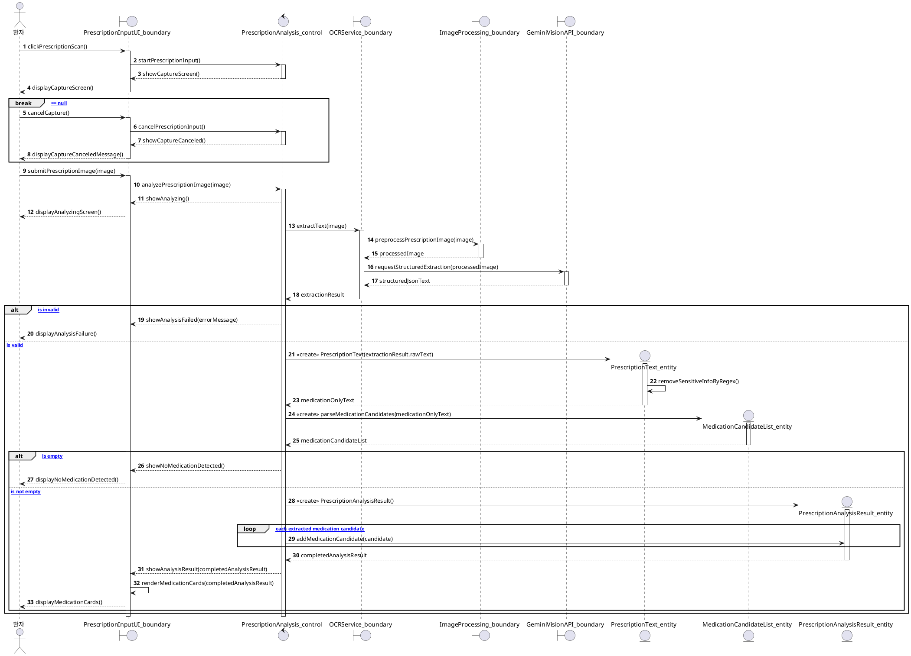
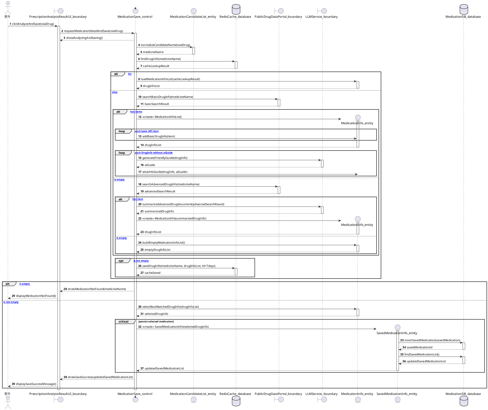
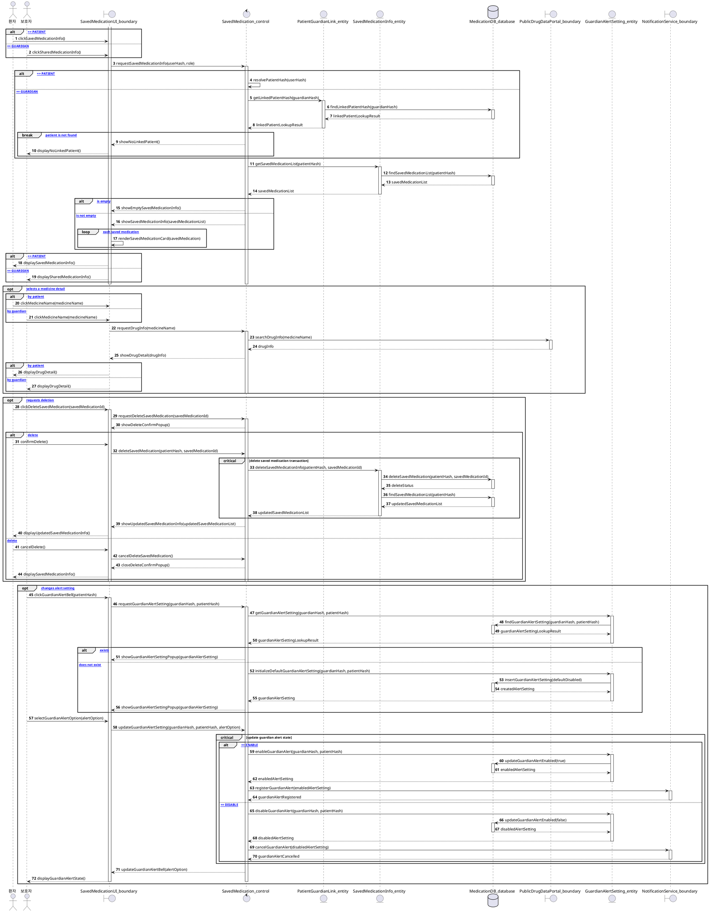
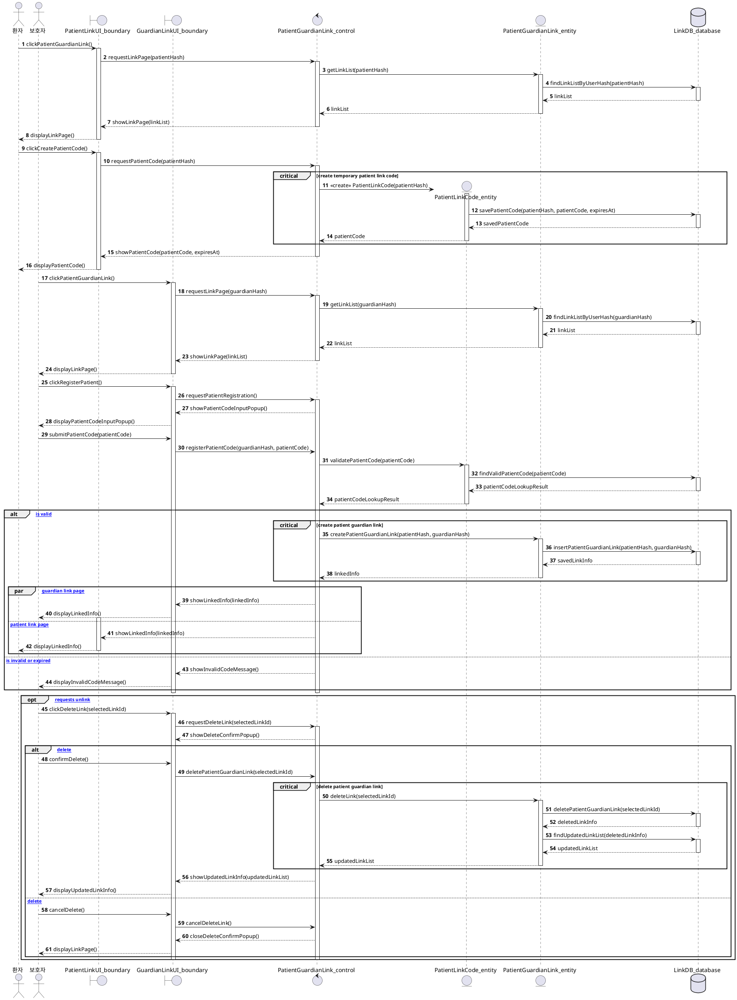
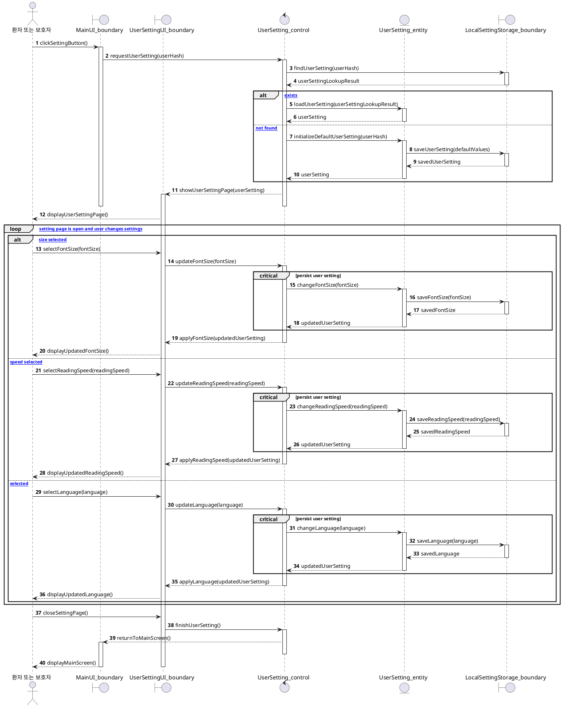

# MedBuddy Sequence Diagrams

이 문서는 MedBuddy의 주요 상호작용을 Boundary-Control-Entity 관점으로 정리한 PlantUML 시퀀스 다이어그램 제안본이다.

## 수정 기준과 논거

- `boundary`는 사용자 화면, 외부 API, 로컬 저장소처럼 시스템 경계에서 입출력을 담당하는 객체로 둔다.
- `control`은 시나리오의 순서, 분기 조건, 트랜잭션 흐름을 조정하는 객체로 둔다.
- `entity`는 처방 분석 결과, 저장 복약 정보, 사용자 설정, 연동 정보처럼 도메인 상태를 가지는 객체로 둔다.
- `database`는 entity의 영속화 저장소로만 표현한다. DB가 직접 업무 규칙을 판단하지 않는다.
- `alt`는 상호 배타적인 조건 분기에만 사용한다. 예: 환자/보호자 권한, 캐시 hit/miss, API 조회 성공/실패.
- `opt`는 기본 시나리오 이후 사용자가 선택할 때만 발생하는 확장 흐름에 사용한다. 예: 상세 보기, 삭제, 알림 설정, 음성 안내.
- `loop`는 동일한 메시지 패턴이 반복되는 경우에만 사용한다. 예: 약물 후보 반복, 복약 카드 렌더링, 설정 항목 반복 변경.
- `break`는 이후 흐름을 진행할 수 없는 중단 조건에 사용한다. 예: 촬영 취소, 연동 환자 없음, 약 정보 미검색.
- `critical`은 DB 상태 변경과 외부 알림 등록처럼 원자성이 필요한 변경 구간에 사용한다.
- `par`는 하나의 커밋 이후 서로 독립적으로 갱신 가능한 UI/알림 흐름에만 제한적으로 사용한다.

최종 시퀀스 다이어그램은 다음 6개로 구성한다.

| No. | 시나리오 | 관련 유스케이스 |
| --- | --- | --- |
| 1 | 처방전/약봉투 이미지 입력, 분석, 결과 확인 | UC-1, UC-2 |
| 2 | 분석된 약물 상세 조회 및 저장 | UC-4, UC-9 |
| 3 | 저장된 복약 정보 조회, 상세 확인, 삭제, 보호자 알림 설정 | UC-4, UC-5, UC-9, UC-13 |
| 4 | 오늘의 복약 일정 확인, 건강 추천, 음성 안내, 알림, 복약 완료 | UC-3, UC-8, UC-10, UC-11, UC-12 |
| 5 | 환자/보호자 연동 및 연동 해제 | UC-6, UC-7 |
| 6 | 사용자 설정 | UC-14 |

## 1. 처방전/약봉투 이미지 입력, 분석, 결과 확인

### 수정 논거

- 촬영 취소는 이후 OCR/AI 분석으로 진행될 수 없으므로 `break [pickedFile == null]`로 중단 조건을 명확히 했다.
- OCR/Gemini 응답 이후 후보 약물이 없는 경우와 후보가 있는 경우는 상호 배타적이므로 `alt`로 분리했다.
- 약물 후보 카드는 후보 수만큼 반복 생성되므로 `loop [for each extracted medication candidate]`로 표현했다.
- 분석 결과 객체 구성은 성공 경로에서만 발생하므로 실패/빈 결과 경로 밖으로 새지 않도록 했다.

## 2. 분석된 약물 상세 조회 및 저장

### 수정 논거

- Redis 캐시 조회는 `cache hit`과 `cache miss`가 동시에 성립할 수 없으므로 `alt`로 분리했다.
- 공공 API 조회는 실제 코드 흐름처럼 Basic API 우선, 결과가 없으면 Advanced API fallback으로 표현했다.
- Basic API는 여러 건을 반환할 수 있으므로 `loop [for each basic API item]`와 `loop [for each DrugInfo without aiGuide]`를 사용했다.
- 조회 결과가 없는 경우 저장으로 넘어가면 안 되므로 `alt [drugInfoList is empty]`에서 사용자에게 실패를 표시하고 저장 경로와 분리했다.
- 저장은 DB insert, commit, 목록 최신화가 하나의 변경 흐름이므로 `critical persist selected medication`으로 묶었다.

## 3. 저장된 복약 정보 조회, 상세 확인, 삭제, 보호자 알림 설정

### 수정 논거

- 환자는 자신의 `patientHash`로 바로 조회하지만, 보호자는 연동된 환자를 먼저 찾아야 하므로 `alt [role == PATIENT] / [role == GUARDIAN]`로 접근 경로를 분리했다.
- 보호자에게 연동 환자가 없으면 저장 복약 정보 조회가 불가능하므로 `break [linked patient is not found]`로 중단 조건을 둔다.
- 조회된 복약 정보 목록 렌더링은 항목 수만큼 반복되므로 `loop [for each saved medication]`로 표시했다.
- 상세 확인, 삭제, 보호자 알림 설정은 기본 조회 이후 선택적으로 발생하므로 각각 `opt`로 분리했다.
- 삭제와 보호자 알림 변경은 DB 상태와 알림 서비스 상태가 함께 바뀌므로 `critical` 구간으로 묶었다.

## 4. 오늘의 복약 일정 확인, 건강 추천, 음성 안내, 알림, 복약 완료

### 수정 논거

- 환자와 보호자는 같은 화면을 볼 수 있지만 권한 해석 방식이 다르므로 일정 조회 전 `alt`로 환자 식별 과정을 분리했다.
- 보호자가 연동된 환자를 찾지 못하면 이후 일정 조회가 불가능하므로 `break [linked patient is not found]`를 둔다.
- 복약 일정은 여러 약과 여러 시간대의 조합으로 구성되므로 `loop [for each medication and time slot]`로 일정 계산을 표현했다.
- 건강 추천, 약 상세 정보, 음성 안내, 알림 설정, 복약 완료는 오늘 일정 조회 이후 선택적으로 발생하는 확장 흐름이므로 `opt`로 분리했다.
- 알림 설정과 복약 완료 기록은 상태 변경이므로 `critical`로 묶었다.

```plantuml
@startuml SD04_Today_Medication
autonumber
actor "환자" as Patient
actor "보호자" as Guardian
boundary "TodayMedicationUI_boundary" as UI
control "TodayMedication_control" as C
entity "PatientGuardianLink_entity" as CareLink
entity "MedicationSchedule_entity" as Schedule
database "MedicationDB_database" as DB
entity "HealthRecommendation_entity" as Recommend
boundary "LLMService_boundary" as LLM
boundary "PublicDrugDataPortal_boundary" as DrugAPI
entity "MedicationAlarm_entity" as Alarm
boundary "NotificationService_boundary" as Notify
boundary "TTSService_boundary" as TTS
entity "MedicationCompletion_entity" as Complete

alt [role == PATIENT]
  Patient -> UI : openMainScreen()
else [role == GUARDIAN]
  Guardian -> UI : openSharedMainScreen()
end
activate UI
UI -> C : requestTodayMedicationSummary(userHash, role)
activate C

alt [role == PATIENT]
  C -> C : resolvePatientHash(userHash)
else [role == GUARDIAN]
  C -> CareLink : getLinkedPatientHash(guardianHash)
  activate CareLink
  CareLink -> DB : findLinkedPatientHash(guardianHash)
  activate DB
  DB --> CareLink : linkedPatientLookupResult
  deactivate DB
  CareLink --> C : linkedPatientLookupResult
  deactivate CareLink

  break [linked patient is not found]
    C --> UI : showNoLinkedPatient()
    UI --> Guardian : displayNoLinkedPatient()
  end
end

C -> Schedule : getTodayMedicationSummary(patientHash)
activate Schedule
Schedule -> DB : findTodayMedicationSummary(patientHash)
activate DB
DB --> Schedule : todayMedicationSummaryData
deactivate DB
loop [for each medication and time slot]
  Schedule -> Schedule : calculateDoseSummary(medication, timeSlot)
end
Schedule --> C : todayMedicationSummary
deactivate Schedule
C --> UI : showMainTodaySchedule(todayMedicationSummary)
alt [role == PATIENT]
  UI --> Patient : displayMainTodaySchedule()
else [role == GUARDIAN]
  UI --> Guardian : displaySharedTodaySchedule()
end
deactivate C
deactivate UI

opt [user opens today's medication schedule]
  alt [opened by patient]
    Patient -> UI : clickTodayMedicationSchedule()
  else [opened by guardian]
    Guardian -> UI : clickTodayMedicationSchedule()
  end
  activate UI
  UI -> C : requestTodayMedicationSchedule(patientHash)
  activate C
  C -> Schedule : getTodayMedicationSchedule(patientHash)
  activate Schedule
  Schedule -> DB : findTodayMedicationSchedule(patientHash)
  activate DB
  DB --> Schedule : todayMedicationScheduleData
  deactivate DB
  loop [for each schedule item]
    Schedule -> Schedule : buildScheduleItemViewModel(scheduleItem)
  end
  Schedule --> C : todayMedicationSchedule
  deactivate Schedule
  C --> UI : showTodaySchedule(todayMedicationSchedule)
  alt [opened by patient]
    UI --> Patient : displayTodayMedicationSchedule()
  else [opened by guardian]
    UI --> Guardian : displaySharedTodayMedicationSchedule()
  end
  deactivate C
  deactivate UI
end

opt [user requests health recommendation]
  alt [requested by patient]
    Patient -> UI : clickHealthRecommendation()
  else [requested by guardian]
    Guardian -> UI : clickHealthRecommendation()
  end
  activate UI
  UI -> C : requestHealthRecommendation(patientHash)
  activate C
  C -> Schedule : getMedicationContext(patientHash)
  activate Schedule
  Schedule -> DB : findMedicationContext(patientHash)
  activate DB
  DB --> Schedule : medicationContextData
  deactivate DB
  Schedule --> C : medicationContext
  deactivate Schedule
  C -> LLM : generateHealthRecommendation(medicationContext)
  activate LLM
  LLM --> C : recommendationMessage
  deactivate LLM
  create Recommend
  C -> Recommend : <<create>> HealthRecommendation(recommendationMessage)
  activate Recommend
  Recommend --> C : healthRecommendation
  deactivate Recommend
  C --> UI : showHealthRecommendation(healthRecommendation)
  alt [requested by patient]
    UI --> Patient : displayHealthRecommendation()
  else [requested by guardian]
    UI --> Guardian : displayHealthRecommendation()
  end
  deactivate C
  deactivate UI
end

opt [user selects medicine detail]
  alt [selected by patient]
    Patient -> UI : clickMedicineName(medicineName)
  else [selected by guardian]
    Guardian -> UI : clickMedicineName(medicineName)
  end
  activate UI
  UI -> C : requestDrugInfo(medicineName)
  activate C
  C -> DrugAPI : searchDrugInfo(medicineName)
  activate DrugAPI
  DrugAPI --> C : drugInfo
  deactivate DrugAPI
  C --> UI : showDrugDetail(drugInfo)
  alt [selected by patient]
    UI --> Patient : displayDrugDetail()
  else [selected by guardian]
    UI --> Guardian : displayDrugDetail()
  end
  deactivate C
  deactivate UI
end

opt [patient requests read aloud]
  Patient -> UI : clickReadAloud(text)
  activate UI
  UI -> C : requestTTS(text)
  activate C
  C -> TTS : readDoseInstruction(text)
  activate TTS
  TTS --> C : ttsAudio
  deactivate TTS
  C --> UI : playTTSAudio(ttsAudio)
  UI --> Patient : hearDoseInstruction()
  deactivate C
  deactivate UI
end

opt [patient changes medication alarm]
  Patient -> UI : clickAlarmBell(timeSlot)
  activate UI
  UI -> C : requestAlarmToggle(patientHash, timeSlot)
  activate C
  C -> Alarm : getAlarmStatus(patientHash, timeSlot)
  activate Alarm
  Alarm -> DB : findAlarmSetting(patientHash, timeSlot)
  activate DB
  DB --> Alarm : alarmStatus
  deactivate DB
  Alarm --> C : alarmStatus
  deactivate Alarm

  critical update medication alarm state
    alt [alarm disabled or not found]
      C --> UI : showAlarmSettingPopup()
      Patient -> UI : submitAlarmTime(alarmTime)
      UI -> C : setMedicationAlarm(patientHash, timeSlot, alarmTime)
      C -> Alarm : upsertMedicationAlarm(patientHash, timeSlot, alarmTime)
      activate Alarm
      Alarm -> DB : saveAlarmSetting(patientHash, timeSlot, alarmTime)
      activate DB
      DB --> Alarm : savedAlarmSetting
      deactivate DB
      Alarm --> C : savedAlarmSetting
      deactivate Alarm
      C -> Notify : registerMedicationAlarm(savedAlarmSetting)
      activate Notify
      Notify --> C : alarmRegistered
      deactivate Notify
      C --> UI : displayEnabledAlarmBell()
    else [alarm enabled]
      C -> Alarm : disableAlarmSetting(patientHash, timeSlot)
      activate Alarm
      Alarm -> DB : updateAlarmEnabled(patientHash, timeSlot, false)
      activate DB
      DB --> Alarm : disabledAlarmSetting
      deactivate DB
      Alarm --> C : disabledAlarmSetting
      deactivate Alarm
      C -> Notify : cancelMedicationAlarm(disabledAlarmSetting)
      activate Notify
      Notify --> C : alarmCancelled
      deactivate Notify
      C --> UI : displayDisabledAlarmBell()
    end
  end

  deactivate C
  deactivate UI
end

opt [patient checks medication as taken]
  Patient -> UI : clickMedicationCheck(medicineName, timeSlot)
  activate UI
  UI -> C : completeMedication(patientHash, medicineName, timeSlot)
  activate C
  critical record completion and refresh progress
    create Complete
    C -> Complete : <<create>> MedicationCompletion(patientHash, medicineName, timeSlot)
    activate Complete
    Complete -> DB : insertMedicationCompletion(patientHash, medicineName, timeSlot)
    activate DB
    DB --> Complete : savedCompletion
    deactivate DB
    Complete --> C : completionStatus
    deactivate Complete
    C -> Schedule : updateMedicationProgress(patientHash)
    activate Schedule
    Schedule -> DB : findTodayMedicationProgress(patientHash)
    activate DB
    DB --> Schedule : todayMedicationProgressData
    deactivate DB
    Schedule --> C : updatedProgress
    deactivate Schedule
  end
  C --> UI : showUpdatedMedicationSchedule(updatedProgress)
  UI --> Patient : displayCheckedMedicineAndProgress()
  deactivate C
  deactivate UI
end
@enduml
```

## 5. 환자/보호자 연동 및 연동 해제

### 수정 논거

- 환자 코드 생성과 보호자 코드 등록은 시간 순서가 있는 하나의 연동 시나리오이므로 같은 다이어그램에 둔다.
- 코드 검증 성공/실패는 상호 배타적이므로 `alt [patientCode is valid] / [patientCode is invalid or expired]`로 표현했다.
- 연동 관계 생성과 삭제는 DB 상태 변경이므로 `critical`로 묶었다.
- 연동 생성 후 환자 화면과 보호자 화면의 갱신은 동일 커밋 이후 독립적으로 가능하므로 `par`로 표현했다.
- 연동 해제는 사용자가 선택할 때만 발생하므로 `opt`, 해제 확인/취소는 `alt`로 표현했다.

## 6. 사용자 설정

### 수정 논거

- 사용자 설정이 없으면 기본 설정을 생성해야 하므로 `alt [setting exists] / [setting not found]`로 초기 조회 결과를 분리했다.
- 사용자는 설정 화면을 닫기 전까지 여러 항목을 반복 변경할 수 있으므로 `loop [while setting page is open]`를 사용했다.
- 한 번의 변경 이벤트에서 글씨 크기, 읽기 속도, 언어 변경은 동시에 발생하는 것이 아니라 상호 배타적 선택이므로 `alt`로 표현했다.
- 설정 저장은 사용자 경험에 즉시 반영되어야 하는 상태 변경이므로 각 변경을 `critical persist user setting`으로 묶었다.

