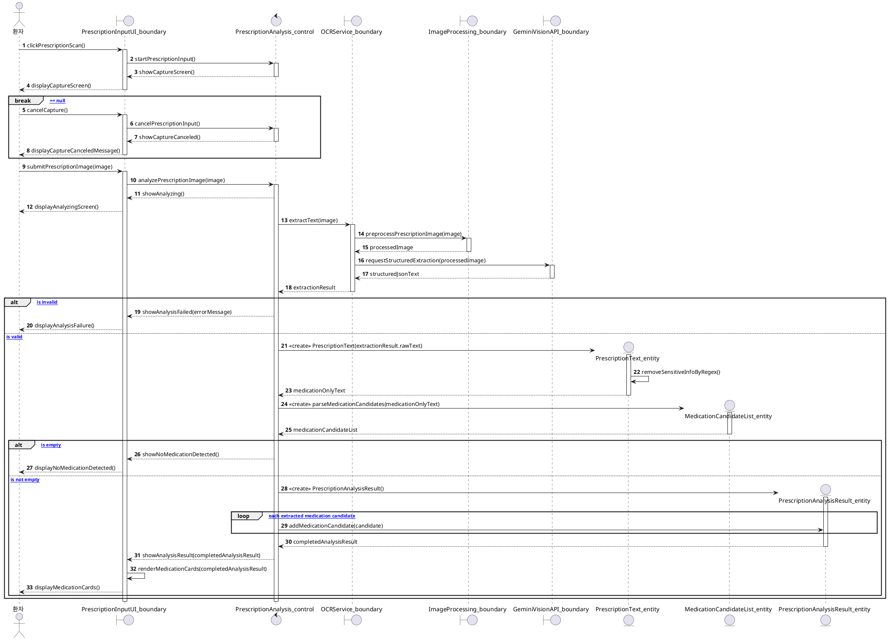
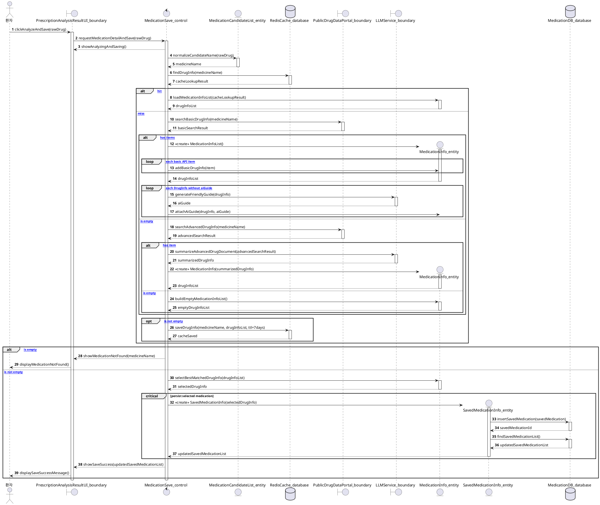
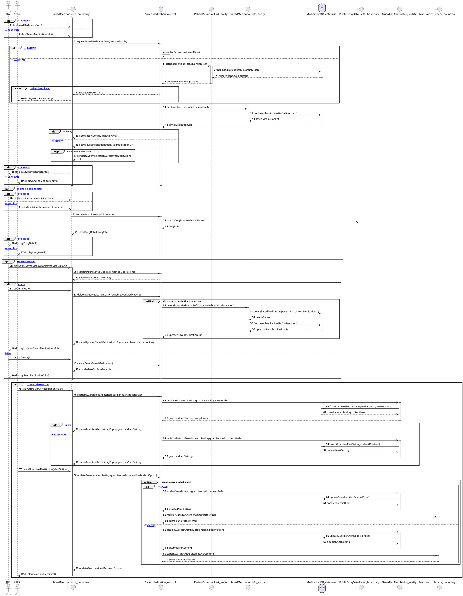
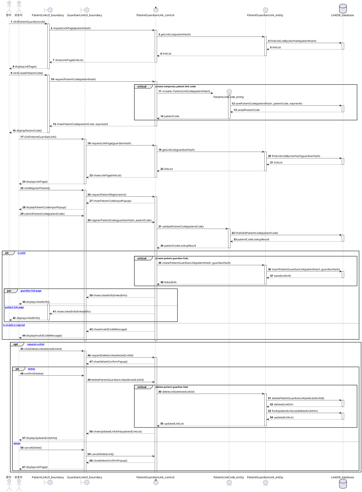
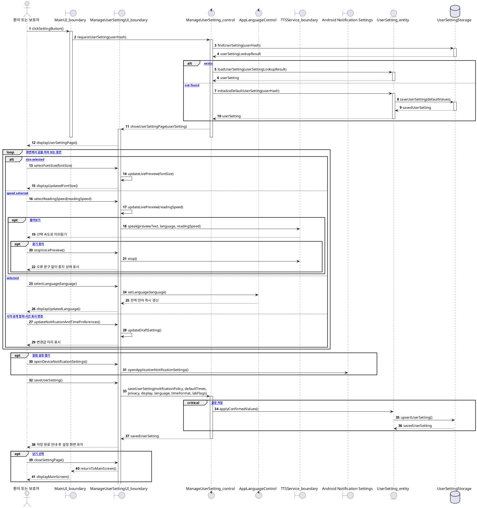
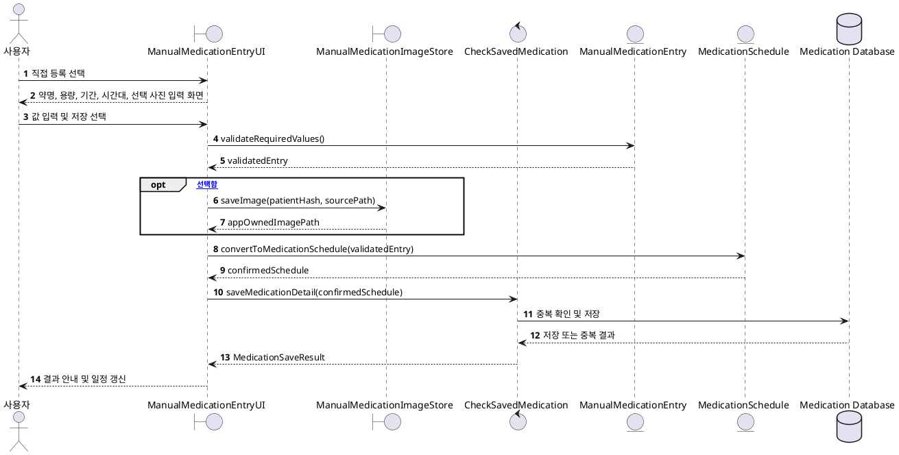
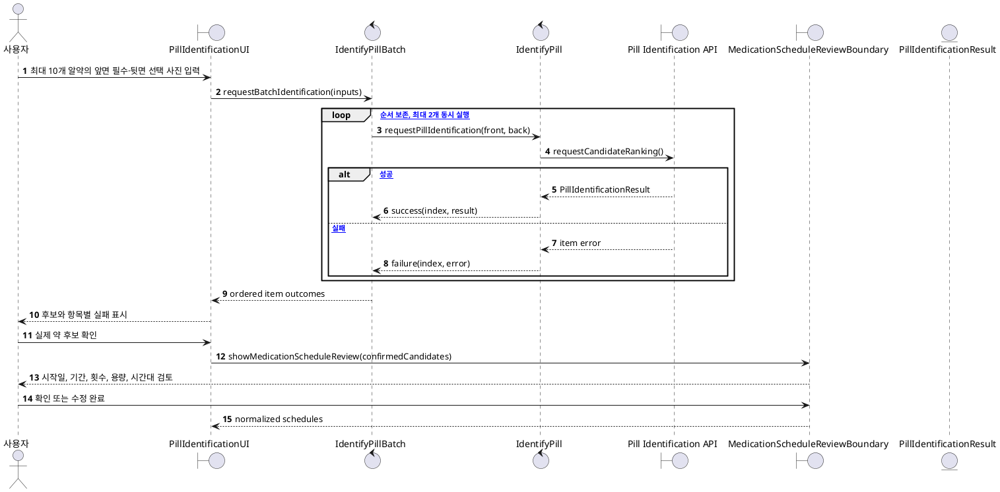
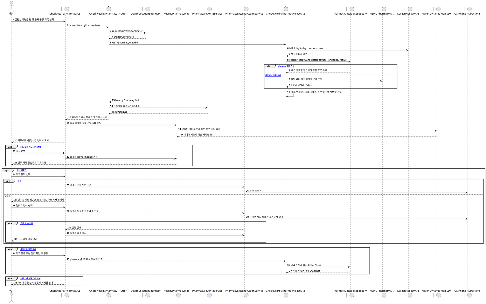
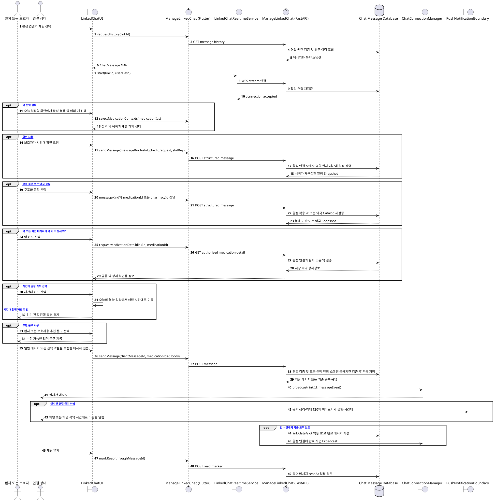

# MedBuddy Sequence Diagrams

이 문서는 MedBuddy의 주요 상호작용을 Boundary-Control-Entity 관점으로 정리한 PlantUML 시퀀스 다이어그램 제안본이다.

> **구현 상태 (2026-08-23):** 1~6번은 1학기 핵심 동작을 보존하되 현재
> 구현 이름과 설정 동작을 반영한다. 7~10번은 `beta/v0.2.0`에서 추가한
> 직접 등록, 다중 낱알 식별, 근처 운영 약국, 복약 맥락 채팅 흐름이다.
> 인증·인가·HTTPS와 실험실 기능의 보안 경계는
> `MedBuddy - Beta Security Architecture.md`를 따른다.

## 수정 기준과 논거

- `boundary`는 사용자 화면, 외부 API, 로컬 저장소처럼 시스템 경계에서 입출력을 담당하는 객체로 둔다.
- `control`은 시나리오의 순서, 분기 조건, 트랜잭션 흐름을 조정하는 객체로 둔다.
- `entity`는 처방 분석 결과, 저장 복약 정보, 사용자 설정, 연동 정보처럼 도메인 상태를 가지는 객체로 둔다.
- `database`는 entity의 영속화 저장소로만 표현한다. DB가 직접 업무 규칙을 판단하지 않는다.
- `alt`는 상호 배타적인 조건 분기에만 사용한다. 예: 환자/보호자 권한, 캐시 hit/miss, API 조회 성공/실패.
- `opt`는 기본 시나리오 이후 사용자가 선택할 때만 발생하는 확장 흐름에 사용한다. 예: 상세 보기, 삭제, 알림 설정, 음성 안내.
- `loop`는 동일한 메시지 패턴이 반복되는 경우에만 사용한다. 예: 약물 후보 반복, 복약 카드 렌더링, 설정 항목 반복 변경.
- `break`는 이후 흐름을 진행할 수 없는 중단 조건에 사용한다. 예: 촬영 취소, 연동 환자 없음, 약 정보 미검색.
- `critical`은 DB 상태 변경과 외부 알림 등록처럼 원자성이 필요한 변경 구간에 사용한다.
- `par`는 하나의 커밋 이후 서로 독립적으로 갱신 가능한 UI/알림 흐름에만 제한적으로 사용한다.

최종 시퀀스 다이어그램은 다음 10개로 구성한다.

| No. | 시나리오 | 관련 유스케이스 |
| --- | --- | --- |
| 1 | 처방전/약봉투 이미지 입력, 분석, 결과 확인 | UC-1, UC-2 |
| 2 | 분석된 약물 상세 조회 및 저장 | UC-4, UC-9 |
| 3 | 저장된 복약 정보 조회, 상세 확인, 삭제, 보호자 알림 설정 | UC-4, UC-5, UC-9, UC-13 |
| 4 | 오늘의 복약 일정 확인, 건강 추천, 음성 안내, 알림, 복약 완료 | UC-3, UC-8, UC-10, UC-11, UC-12 |
| 5 | 환자/보호자 연동 및 연동 해제 | UC-6, UC-7 |
| 6 | 사용자 설정 | UC-14 |
| 7 | 복약정보 직접 등록 및 일정 검토 | UC-25, UC-29 |
| 8 | 다중 낱알 약 일괄 식별 및 일정 검토 | UC-20, UC-26, UC-29 |
| 9 | 근처 운영 약국 조회 | UC-27 |
| 10 | 복약 맥락 채팅 | UC-28 |

## 1. 처방전/약봉투 이미지 입력, 분석, 결과 확인

### 수정 논거

- 촬영 취소는 이후 OCR/AI 분석으로 진행될 수 없으므로 `break [pickedFile == null]`로 중단 조건을 명확히 했다.
- OCR/Gemini 응답 이후 후보 약물이 없는 경우와 후보가 있는 경우는 상호 배타적이므로 `alt`로 분리했다.
- 약물 후보 카드는 후보 수만큼 반복 생성되므로 `loop [for each extracted medication candidate]`로 표현했다.
- 분석 결과 객체 구성은 성공 경로에서만 발생하므로 실패/빈 결과 경로 밖으로 새지 않도록 했다.

```plantuml
@startuml SD01_Prescription_Analysis
autonumber
actor "환자" as Patient
boundary "PrescriptionInputUI_boundary" as UI
control "PrescriptionAnalysis_control" as C
boundary "OCRService_boundary" as OCR
boundary "ImageProcessing_boundary" as Img
boundary "GeminiVisionAPI_boundary" as Gemini
entity "PrescriptionText_entity" as Text
entity "MedicationCandidateList_entity" as Candidates
entity "PrescriptionAnalysisResult_entity" as Result

Patient -> UI : clickPrescriptionScan()
activate UI
UI -> C : startPrescriptionInput()
activate C
C --> UI : showCaptureScreen()
deactivate C
UI --> Patient : displayCaptureScreen()
deactivate UI

break [pickedFile == null]
  Patient -> UI : cancelCapture()
  activate UI
  UI -> C : cancelPrescriptionInput()
  activate C
  C --> UI : showCaptureCanceled()
  deactivate C
  UI --> Patient : displayCaptureCanceledMessage()
  deactivate UI
end

Patient -> UI : submitPrescriptionImage(image)
activate UI
UI -> C : analyzePrescriptionImage(image)
activate C
C --> UI : showAnalyzing()
UI --> Patient : displayAnalyzingScreen()

C -> OCR : extractText(image)
activate OCR
OCR -> Img : preprocessPrescriptionImage(image)
activate Img
Img --> OCR : processedImage
deactivate Img
OCR -> Gemini : requestStructuredExtraction(processedImage)
activate Gemini
Gemini --> OCR : structuredJsonText
deactivate Gemini
OCR --> C : extractionResult
deactivate OCR

alt [extractionResult is invalid]
  C --> UI : showAnalysisFailed(errorMessage)
  UI --> Patient : displayAnalysisFailure()
else [extractionResult is valid]
  create Text
  C -> Text : <<create>> PrescriptionText(extractionResult.rawText)
  activate Text
  Text -> Text : removeSensitiveInfoByRegex()
  Text --> C : medicationOnlyText
  deactivate Text

  create Candidates
  C -> Candidates : <<create>> parseMedicationCandidates(medicationOnlyText)
  activate Candidates
  Candidates --> C : medicationCandidateList
  deactivate Candidates

  alt [medicationCandidateList is empty]
    C --> UI : showNoMedicationDetected()
    UI --> Patient : displayNoMedicationDetected()
  else [medicationCandidateList is not empty]
    create Result
    C -> Result : <<create>> PrescriptionAnalysisResult()
    activate Result
    loop [for each extracted medication candidate]
      C -> Result : addMedicationCandidate(candidate)
    end
    Result --> C : completedAnalysisResult
    deactivate Result

    C --> UI : showAnalysisResult(completedAnalysisResult)
    UI -> UI : renderMedicationCards(completedAnalysisResult)
    UI --> Patient : displayMedicationCards()
  end
end

deactivate C
deactivate UI
@enduml
```

## 2. 분석된 약물 상세 조회 및 저장

### 수정 논거

- Redis 캐시 조회는 `cache hit`과 `cache miss`가 동시에 성립할 수 없으므로 `alt`로 분리했다.
- 공공 API 조회는 실제 코드 흐름처럼 Basic API 우선, 결과가 없으면 Advanced API fallback으로 표현했다.
- Basic API는 여러 건을 반환할 수 있으므로 `loop [for each basic API item]`와 `loop [for each DrugInfo without aiGuide]`를 사용했다.
- 조회 결과가 없는 경우 저장으로 넘어가면 안 되므로 `alt [drugInfoList is empty]`에서 사용자에게 실패를 표시하고 저장 경로와 분리했다.
- 저장은 DB insert, commit, 목록 최신화가 하나의 변경 흐름이므로 `critical persist selected medication`으로 묶었다.

```plantuml
@startuml SD02_Drug_Detail_Save
autonumber
actor "환자" as Patient
boundary "PrescriptionAnalysisResultUI_boundary" as UI
control "MedicationSave_control" as C
entity "MedicationCandidateList_entity" as Candidates
database "RedisCache_database" as Cache
boundary "PublicDrugDataPortal_boundary" as DrugAPI
boundary "LLMService_boundary" as LLM
entity "MedicationInfo_entity" as Info
entity "SavedMedicationInfo_entity" as Saved
database "MedicationDB_database" as DB

Patient -> UI : clickAnalyzeAndSave(rawDrug)
activate UI
UI -> C : requestMedicationDetailAndSave(rawDrug)
activate C
C --> UI : showAnalyzingAndSaving()

C -> Candidates : normalizeCandidateName(rawDrug)
activate Candidates
Candidates --> C : medicineName
deactivate Candidates

C -> Cache : findDrugInfo(medicineName)
activate Cache
Cache --> C : cacheLookupResult
deactivate Cache

alt [cache hit]
  C -> Info : loadMedicationInfoList(cacheLookupResult)
  activate Info
  Info --> C : drugInfoList
  deactivate Info
else [cache miss]
  C -> DrugAPI : searchBasicDrugInfo(medicineName)
  activate DrugAPI
  DrugAPI --> C : basicSearchResult
  deactivate DrugAPI

  alt [basicSearchResult has items]
    create Info
    C -> Info : <<create>> MedicationInfoList()
    activate Info
    loop [for each basic API item]
      C -> Info : addBasicDrugInfo(item)
    end
    Info --> C : drugInfoList
    deactivate Info

    loop [for each DrugInfo without aiGuide]
      C -> LLM : generateFriendlyGuide(drugInfo)
      activate LLM
      LLM --> C : aiGuide
      deactivate LLM
      C -> Info : attachAiGuide(drugInfo, aiGuide)
    end
  else [basicSearchResult is empty]
    C -> DrugAPI : searchAdvancedDrugInfo(medicineName)
    activate DrugAPI
    DrugAPI --> C : advancedSearchResult
    deactivate DrugAPI

    alt [advancedSearchResult has item]
      C -> LLM : summarizeAdvancedDrugDocument(advancedSearchResult)
      activate LLM
      LLM --> C : summarizedDrugInfo
      deactivate LLM
      create Info
      C -> Info : <<create>> MedicationInfo(summarizedDrugInfo)
      activate Info
      Info --> C : drugInfoList
      deactivate Info
    else [advancedSearchResult is empty]
      C -> Info : buildEmptyMedicationInfoList()
      activate Info
      Info --> C : emptyDrugInfoList
      deactivate Info
    end
  end

  opt [drugInfoList is not empty]
    C -> Cache : saveDrugInfo(medicineName, drugInfoList, ttl=7days)
    activate Cache
    Cache --> C : cacheSaved
    deactivate Cache
  end
end

alt [drugInfoList is empty]
  C --> UI : showMedicationNotFound(medicineName)
  UI --> Patient : displayMedicationNotFound()
else [drugInfoList is not empty]
  C -> Info : selectBestMatchedDrugInfo(drugInfoList)
  activate Info
  Info --> C : selectedDrugInfo
  deactivate Info

  critical persist selected medication
    create Saved
    C -> Saved : <<create>> SavedMedicationInfo(selectedDrugInfo)
    activate Saved
    Saved -> DB : insertSavedMedication(savedMedication)
    activate DB
    DB --> Saved : savedMedicationId
    deactivate DB
    Saved -> DB : findSavedMedicationList()
    activate DB
    DB --> Saved : updatedSavedMedicationList
    deactivate DB
    Saved --> C : updatedSavedMedicationList
    deactivate Saved
  end

  C --> UI : showSaveSuccess(updatedSavedMedicationList)
  UI --> Patient : displaySaveSuccessMessage()
end

deactivate C
deactivate UI
@enduml
```

## 3. 저장된 복약 정보 조회, 상세 확인, 삭제, 보호자 알림 설정

### 수정 논거

- 환자는 자신의 `patientHash`로 바로 조회하지만, 보호자는 연동된 환자를 먼저 찾아야 하므로 `alt [role == PATIENT] / [role == GUARDIAN]`로 접근 경로를 분리했다.
- 보호자에게 연동 환자가 없으면 저장 복약 정보 조회가 불가능하므로 `break [linked patient is not found]`로 중단 조건을 둔다.
- 조회된 복약 정보 목록 렌더링은 항목 수만큼 반복되므로 `loop [for each saved medication]`로 표시했다.
- 상세 확인, 삭제, 보호자 알림 설정은 기본 조회 이후 선택적으로 발생하므로 각각 `opt`로 분리했다.
- 삭제와 보호자 알림 변경은 DB 상태와 알림 서비스 상태가 함께 바뀌므로 `critical` 구간으로 묶었다.

```plantuml
@startuml SD03_Saved_Medication_Management
autonumber
actor "환자" as Patient
actor "보호자" as Guardian
boundary "SavedMedicationUI_boundary" as UI
control "SavedMedication_control" as C
entity "PatientGuardianLink_entity" as CareLink
entity "SavedMedicationInfo_entity" as Saved
database "MedicationDB_database" as DB
boundary "PublicDrugDataPortal_boundary" as DrugAPI
entity "GuardianAlertSetting_entity" as Alert
boundary "NotificationService_boundary" as Notify

alt [role == PATIENT]
  Patient -> UI : clickSavedMedicationInfo()
else [role == GUARDIAN]
  Guardian -> UI : clickSharedMedicationInfo()
end
activate UI
UI -> C : requestSavedMedicationInfo(userHash, role)
activate C

alt [role == PATIENT]
  C -> C : resolvePatientHash(userHash)
else [role == GUARDIAN]
  C -> CareLink : getLinkedPatientHash(guardianHash)
  activate CareLink
  CareLink -> DB : findLinkedPatientHash(guardianHash)
  activate DB
  DB --> CareLink : linkedPatientLookupResult
  deactivate DB
  CareLink --> C : linkedPatientLookupResult
  deactivate CareLink

  break [linked patient is not found]
    C --> UI : showNoLinkedPatient()
    UI --> Guardian : displayNoLinkedPatient()
  end
end

C -> Saved : getSavedMedicationList(patientHash)
activate Saved
Saved -> DB : findSavedMedicationList(patientHash)
activate DB
DB --> Saved : savedMedicationList
deactivate DB
Saved --> C : savedMedicationList
deactivate Saved

alt [savedMedicationList is empty]
  C --> UI : showEmptySavedMedicationInfo()
else [savedMedicationList is not empty]
  C --> UI : showSavedMedicationInfo(savedMedicationList)
  loop [for each saved medication]
    UI -> UI : renderSavedMedicationCard(savedMedication)
  end
end

alt [role == PATIENT]
  UI --> Patient : displaySavedMedicationInfo()
else [role == GUARDIAN]
  UI --> Guardian : displaySharedMedicationInfo()
end
deactivate C
deactivate UI

opt [user selects a medicine detail]
  alt [selected by patient]
    Patient -> UI : clickMedicineName(medicineName)
  else [selected by guardian]
    Guardian -> UI : clickMedicineName(medicineName)
  end
  activate UI
  UI -> C : requestDrugInfo(medicineName)
  activate C
  C -> DrugAPI : searchDrugInfo(medicineName)
  activate DrugAPI
  DrugAPI --> C : drugInfo
  deactivate DrugAPI
  C --> UI : showDrugDetail(drugInfo)
  alt [selected by patient]
    UI --> Patient : displayDrugDetail()
  else [selected by guardian]
    UI --> Guardian : displayDrugDetail()
  end
  deactivate C
  deactivate UI
end

opt [patient requests deletion]
  Patient -> UI : clickDeleteSavedMedication(savedMedicationId)
  activate UI
  UI -> C : requestDeleteSavedMedication(savedMedicationId)
  activate C
  C --> UI : showDeleteConfirmPopup()

  alt [confirm delete]
    Patient -> UI : confirmDelete()
    UI -> C : deleteSavedMedication(patientHash, savedMedicationId)
    critical delete saved medication transaction
      C -> Saved : deleteSavedMedicationInfo(patientHash, savedMedicationId)
      activate Saved
      Saved -> DB : deleteSavedMedication(patientHash, savedMedicationId)
      activate DB
      DB --> Saved : deleteStatus
      deactivate DB
      Saved -> DB : findSavedMedicationList(patientHash)
      activate DB
      DB --> Saved : updatedSavedMedicationList
      deactivate DB
      Saved --> C : updatedSavedMedicationList
      deactivate Saved
    end
    C --> UI : showUpdatedSavedMedicationInfo(updatedSavedMedicationList)
    UI --> Patient : displayUpdatedSavedMedicationInfo()
  else [cancel delete]
    Patient -> UI : cancelDelete()
    UI -> C : cancelDeleteSavedMedication()
    C --> UI : closeDeleteConfirmPopup()
    UI --> Patient : displaySavedMedicationInfo()
  end

  deactivate C
  deactivate UI
end

opt [guardian changes alert setting]
  Guardian -> UI : clickGuardianAlertBell(patientHash)
  activate UI
  UI -> C : requestGuardianAlertSetting(guardianHash, patientHash)
  activate C
  C -> Alert : getGuardianAlertSetting(guardianHash, patientHash)
  activate Alert
  Alert -> DB : findGuardianAlertSetting(guardianHash, patientHash)
  activate DB
  DB --> Alert : guardianAlertSettingLookupResult
  deactivate DB
  Alert --> C : guardianAlertSettingLookupResult
  deactivate Alert

  alt [setting exists]
    C --> UI : showGuardianAlertSettingPopup(guardianAlertSetting)
  else [setting does not exist]
    C -> Alert : initializeDefaultGuardianAlertSetting(guardianHash, patientHash)
    activate Alert
    Alert -> DB : insertGuardianAlertSetting(defaultDisabled)
    activate DB
    DB --> Alert : createdAlertSetting
    deactivate DB
    Alert --> C : guardianAlertSetting
    deactivate Alert
    C --> UI : showGuardianAlertSettingPopup(guardianAlertSetting)
  end

  Guardian -> UI : selectGuardianAlertOption(alertOption)
  UI -> C : updateGuardianAlertSetting(guardianHash, patientHash, alertOption)

  critical update guardian alert state
    alt [alertOption == ENABLE]
      C -> Alert : enableGuardianAlert(guardianHash, patientHash)
      activate Alert
      Alert -> DB : updateGuardianAlertEnabled(true)
      activate DB
      DB --> Alert : enabledAlertSetting
      deactivate DB
      Alert --> C : enabledAlertSetting
      deactivate Alert
      C -> Notify : registerGuardianAlert(enabledAlertSetting)
      activate Notify
      Notify --> C : guardianAlertRegistered
      deactivate Notify
    else [alertOption == DISABLE]
      C -> Alert : disableGuardianAlert(guardianHash, patientHash)
      activate Alert
      Alert -> DB : updateGuardianAlertEnabled(false)
      activate DB
      DB --> Alert : disabledAlertSetting
      deactivate DB
      Alert --> C : disabledAlertSetting
      deactivate Alert
      C -> Notify : cancelGuardianAlert(disabledAlertSetting)
      activate Notify
      Notify --> C : guardianAlertCancelled
      deactivate Notify
    end
  end

  C --> UI : updateGuardianAlertBell(alertOption)
  UI --> Guardian : displayGuardianAlertState()
  deactivate C
  deactivate UI
end
@enduml
```

## 4. 오늘의 복약 일정 확인, 건강 추천, 음성 안내, 알림, 복약 완료

### 수정 논거

- 환자와 보호자는 같은 화면을 볼 수 있지만 권한 해석 방식이 다르므로 일정 조회 전 `alt`로 환자 식별 과정을 분리했다.
- 보호자가 연동된 환자를 찾지 못하면 이후 일정 조회가 불가능하므로 `break [linked patient is not found]`를 둔다.
- 복약 일정은 여러 약과 여러 시간대의 조합으로 구성되므로 `loop [for each medication and time slot]`로 일정 계산을 표현했다.
- 건강 추천, 약 상세 정보, 음성 안내, 알림 설정, 복약 완료는 오늘 일정 조회 이후 선택적으로 발생하는 확장 흐름이므로 `opt`로 분리했다.
- 알림 설정과 복약 완료 기록은 상태 변경이므로 `critical`로 묶었다.

```plantuml
@startuml SD04_Today_Medication
autonumber
actor "환자" as Patient
actor "보호자" as Guardian
boundary "TodayMedicationUI_boundary" as UI
control "TodayMedication_control" as C
entity "PatientGuardianLink_entity" as CareLink
entity "MedicationSchedule_entity" as Schedule
database "MedicationDB_database" as DB
entity "HealthRecommendation_entity" as Recommend
boundary "LLMService_boundary" as LLM
boundary "PublicDrugDataPortal_boundary" as DrugAPI
entity "MedicationAlarm_entity" as Alarm
boundary "NotificationService_boundary" as Notify
boundary "TTSService_boundary" as TTS
entity "MedicationCompletion_entity" as Complete

alt [role == PATIENT]
  Patient -> UI : openMainScreen()
else [role == GUARDIAN]
  Guardian -> UI : openSharedMainScreen()
end
activate UI
UI -> C : requestTodayMedicationSummary(userHash, role)
activate C

alt [role == PATIENT]
  C -> C : resolvePatientHash(userHash)
else [role == GUARDIAN]
  C -> CareLink : getLinkedPatientHash(guardianHash)
  activate CareLink
  CareLink -> DB : findLinkedPatientHash(guardianHash)
  activate DB
  DB --> CareLink : linkedPatientLookupResult
  deactivate DB
  CareLink --> C : linkedPatientLookupResult
  deactivate CareLink

  break [linked patient is not found]
    C --> UI : showNoLinkedPatient()
    UI --> Guardian : displayNoLinkedPatient()
  end
end

C -> Schedule : getTodayMedicationSummary(patientHash)
activate Schedule
Schedule -> DB : findTodayMedicationSummary(patientHash)
activate DB
DB --> Schedule : todayMedicationSummaryData
deactivate DB
loop [for each medication and time slot]
  Schedule -> Schedule : calculateDoseSummary(medication, timeSlot)
end
Schedule --> C : todayMedicationSummary
deactivate Schedule
C --> UI : showMainTodaySchedule(todayMedicationSummary)
alt [role == PATIENT]
  UI --> Patient : displayMainTodaySchedule()
else [role == GUARDIAN]
  UI --> Guardian : displaySharedTodaySchedule()
end
deactivate C
deactivate UI

opt [user opens today's medication schedule]
  alt [opened by patient]
    Patient -> UI : clickTodayMedicationSchedule()
  else [opened by guardian]
    Guardian -> UI : clickTodayMedicationSchedule()
  end
  activate UI
  UI -> C : requestTodayMedicationSchedule(patientHash)
  activate C
  C -> Schedule : getTodayMedicationSchedule(patientHash)
  activate Schedule
  Schedule -> DB : findTodayMedicationSchedule(patientHash)
  activate DB
  DB --> Schedule : todayMedicationScheduleData
  deactivate DB
  loop [for each schedule item]
    Schedule -> Schedule : buildScheduleItemViewModel(scheduleItem)
  end
  Schedule --> C : todayMedicationSchedule
  deactivate Schedule
  C --> UI : showTodaySchedule(todayMedicationSchedule)
  alt [opened by patient]
    UI --> Patient : displayTodayMedicationSchedule()
  else [opened by guardian]
    UI --> Guardian : displaySharedTodayMedicationSchedule()
  end
  deactivate C
  deactivate UI
end

opt [user requests health recommendation]
  alt [requested by patient]
    Patient -> UI : clickHealthRecommendation()
  else [requested by guardian]
    Guardian -> UI : clickHealthRecommendation()
  end
  activate UI
  UI -> C : requestHealthRecommendation(patientHash)
  activate C
  C -> Schedule : getMedicationContext(patientHash)
  activate Schedule
  Schedule -> DB : findMedicationContext(patientHash)
  activate DB
  DB --> Schedule : medicationContextData
  deactivate DB
  Schedule --> C : medicationContext
  deactivate Schedule
  C -> LLM : generateHealthRecommendation(medicationContext)
  activate LLM
  LLM --> C : recommendationMessage
  deactivate LLM
  create Recommend
  C -> Recommend : <<create>> HealthRecommendation(recommendationMessage)
  activate Recommend
  Recommend --> C : healthRecommendation
  deactivate Recommend
  C --> UI : showHealthRecommendation(healthRecommendation)
  alt [requested by patient]
    UI --> Patient : displayHealthRecommendation()
  else [requested by guardian]
    UI --> Guardian : displayHealthRecommendation()
  end
  deactivate C
  deactivate UI
end

opt [user selects medicine detail]
  alt [selected by patient]
    Patient -> UI : clickMedicineName(medicineName)
  else [selected by guardian]
    Guardian -> UI : clickMedicineName(medicineName)
  end
  activate UI
  UI -> C : requestDrugInfo(medicineName)
  activate C
  C -> DrugAPI : searchDrugInfo(medicineName)
  activate DrugAPI
  DrugAPI --> C : drugInfo
  deactivate DrugAPI
  C --> UI : showDrugDetail(drugInfo)
  alt [selected by patient]
    UI --> Patient : displayDrugDetail()
  else [selected by guardian]
    UI --> Guardian : displayDrugDetail()
  end
  deactivate C
  deactivate UI
end

opt [patient requests read aloud]
  Patient -> UI : clickReadAloud(text)
  activate UI
  UI -> C : requestTTS(text)
  activate C
  C -> TTS : readDoseInstruction(text)
  activate TTS
  TTS --> C : ttsAudio
  deactivate TTS
  C --> UI : playTTSAudio(ttsAudio)
  UI --> Patient : hearDoseInstruction()
  deactivate C
  deactivate UI
end

opt [patient changes medication alarm]
  Patient -> UI : clickAlarmBell(timeSlot)
  activate UI
  UI -> C : requestAlarmToggle(patientHash, timeSlot)
  activate C
  C -> Alarm : getAlarmStatus(patientHash, timeSlot)
  activate Alarm
  Alarm -> DB : findAlarmSetting(patientHash, timeSlot)
  activate DB
  DB --> Alarm : alarmStatus
  deactivate DB
  Alarm --> C : alarmStatus
  deactivate Alarm

  critical update medication alarm state
    alt [alarm disabled or not found]
      C --> UI : showAlarmSettingPopup()
      Patient -> UI : submitAlarmTime(alarmTime)
      UI -> C : setMedicationAlarm(patientHash, timeSlot, alarmTime)
      C -> Alarm : upsertMedicationAlarm(patientHash, timeSlot, alarmTime)
      activate Alarm
      Alarm -> DB : saveAlarmSetting(patientHash, timeSlot, alarmTime)
      activate DB
      DB --> Alarm : savedAlarmSetting
      deactivate DB
      Alarm --> C : savedAlarmSetting
      deactivate Alarm
      C -> Notify : registerMedicationAlarm(savedAlarmSetting)
      activate Notify
      Notify --> C : alarmRegistered
      deactivate Notify
      C --> UI : displayEnabledAlarmBell()
    else [alarm enabled]
      C -> Alarm : disableAlarmSetting(patientHash, timeSlot)
      activate Alarm
      Alarm -> DB : updateAlarmEnabled(patientHash, timeSlot, false)
      activate DB
      DB --> Alarm : disabledAlarmSetting
      deactivate DB
      Alarm --> C : disabledAlarmSetting
      deactivate Alarm
      C -> Notify : cancelMedicationAlarm(disabledAlarmSetting)
      activate Notify
      Notify --> C : alarmCancelled
      deactivate Notify
      C --> UI : displayDisabledAlarmBell()
    end
  end

  deactivate C
  deactivate UI
end

opt [patient checks medication as taken]
  Patient -> UI : clickMedicationCheck(medicineName, timeSlot)
  activate UI
  UI -> C : completeMedication(patientHash, medicineName, timeSlot)
  activate C
  critical record completion and refresh progress
    create Complete
    C -> Complete : <<create>> MedicationCompletion(patientHash, medicineName, timeSlot)
    activate Complete
    Complete -> DB : insertMedicationCompletion(patientHash, medicineName, timeSlot)
    activate DB
    DB --> Complete : savedCompletion
    deactivate DB
    Complete --> C : completionStatus
    deactivate Complete
    C -> Schedule : updateMedicationProgress(patientHash)
    activate Schedule
    Schedule -> DB : findTodayMedicationProgress(patientHash)
    activate DB
    DB --> Schedule : todayMedicationProgressData
    deactivate DB
    Schedule --> C : updatedProgress
    deactivate Schedule
  end
  C --> UI : showUpdatedMedicationSchedule(updatedProgress)
  UI --> Patient : displayCheckedMedicineAndProgress()
  deactivate C
  deactivate UI
end
@enduml
```

## 5. 환자/보호자 연동 및 연동 해제

### 수정 논거

- 환자 코드 생성과 보호자 코드 등록은 시간 순서가 있는 하나의 연동 시나리오이므로 같은 다이어그램에 둔다.
- 코드 검증 성공/실패는 상호 배타적이므로 `alt [patientCode is valid] / [patientCode is invalid or expired]`로 표현했다.
- 연동 관계 생성과 삭제는 DB 상태 변경이므로 `critical`로 묶었다.
- 연동 생성 후 환자 화면과 보호자 화면의 갱신은 동일 커밋 이후 독립적으로 가능하므로 `par`로 표현했다.
- 연동 해제는 사용자가 선택할 때만 발생하므로 `opt`, 해제 확인/취소는 `alt`로 표현했다.

```plantuml
@startuml SD05_Patient_Guardian_Link
autonumber
actor "환자" as Patient
actor "보호자" as Guardian
boundary "PatientLinkUI_boundary" as PatientUI
boundary "GuardianLinkUI_boundary" as GuardianUI
control "PatientGuardianLink_control" as C
entity "PatientLinkCode_entity" as Code
entity "PatientGuardianLink_entity" as CareLink
database "LinkDB_database" as DB

Patient -> PatientUI : clickPatientGuardianLink()
activate PatientUI
PatientUI -> C : requestLinkPage(patientHash)
activate C
C -> CareLink : getLinkList(patientHash)
activate CareLink
CareLink -> DB : findLinkListByUserHash(patientHash)
activate DB
DB --> CareLink : linkList
deactivate DB
CareLink --> C : linkList
deactivate CareLink
C --> PatientUI : showLinkPage(linkList)
deactivate C
PatientUI --> Patient : displayLinkPage()
deactivate PatientUI

Patient -> PatientUI : clickCreatePatientCode()
activate PatientUI
PatientUI -> C : requestPatientCode(patientHash)
activate C
critical create temporary patient link code
  create Code
  C -> Code : <<create>> PatientLinkCode(patientHash)
  activate Code
  Code -> DB : savePatientCode(patientHash, patientCode, expiresAt)
  activate DB
  DB --> Code : savedPatientCode
  deactivate DB
  Code --> C : patientCode
  deactivate Code
end
C --> PatientUI : showPatientCode(patientCode, expiresAt)
deactivate C
PatientUI --> Patient : displayPatientCode()
deactivate PatientUI

Guardian -> GuardianUI : clickPatientGuardianLink()
activate GuardianUI
GuardianUI -> C : requestLinkPage(guardianHash)
activate C
C -> CareLink : getLinkList(guardianHash)
activate CareLink
CareLink -> DB : findLinkListByUserHash(guardianHash)
activate DB
DB --> CareLink : linkList
deactivate DB
CareLink --> C : linkList
deactivate CareLink
C --> GuardianUI : showLinkPage(linkList)
deactivate C
GuardianUI --> Guardian : displayLinkPage()
deactivate GuardianUI

Guardian -> GuardianUI : clickRegisterPatient()
activate GuardianUI
GuardianUI -> C : requestPatientRegistration()
activate C
C --> GuardianUI : showPatientCodeInputPopup()
GuardianUI --> Guardian : displayPatientCodeInputPopup()
Guardian -> GuardianUI : submitPatientCode(patientCode)
GuardianUI -> C : registerPatientCode(guardianHash, patientCode)
C -> Code : validatePatientCode(patientCode)
activate Code
Code -> DB : findValidPatientCode(patientCode)
activate DB
DB --> Code : patientCodeLookupResult
deactivate DB
Code --> C : patientCodeLookupResult
deactivate Code

alt [patientCode is valid]
  critical create patient guardian link
    C -> CareLink : createPatientGuardianLink(patientHash, guardianHash)
    activate CareLink
    CareLink -> DB : insertPatientGuardianLink(patientHash, guardianHash)
    activate DB
    DB --> CareLink : savedLinkInfo
    deactivate DB
    CareLink --> C : linkedInfo
    deactivate CareLink
  end

  par [update guardian link page]
    C --> GuardianUI : showLinkedInfo(linkedInfo)
    GuardianUI --> Guardian : displayLinkedInfo()
  else [update patient link page]
    activate PatientUI
    C --> PatientUI : showLinkedInfo(linkedInfo)
    PatientUI --> Patient : displayLinkedInfo()
    deactivate PatientUI
  end
else [patientCode is invalid or expired]
  C --> GuardianUI : showInvalidCodeMessage()
  GuardianUI --> Guardian : displayInvalidCodeMessage()
end
deactivate C
deactivate GuardianUI

opt [guardian requests unlink]
  Guardian -> GuardianUI : clickDeleteLink(selectedLinkId)
  activate GuardianUI
  GuardianUI -> C : requestDeleteLink(selectedLinkId)
  activate C
  C --> GuardianUI : showDeleteConfirmPopup()

  alt [confirm delete]
    Guardian -> GuardianUI : confirmDelete()
    GuardianUI -> C : deletePatientGuardianLink(selectedLinkId)
    critical delete patient guardian link
      C -> CareLink : deleteLink(selectedLinkId)
      activate CareLink
      CareLink -> DB : deletePatientGuardianLink(selectedLinkId)
      activate DB
      DB --> CareLink : deletedLinkInfo
      deactivate DB
      CareLink -> DB : findUpdatedLinkList(deletedLinkInfo)
      activate DB
      DB --> CareLink : updatedLinkList
      deactivate DB
      CareLink --> C : updatedLinkList
      deactivate CareLink
    end
    C --> GuardianUI : showUpdatedLinkInfo(updatedLinkList)
    GuardianUI --> Guardian : displayUpdatedLinkInfo()
  else [cancel delete]
    Guardian -> GuardianUI : cancelDelete()
    GuardianUI -> C : cancelDeleteLink()
    C --> GuardianUI : closeDeleteConfirmPopup()
    GuardianUI --> Guardian : displayLinkPage()
  end

  deactivate C
  deactivate GuardianUI
end
@enduml
```

## 6. 사용자 설정

### 수정 논거

- 사용자 설정이 없으면 기본 설정을 생성해야 하므로 `alt [setting exists] / [setting not found]`로 초기 조회 결과를 분리했다.
- 글자 크기와 언어 선택은 저장 전에도 현재 설정 화면에 즉시 반영되므로 `loop` 안에서 미리보기 상태만 갱신한다.
- 읽기 속도는 TTS 미리듣기로 확인하며 사용자가 직접 중지한 경우 오류로 처리하지 않는다.
- 복약·보호자·채팅 알림 허용, 잠금 화면 공개 범위, 시간 표시 방식과 신규 일정 기본 시각을 하나의 사용자 설정 계약으로 저장한다.
- 신규 일정 기본 시각은 이후 생성되는 일정에만 적용하고 이미 확인한 복약 일정은 변경하지 않는다.
- 명시적인 저장을 선택할 때만 서버 설정을 변경하고, 저장 후에도 설정 화면에 남는다.

```plantuml
@startuml SD06_User_Setting
autonumber
actor "환자 또는 보호자" as User
boundary "MainUI_boundary" as MainUI
boundary "ManageUserSettingUI_boundary" as SettingUI
control "ManageUserSetting_control" as C
control "AppLanguageControl" as LanguageControl
boundary "TTSService_boundary" as TTS
boundary "Android Notification Settings" as AndroidSettings
entity "UserSetting_entity" as Setting
database "UserSettingStorage" as Storage

User -> MainUI : clickSettingButton()
activate MainUI
MainUI -> C : requestUserSetting(userHash)
activate C
C -> Storage : findUserSetting(userHash)
activate Storage
Storage --> C : userSettingLookupResult
deactivate Storage

alt [setting exists]
  C -> Setting : loadUserSetting(userSettingLookupResult)
  activate Setting
  Setting --> C : userSetting
  deactivate Setting
else [setting not found]
  C -> Setting : initializeDefaultUserSetting(userHash)
  activate Setting
  Setting -> Storage : saveUserSetting(defaultValues)
  activate Storage
  Storage --> Setting : savedUserSetting
  deactivate Storage
  Setting --> C : userSetting
  deactivate Setting
end

C --> SettingUI : showUserSettingPage(userSetting)
activate SettingUI
deactivate C
deactivate MainUI
SettingUI --> User : displayUserSettingPage()

loop [설정 화면에서 값을 미리 보는 동안]
  alt [font size selected]
    User -> SettingUI : selectFontSize(fontSize)
    SettingUI -> SettingUI : updateLivePreview(fontSize)
    SettingUI --> User : displayUpdatedFontSize()
  else [reading speed selected]
    User -> SettingUI : selectReadingSpeed(readingSpeed)
    SettingUI -> SettingUI : updateLivePreview(readingSpeed)
    opt [음성으로 들어보기]
      SettingUI -> TTS : speak(previewText, language, readingSpeed)
      TTS --> User : 선택 속도로 미리듣기
      opt [사용자가 듣기 중지]
        User -> SettingUI : stopVoicePreview()
        SettingUI -> TTS : stop()
        SettingUI --> User : 오류 문구 없이 중지 상태 표시
      end
    end
  else [language selected]
    User -> SettingUI : selectLanguage(language)
    SettingUI -> LanguageControl : setLanguage(language)
    LanguageControl --> SettingUI : 전역 언어 즉시 갱신
    SettingUI --> User : displayUpdatedLanguage()
  else [알림·기본 시각·공개 범위·시간 표시 변경]
    User -> SettingUI : updateNotificationAndTimePreferences()
    SettingUI -> SettingUI : updateDraftSetting()
    SettingUI --> User : 변경값 미리 표시
  end
end

opt [휴대폰 알림 설정 열기]
  User -> SettingUI : openDeviceNotificationSettings()
  SettingUI -> AndroidSettings : openApplicationNotificationSettings()
end

User -> SettingUI : saveUserSetting()
SettingUI -> C : saveUserSetting(notificationPolicy, defaultTimes,\nprivacy, display, language, timeFormat, labFlags)
activate C
critical [사용자 설정 저장]
  C -> Setting : applyConfirmedValues()
  Setting -> Storage : upsertUserSetting()
  Storage --> Setting : savedUserSetting
end
C --> SettingUI : savedUserSetting
deactivate C
SettingUI --> User : 저장 완료 안내 후 설정 화면 유지

opt [사용자가 닫기 선택]
  User -> SettingUI : closeSettingPage()
  SettingUI --> MainUI : returnToMainScreen()
  MainUI --> User : displayMainScreen()
end
@enduml
```

## 7. 복약정보 직접 등록 및 일정 검토

### 수정 논거

- 직접 입력도 별도 저장 체계를 만들지 않고 기존 저장 복약정보와 일정 모델을 재사용한다.
- 선택 사진은 앱 전용 저장소에 보관하고 서버에는 로컬 경로를 전송하지 않는다.
- 저장 전 날짜·횟수·용량·시간대를 검토하여 사진 기반 입력과 동일한 일정 품질을 유지한다.

```plantuml
@startuml SD07_Manual_Medication_Entry
autonumber
actor "사용자" as User
boundary "ManualMedicationEntryUI" as UI
boundary "ManualMedicationImageStore" as ImageStore
control "CheckSavedMedication" as SaveControl
entity "ManualMedicationEntry" as Entry
entity "MedicationSchedule" as Schedule
database "Medication Database" as DB

User -> UI : 직접 등록 선택
UI --> User : 약명, 용량, 기간, 시간대, 선택 사진 입력 화면
User -> UI : 값 입력 및 저장 선택
UI -> Entry : validateRequiredValues()
Entry --> UI : validatedEntry
opt [사진을 선택함]
  UI -> ImageStore : saveImage(patientHash, sourcePath)
  ImageStore --> UI : appOwnedImagePath
end
UI -> Schedule : convertToMedicationSchedule(validatedEntry)
Schedule --> UI : confirmedSchedule
UI -> SaveControl : saveMedicationDetail(confirmedSchedule)
SaveControl -> DB : 중복 확인 및 저장
DB --> SaveControl : 저장 또는 중복 결과
SaveControl --> UI : MedicationSaveResult
UI --> User : 결과 안내 및 일정 갱신
@enduml
```

## 8. 다중 낱알 약 일괄 식별 및 일정 검토

### 수정 논거

- 일괄 식별은 검증된 단일 낱알 식별 컨트롤을 재사용한다.
- 최대 10개 입력과 최대 2개 동시 요청으로 외부 분석 호출을 제한한다.
- 한 항목이 실패해도 성공한 항목을 유지하고, 확인된 후보만 일정 검토와 저장으로 전달한다.

```plantuml
@startuml SD08_Multi_Pill_Batch
autonumber
actor "사용자" as User
boundary "PillIdentificationUI" as UI
control "IdentifyPillBatch" as Batch
control "IdentifyPill" as Single
boundary "Pill Identification API" as API
boundary "MedicationScheduleReviewBoundary" as Review
entity "PillIdentificationResult" as Result

User -> UI : 최대 10개 알약의 앞면 필수·뒷면 선택 사진 입력
UI -> Batch : requestBatchIdentification(inputs)
loop [입력 순서 보존, 최대 2개 동시 실행]
  Batch -> Single : requestPillIdentification(front, back)
  Single -> API : requestCandidateRanking()
  alt [항목 성공]
    API --> Single : PillIdentificationResult
    Single --> Batch : success(index, result)
  else [항목 실패]
    API --> Single : item error
    Single --> Batch : failure(index, error)
  end
end
Batch --> UI : ordered item outcomes
UI --> User : 후보와 항목별 실패 표시
User -> UI : 실제 약 후보 확인
UI -> Review : showMedicationScheduleReview(confirmedCandidates)
Review --> User : 시작일, 기간, 횟수, 용량, 시간대 검토
User -> Review : 확인 또는 수정 완료
Review --> UI : normalized schedules
@enduml
```

## 9. 근처 운영 약국 조회

### 수정 논거

- 기기는 좌표만 제공하고 공공데이터 인증키는 Backend가 소유한다.
- 위치 권한, 공공 API 조회, 거리·영업상태 계산, 앱 내 지도, 전화·길찾기 실행을 분리한다.
- 약국 카드와 지도 마커는 하나의 선택 상태를 공유하며 지도 이동만으로 공공 API를 다시 호출하지 않는다.
- 반복 새로고침은 화면에서 제한하여 불필요한 외부 API 호출을 줄인다.
- 즐겨찾기는 사용자별 기기 저장소에만 보관하며 서버 거리 정렬 결과를 변경하지 않는다.
- 전화·길찾기·주소 복사·출처·채팅 공유는 검증된 공통 외부 동작 서비스와 서버 약국 스냅샷을 사용한다.

```plantuml
@startuml SD09_Nearby_Pharmacy
autonumber
actor "사용자" as User
boundary "CheckNearbyPharmacyUI" as UI
control "CheckNearbyPharmacy (Flutter)" as FE
boundary "DeviceLocationBoundary" as Location
boundary "NearbyPharmacyMap" as Map
boundary "PharmacyFavoriteService" as Favorite
boundary "PharmacyExternalActionService" as ExternalAction
control "CheckNearbyPharmacy (FastAPI)" as BE
boundary "PharmacyCatalogRepository" as Catalog
boundary "NEMC Pharmacy API" as PharmacyAPI
boundary "KoreanHolidayAPI" as HolidayAPI
boundary "Naver Dynamic Map SDK" as NaverMap
boundary "OS Phone / Directions" as ExternalApp

User -> UI : 실험실 기능을 켠 뒤 근처 운영 약국 선택
UI -> FE : requestNearbyPharmacies()
FE -> Location : requestCurrentCoordinate()
Location --> FE : DeviceCoordinate
FE -> BE : GET /pharmacy/nearby
BE -> HolidayAPI : isHoliday(today, previous day)
HolidayAPI --> BE : 법정공휴일 여부
BE -> Catalog : searchNearbyCandidates(latitude, longitude, radius)
alt [지역 Catalog 조회 가능]
  Catalog --> BE : 주간·공휴일 영업시간 포함 약국 목록
else [Catalog가 비었거나 조회 실패]
  BE -> PharmacyAPI : 현재 위치 기준 실시간 보완 조회
  PharmacyAPI --> BE : 약국 위치와 운영시간
end
BE -> BE : 거리, 영업 중, 마감 임박, 다음 영업시각 계산 및 정렬
BE --> FE : NearbyPharmacy 목록
FE -> Favorite : 사용자별 즐겨찾기 ID 조회
Favorite --> FE : favoriteIds
FE --> UI : 즐겨찾기 우선 목록과 필터·갱신 상태
UI -> Map : 약국 좌표와 공통 선택 상태 전달
Map -> NaverMap : 인증된 SDK로 현재 화면 범위 지도 요청
NaverMap --> Map : 네이버 지도와 기본 저작권 표시
UI --> User : 지도·거리·운영시간·연락처 표시
opt [약국 카드 또는 지도 마커 선택]
  User -> UI : 약국 선택
  UI -> Map : selectedPharmacyId 갱신
  Map --> User : 선택 약국 중심으로 지도 이동
end
opt [전화 또는 길찾기]
  User -> UI : 약국 동작 선택
  alt [전화]
    UI -> ExternalAction : 검증된 전화번호 전달
    ExternalAction -> ExternalApp : 전화 앱 열기
  else [길찾기]
    UI --> User : 설치된 지도 앱, Google 지도, 주소 복사 선택지
    User -> UI : 길찾기 방식 선택
    UI -> ExternalAction : 검증된 약국명·좌표·주소 전달
    ExternalAction -> ExternalApp : 선택한 지도 앱 또는 브라우저 열기
    opt [외부 앱을 열 수 없음]
      ExternalAction --> UI : 실행 실패
      UI -> ExternalAction : 검증된 주소 복사
      UI --> User : 주소 복사 완료 안내
    end
  end
end
opt [연동 채팅으로 약국 공유]
  User -> UI : 약국 공유 또는 전화 확인 후 공유
  UI -> BE : pharmacyId와 메시지 유형 전송
  BE -> Catalog : 약국 존재와 최신 표시값 재조회
  Catalog --> BE : 신뢰 가능한 약국 Snapshot
end
opt [짧은 시간 안에 새로고침 반복]
  UI --> User : API 재호출 없이 남은 대기시간 안내
end
@enduml
```

## 10. 복약 맥락 채팅

### 수정 논거

- 실험실 기능이 켜져 있어도 활성 환자-보호자 연결과 현재 복용 약이 있어야 채팅을 사용할 수 있다.
- 메시지 저장은 REST, 실시간 수신은 WebSocket으로 분리하고 재연결 시 이력으로 누락을 보완한다.
- `clientMessageId`로 재전송 중복을 막고, 사용자가 약을 선택한 메시지는 전송 시점의 표시용 스냅샷을 선택적으로 보존한다.
- 일반 메시지는 약 선택 없이 전송할 수 있다. 약을 첨부할 때는 오늘 일정의 시간대별 화면을 재사용하고, 선택 약과 이전 메시지의 약 카드는 권한 확인 후 공통 상세 화면으로 이동한다.
- 상대가 채팅 화면에 없으면 공백을 정리하고 120자로 제한한 메시지 미리보기를 알림에 표시한다.
- 시간대 확인 요청, 자동 복용 완료, 약 부족·불편, 약국 공유는 `messageKind`로 구분하고 서버가 현재 일정·복용 기간·약국 Catalog에서 표시 스냅샷을 다시 만든다.
- 같은 날짜와 시간대의 자동 완료 메시지는 멱등 ID를 사용해 한 번만 저장한다.

```plantuml
@startuml SD10_Linked_Medication_Chat
autonumber
actor "환자 또는 보호자" as User
actor "연결 상대" as Peer
boundary "LinkedChatUI" as UI
control "ManageLinkedChat (Flutter)" as FE
boundary "LinkedChatRealtimeService" as Realtime
control "ManageLinkedChat (FastAPI)" as BE
database "Chat Message Database" as DB
boundary "ChatConnectionManager" as Connections
boundary "PushNotificationBoundary" as Push

User -> UI : 활성 연결의 채팅 선택
UI -> FE : requestHistory(linkId)
FE -> BE : GET message history
BE -> DB : 연결 권한 검증 및 최근 이력 조회
DB --> BE : 메시지와 복약 스냅샷
BE --> UI : ChatMessage 목록
UI -> Realtime : start(linkId, userHash)
Realtime -> BE : WSS stream 연결
BE -> DB : 활성 연결 재검증
BE --> Realtime : connection accepted

opt [메시지에 약 문맥 첨부]
  User -> UI : 오늘 일정형 화면에서 활성 복용 약 여러 개 선택
  UI -> FE : selectMedicationContexts(medicationIds)
  FE --> UI : 선택 약 목록과 개별 해제 상태
end
opt [시간대별 확인 요청]
  User -> UI : 보호자가 시간대 확인 요청
  UI -> FE : sendMessage(messageKind=slot_check_request, slotKey)
  FE -> BE : POST structured message
  BE -> DB : 활성 연결·보호자 역할·현재 시간대 일정 검증
  DB --> BE : 서버가 재구성한 일정 Snapshot
end
opt [약 부족·불편 또는 약국 공유]
  User -> UI : 구조화 동작 선택
  UI -> FE : messageKind와 medicationId 또는 pharmacyId 전달
  FE -> BE : POST structured message
  BE -> DB : 활성 복용 약 또는 약국 Catalog 재검증
  DB --> BE : 복용 기간 또는 약국 Snapshot
end
opt [선택 약 또는 이전 메시지의 약 카드 상세보기]
  User -> UI : 약 카드 선택
  UI -> FE : requestMedicationDetail(linkId, medicationId)
  FE -> BE : GET authorized medication detail
  BE -> DB : 활성 연결과 환자 소유 약 검증
  DB --> BE : 저장 복약 상세정보
  BE --> UI : 공통 약 상세 화면용 정보
end
opt [환자가 시간대 일정 카드 선택]
  User -> UI : 시간대 카드 선택
  UI -> UI : 오늘의 복약 일정에서 해당 시간대로 이동
else [보호자가 시간대 일정 카드 확인]
  UI --> User : 읽기 전용 진행 상태 유지
end
opt [역할별 추천 문구 사용]
  User -> UI : 환자 또는 보호자용 추천 문구 선택
  UI --> User : 수정 가능한 입력 문구 제공
end
User -> UI : 일반 메시지 또는 선택 약들을 포함한 메시지 전송
UI -> FE : sendMessage(clientMessageId, medicationIds?, body)
FE -> BE : POST message
BE -> DB : 연결 검증 및 모든 선택 약의 소유권·복용기간 검증 후 멱등 저장
DB --> BE : 저장 메시지 또는 기존 중복 응답
BE -> Connections : broadcast(linkId, messageEvent)
Connections --> Peer : 실시간 메시지
opt [상대가 실시간 연결 중이 아님]
  BE -> Push : 공백 정리·최대 120자 미리보기와 유형·시간대
  Push --> Peer : 채팅 또는 해당 복약 시간대로 이동할 알림
end
opt [환자가 한 시간대의 약을 모두 완료]
  BE -> DB : link/date/slot 멱등 ID로 완료 메시지 저장
  BE -> Connections : 활성 연결에 완료 사건 Broadcast
end
Peer -> UI : 채팅 열기
UI -> FE : markRead(throughMessageId)
FE -> BE : POST read marker
BE -> DB : 상대 메시지 readAt 일괄 갱신
@enduml
```
