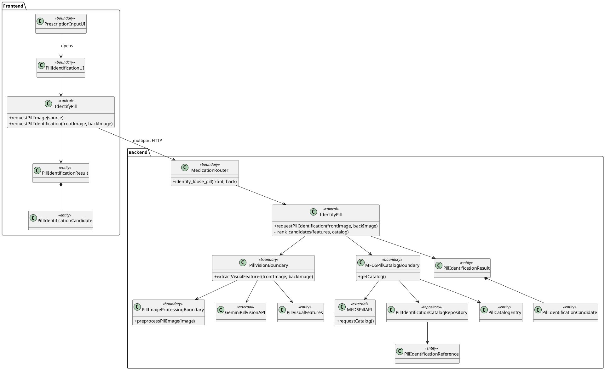

# MedBuddy v0.0.9 Loose-Pill Identification Extension

## Status and scope

This document defines the experimental extension developed on `temp` for the
v0.0.9-alpha candidate. Loose-pill identification was not part of the original
MedBuddy use cases, so the baseline class and sequence diagrams remain
unchanged. The extension follows the same Boundary-Control-Entity structure and
does not enter the prescription OCR or saved-medication workflows.

The feature returns **possible MFDS product candidates**, not a medical
diagnosis. It never saves a candidate as medication automatically, and the UI
requires the user to select and explicitly confirm a candidate. Users are told
to verify the package or consult a pharmacist before taking an unknown pill.

## Data and model boundaries

- The MFDS pill-identification API is the authoritative product catalog.
- Gemini Vision extracts only visible attributes: shape, color, imprint, score
  line, and image quality. Its prompt explicitly forbids product-name guessing.
- `IdentifyPill` ranks MFDS rows deterministically from those attributes.
- User photos are normalized in memory and sent for analysis, but are not
  persisted or logged.
- Public MFDS metadata is cached for seven days in an isolated local SQLite
  reference database, so a catalog refresh cannot lock or enlarge the core
  medication/schedule database. A stale complete cache remains available
  during an MFDS outage.
- The published Korean pill-identification reference implementation expects
  trained shape-specific model weights and a large offline image corpus. Those
  assets are not publicly bundled, so v0.0.9 uses a replaceable vision boundary
  instead of claiming to ship that model.

Official sources:

- [MFDS pill-identification Open API](https://www.data.go.kr/data/15057639/openapi.do)
- [Public pill-identification algorithm source](https://www.data.go.kr/data/15112583/fileData.do?recommendDataYn=Y)
- [Public pill-identification sample images](https://www.data.go.kr/data/15112582/fileData.do?recommendDataYn=Y)

## Extension class diagram



`PillIdentificationCatalogRepository` is an infrastructure adapter, not a new
domain use case. `MFDSPillCatalogBoundary` owns its short-lived session factory
and runs synchronous SQLite access outside the event loop. Its isolated
reference database keeps catalog replacement independent from core MedBuddy
transactions and keeps SQLAlchemy concerns out of the `IdentifyPill` control.
The repository initializes this optional database lazily on first catalog
access, so the extension adds no catalog I/O to the baseline app startup.

## Extension sequence diagram

```plantuml
@startuml MedBuddy_v009_Pill_Identification_Sequence
actor User
boundary PrescriptionInputUI
boundary PillIdentificationUI
control IdentifyPillFlutter
boundary MedicationRouter
control IdentifyPill
boundary PillVisionBoundary
boundary MFDSPillCatalogBoundary
external GeminiPillVisionAPI
external MFDSPillAPI
database PillCatalogSQLite

User -> PrescriptionInputUI : click camera analysis
PrescriptionInputUI -> User : choose prescription or loose pill
User -> PrescriptionInputUI : choose loose pill
PrescriptionInputUI -> PillIdentificationUI : open
User -> PillIdentificationUI : select front image\n[optional back image]
User -> PillIdentificationUI : request identification
PillIdentificationUI -> IdentifyPillFlutter : requestPillIdentification()
IdentifyPillFlutter -> MedicationRouter : POST front + optional back
MedicationRouter -> IdentifyPill : requestPillIdentification()

par Visual attributes
  IdentifyPill -> PillVisionBoundary : extractVisualFeatures()
  PillVisionBoundary -> GeminiPillVisionAPI : bounded normalized images
  GeminiPillVisionAPI --> PillVisionBoundary : visible attributes only
  PillVisionBoundary --> IdentifyPill : PillVisualFeatures
else Public catalog
  IdentifyPill -> MFDSPillCatalogBoundary : getCatalog()
  MFDSPillCatalogBoundary -> PillCatalogSQLite : read fresh cache
  alt cache missing or expired
    MFDSPillCatalogBoundary -> MFDSPillAPI : fetch bounded pages concurrently
    MFDSPillAPI --> MFDSPillCatalogBoundary : public product rows
    MFDSPillCatalogBoundary -> PillCatalogSQLite : replace complete cache atomically
  end
  MFDSPillCatalogBoundary --> IdentifyPill : PillCatalogEntry[]
end

IdentifyPill -> IdentifyPill : deterministic weighted ranking
IdentifyPill --> MedicationRouter : candidate result
MedicationRouter --> IdentifyPillFlutter : response DTO
IdentifyPillFlutter --> PillIdentificationUI : candidate entities
PillIdentificationUI --> User : show candidates + safety warning
User -> PillIdentificationUI : select and confirm candidate
note right of PillIdentificationUI
  Confirmation does not save medication
  and does not assert a diagnosis.
end note
@enduml
```

## Release-candidate validation

The v0.0.9-alpha candidate was validated against three distinct front/back
image pairs obtained from the official MFDS catalog. The production FastAPI
endpoint, local image preprocessing, Gemini visual-feature boundary, MFDS
catalog boundary, deterministic ranking, response DTO, and confirmation policy
were exercised together. The expected MFDS products ranked first for item
sequences `200808877`, `200809076`, and `200809402`; every response kept
`requires_confirmation=true`.

A complete live catalog refresh advertised 25,315 upstream rows and accepted
25,298 normalized image-bearing entries after validation and deduplication,
well above the 95% completeness threshold. With the bounded 12-request
concurrency used by the external catalog adapter, the local validation refresh
completed in approximately 14.7 seconds; an in-memory cache lookup was
effectively immediate. These timings describe one development-machine run and
are not a service-level guarantee.

Live external-service validation is intentionally separate from CI because it
requires private credentials and network availability. Deterministic unit and
widget tests cover malformed upstream data, candidate ambiguity, mandatory
confirmation, request cancellation, replacement-image locking, and compact
large-text layouts without committing pill photos or generated catalog files.

## Failure and performance policy

- Empty, invalid, oversized, tiny, or excessively large images are rejected
  before external analysis. Encoded dimensions are bounded before OpenCV
  allocates a decoded pixel buffer.
- Poor visual quality is reported as `422`; unavailable catalog as `503`;
  visual timeout as `504`; internal details are not returned to the client.
- Front/back preprocessing and catalog loading run concurrently with visual
  analysis. MFDS pages are downloaded with bounded concurrency and the complete
  refresh has a fixed deadline. Visual preprocessing, queueing, and the Gemini
  request share one deadline and a bounded concurrency gate. A failed required
  stage cancels its sibling.
- A catalog refresh is accepted only when at least 95% of the advertised rows
  are present, preventing a partial response from replacing a valid cache.
- A stale persisted catalog remains available during upstream failure, but its
  in-memory fallback is retried after five minutes rather than suppressing
  refresh attempts for the full seven-day fresh-cache lifetime.
- If no readable imprint exists, the score is capped and `is_confident` remains
  false. Shape and color must both match before an imprint-free candidate can
  be returned, and a one-character imprint cannot produce a confident result.
  `requires_confirmation` remains true for every result.

## Future replacement path

A licensed or locally trained pill classifier can replace
`PillVisionBoundary` later. It must emit the same `PillVisualFeatures` contract,
which keeps the control, MFDS matching, API response, and Flutter UI unchanged.
