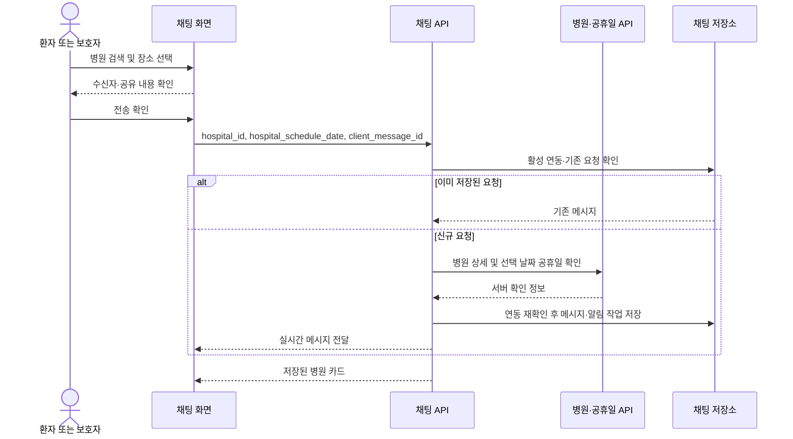

# 병원 검색과 채팅 공유

## 진입과 조회 조건

- 홈의 `근처 운영 병원·약국`에서 병원 또는 약국을 선택한다. 병원도 기존 약국의 지도·목록·상세·즐겨찾기·전화·길찾기 구성을 사용한다.
- 병원 화면은 **진료과목 선택**부터 시작한다. 과목을 고르기 전에는 GPS·병원 조회·지도 생성을 시작하지 않으며, 화면 복귀로도 자동 조회하지 않는다. `전체`도 사용자가 직접 선택한 경우에만 조회한다. 선택 전 뒤로 가면 검색 없이 종료한다. 채팅에서 병원을 고르는 경로도 동일하며 약국은 기존 즉시 조회를 유지한다.
- 병원 화면 왼쪽은 진료과목, 오른쪽은 조회 조건이다. 진료과목 목록의 초성 색인은 해당 위치로 이동하며 과목을 자동 선택하지 않는다.
- 조회 조건 창 안에서 날짜와 진료 상태(약국은 영업 상태)를 구분한다. 날짜는 연·월·일로만 표시하고, 적용 전 변경은 닫기·취소 시 버린다. 날짜를 지도 위 별도 줄로 추가하지 않는다.
- `현재 진료 중`은 현재 시각 기준이며 다른 날짜 선택은 비활성화된다. 나머지 조건은 선택 날짜에 적용한다.
- 병원 상세의 공유 버튼은 전화·길찾기 바로 아래에 둔다. 병원명을 반복하지 않으며, 약국 공유의 실제 전화 확인 체크는 유지한다.

## API와 실패 처리

- `GET /api/v1/hospitals/nearby`는 인증·요청 제한을 거쳐 `CheckNearbyHospital`을 호출한다. 국립중앙의료원 병·의원 API가 위치·진료과·상세 시간표를 제공하고, 한국천문연구원 특일 정보 API가 조회 날짜의 공휴일 여부를 제공한다.
- `HOSPITAL_API_KEY`가 비어 있으면 기존 `PUBLIC_DATA_API_KEY`를 사용한다. 제공자 신청과 키 설정은 운영 환경에서 별도로 필요하며 키를 앱에 포함하지 않는다.
- 기본 제한은 목록 캐시 5분, 상세 캐시 24시간, 전체 검색 위치 목록 최대 3페이지·추가 상세 12건·요청 전체 22초다. 진료과 선택 시에는 아래의 지역별 목록 경로를 사용한다. 제공자 일일 예산 800회는 프로세스별이며 재시작 시 초기화된다. 여러 worker가 공유하는 영구 할당량이 아니다.
- 제공자 예산·시간 제한, 실제 지역 탐색 실패, 결과 수 제한에 걸린 부분 결과는 `search_truncated`로 전달한다. 지역 파악용 위치 목록의 다음 페이지가 있다는 사실만으로 진료과 검색을 잘린 결과로 판정하지 않는다. 주소 표본의 지역 불확실성은 별도 `region_scope_uncertain`으로 전달한다.
- 공휴일 조회 실패를 평일로 단정하지 않는다. 검증된 공휴일 캐시를 재사용할 수 있으나, 확인 불가 상태에서 임의 공휴일표를 만들어 진료 중으로 표시하지 않는다. 잘못된 XML·날짜 응답은 실패 처리하고 반복 실패에는 짧은 재시도 유예를 적용한다.
- 병원 검색은 약국의 당번표·심야약국 지정 정보와 별개다. 약국의 기존 조회 경로와 즐겨찾기를 유지하고 병원 즐겨찾기는 계정별 별도 저장 공간을 쓴다.

## 검색 기준

- 병원 `저녁 진료`는 선택한 날짜의 진료 종료가 **18:00을 초과**하는 일정이다. 18:00에 끝나는 일정과 새벽에만 진료하는 일정은 제외한다. 자정을 넘는 저녁 일정과 24시간 일정은 포함한다.
- 약국의 `늦게까지 영업` 기준은 변경하지 않는다.
- 공휴일에는 공휴일 전용 시간표를 사용한다. 공휴일 여부나 시간표를 확인하지 못하면 진료 중으로 단정하지 않는다.
- 검색은 이 기기의 위치 또는 사용자가 옮긴 지도 지역을 기준으로 한다. 보호자 기기에서 환자의 위치를 자동으로 추정하거나 조회하지 않는다.
- 앱의 병원 첫 조회와 `현재 위치로 이동` 재검색은 반경 **300m**로 시작한다. 결과가 없으면 같은 중심·날짜·진료과·진료 상태로 **500m → 1km → 2km**까지 넓히며, 결과가 생긴 첫 범위에서 멈춘다. 확대 여부는 잠깐 표시하고 지도 배율도 실제 검색 반경에 맞춘다. 약국은 기존 20km를 유지한다.
- 지도에서 직접 선택한 지역·반경은 빈 결과여도 자동 확대하지 않고, 진료과·조회 조건 변경과 새로고침에도 보존한다. 위치 실패 시 대체 지역과 출처를 유지한다. 화면 종료·새 검색·진료과 변경 시 이전 요청은 후속 확대를 중지한다.
- 오류를 빈 결과로 취급하지 않는다. 달력 확인 불가 상태의 진료시간 필터나 평일의 주말·공휴일 조건은 확대하지 않는다. 한 검색은 최대 네 반경까지만 확인하고, 이미 20초가 경과했다면 다음 확대를 시작하지 않는다(진행 중인 HTTP 요청에는 기존 25초 제한 적용).
- 진료과 `전체`는 기존 위치 기반 목록 경로를 유지한다. 진료과를 선택하면 `getHsptlMdcncListInfoInqire`에 시도 `Q0`, 시군구 `Q1`, 진료과 코드 `QD`를 보내 **선택한 진료과의 목록부터** 받는다. 이 목록 API는 좌표·반경 조건을 직접 지원하지 않는다.
- 검색 중심과 반경의 동·서·남·북 지점에서 위치 목록 첫 페이지를 병렬 조회하여 주소에서 주변 행정지역을 찾는다. `서울 마포구` 같은 명시적인 시도 축약명은 정식 명칭으로 정규화한다. 세종은 `Q1` 없이, 일반구가 있는 시는 시 전체로 조회한다. 지역을 알아내지 못하면 전국 검색이나 정상 빈 결과로 대체하지 않고 실패로 처리한다.
- 지역별 진료과 목록을 순환하여 페이지를 모으고, 반경 밖 좌표와 중복 병원을 제외한 뒤 전체 후보를 거리순으로 정렬한다. 그 다음 상세 진료시간을 조회하므로 다른 진료과의 병원이 상세 조회 예산을 먼저 소모하지 않는다. 상세의 진료과 확인과 날짜·진료 상태 필터도 유지한다.
- 진료과 목록은 페이지당 최대 100건, 모든 지역을 합쳐 기본 24페이지(`HOSPITAL_DEPARTMENT_MAX_PAGES`)까지다. 이는 앱의 호출 예산이며 제공자의 총 데이터 제한이 아니다. 제공자가 더 작은 페이지를 반환하면 실제 페이지 크기를 따른다. 상세 조회 시간을 남기기 위해 목록 탐색은 전체 제한보다 5초 일찍 종료한다.
- 목록 조회가 시간 초과되면 이미 모은 후보를 보존하고 남은 지역·페이지 요청을 중지한다. 이벤트 루프의 시계 정밀도와 관계없이 같은 요청 안에서 후속 호출을 시작하지 않는다. 성공한 페이지가 전혀 없으면 정상 빈 결과가 아닌 오류로 처리한다.
- 다섯 지점의 주소 탐색은 행정경계 전수 조사나 반경 내 모든 지역의 발견을 보장하지 않는다. 보조 위치 목록이 표본이어도 발견된 지역의 진료과·상세 조회가 정상 완료되면 실제 조회 제한과 구별한다. 주소 조회 실패·잘못된 행, 진료과 페이지 중단·상세 조회 제한은 여전히 부분 결과다. 캐시가 쌓이면 다음 조회에서 추가 상세 정보를 확인할 수 있으며, 반경 축소나 진료과 선택만으로 누락이 완전히 없어지는 것은 아니다.

## 검색 범위 안내

- 병원 첫 방문에는 지도 아래·목록 버튼 위에 공공데이터에서 병원이 누락되거나 진료시간이 실제와 다를 수 있다는 안내를 띄운다. 병원이 적은 지역에도 무조건 검색 범위를 좁히라고 안내하지 않는다. 최초 안내에만 `닫기(X)` 버튼을 두고, 닫으면 이 기기에서는 반복하지 않는다.
- 실제 적용된 검색 반경이 **3km 이상**이면 넓은 범위에서 일부 병원이 표시되지 않을 수 있다는 문구를 하단에 유지한다. 지도만 이동·축소하고 재검색하지 않은 경우에는 마지막으로 조회한 범위를 기준으로 한다.
- 서버가 일부 결과를 반환하면 반경과 관계없이 '일부 병원 정보를 확인하지 못했어요' 안내를 우선 표시한다. 진료시간 미확인이나 제공자 응답 누락도 있으므로 원인을 모두 조회 횟수 제한으로 단정하지 않는다. 넓은 범위·부분 조회 경고에는 닫히지 않는 확인 버튼을 표시하지 않는다. 오류 화면에서는 별도의 오류 안내를 사용한다.
- `region_scope_uncertain`만 참인 경우에는 지도 아래의 조회 제한 경고를 띄우지 않는다. 목록의 데이터 출처 안내에 행정구역 경계에서 누락될 수 있음을 설명하고, 빈 결과는 '조회한 병원 중 조건에 맞는 결과가 없습니다'로 표현한다. 1건·0건이라는 최종 개수만으로 제한 여부를 판단하지 않으며, 최초 안내와 3km 이상 넓은 범위 안내는 유지한다.
- 한국어·영어를 지원하며, 큰 글씨에서는 상단 조건을 스크롤해 확인할 수 있게 해 지도와 하단 동작을 유지한다. 약국에는 병원용 안내를 추가하지 않는다.

## 채팅 흐름

1. 약 부족 메시지는 전송 후 자동으로 약국 화면을 열지 않는다. 메시지에서 `병원 찾기` 또는 `약국 찾기`를 선택한다.
2. 복용 후 불편 메시지는 기존 안전 안내를 유지하고 `병원 찾기`를 제공한다. 진료과를 자동으로 진단·선택하지 않는다.
3. 채팅 상단의 병원 아이콘에서도 병원·약국 검색을 열 수 있다.
4. 장소 선택 후 받는 사람, 장소, 선택 날짜 및 첨부할 약을 확인한다. 취소하면 전송하지 않는다.
5. 병원 카드는 병원명, 진료과, 주소, 선택 날짜의 진료시간, 정보 확인 시각과 전화·길찾기를 제공한다. 진료시간은 방문 전 전화 확인이 필요하며 예약 확정이나 응급실 안내가 아니다.

## 저장과 신뢰 경계

- `hospital_share` 요청은 `hospital_id`와 `hospital_schedule_date`만 받는다. 병원 이름·전화·좌표·시간표는 서버의 병원 상세 조회와 공휴일 달력으로 구성한다.
- `context.hospital_context`는 공유 시점의 정보다. `source_updated_at`은 서버가 상세 응답을 확인한 시각이며 제공기관의 원본 수정일을 의미하지 않는다.
- 활성 연동 권한과 기존 요청 ID를 먼저 확인한다. 동일 요청 재전송은 기존 메시지를 반환하므로 제공자 API 장애 중에도 저장된 메시지를 중복 생성하지 않는다.
- 조회가 끝난 뒤 저장 직전에 연동 권한을 다시 확인한다. 조회 중 연결이 해제되면 공유를 거절한다.
- 메시지 및 알림 전송 작업은 기존 저장·실시간 전달 경로를 이용한다. 메시지 삭제 시 병원 문맥도 제거된다.
- 외부 제공자 조회 실패는 불완전한 메시지를 저장하지 않는다. 화면의 다시 시도는 같은 병원·날짜·약 첨부와 요청 ID를 유지한다.

클래스 관계는 [병원 검색 클래스](UML/class/07_NearbyCare.puml), 동작 순서는
[검색·공유 시퀀스](UML/sequence/NearbyCareSharing.puml), 사용자 흐름은
[UC-27·UC-28·UC-30](UML/usecase/UseCaseDescription.md)을 따른다.

## Calendar persistence isolation

`PersistentKoreanHolidayLookup` offloads synchronous calendar-cache reads and
writes to worker threads. `SessionScopedKoreanHolidayCache` opens a separate
session per operation using the request's database engine; it never borrows the
authentication or chat transaction. Sessions close before provider network I/O.
Paired date lookups on one lookup instance serialize cache population to avoid
duplicate same-month writes. Fresh and bounded-stale snapshot policies remain
unchanged; database failures remain unknown holiday status, not ordinary days.

This adapter refines the persistence implementation behind the existing nearby
care boundary without changing public APIs, authorization, or database schema.
An async deadline can stop waiting for a cache worker; it does not forcibly cancel
an executing SQL statement. Such a worker still owns and closes its own session.

## Shared calculation policy

Both backend nearby-care controllers use `services/nearby_care_policy.py` for
time parsing/formatting, interval status, minutes until closing and distance.
The hospital specialty-candidate helper uses the same distance function.
Neither controller imports the other or calls its private methods. The shared
module is pure: it has no provider, database, configuration or controller imports.
`HolidayLookupBoundary` lives in its own boundary module rather than inside the
pharmacy use case.

Feature-specific validation and selection stay with each controller: hospitals
still reject ambiguous equal opening/closing times and use their evening-clinic
threshold; pharmacy late-night designations, dated rosters and next-opening
selection remain pharmacy-owned. This refines the implementation behind the
existing UML use cases without changing their public operations or sequence.
