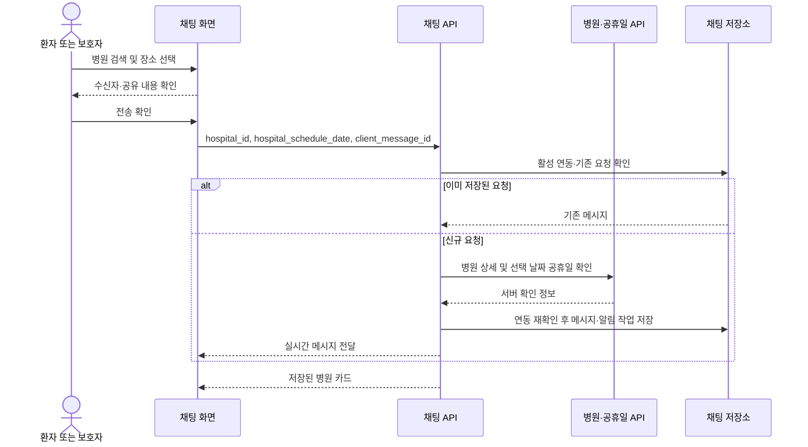

# 병원 검색과 채팅 공유

## 진입과 조회 조건

- 홈의 `근처 운영 병원·약국`에서 병원 또는 약국을 선택한다. 병원도 기존 약국의 지도·목록·상세·즐겨찾기·전화·길찾기 구성을 사용한다.
- 병원 화면 왼쪽은 진료과목, 오른쪽은 조회 조건이다. 진료과목 목록의 초성 색인은 해당 위치로 이동하며 과목을 자동 선택하지 않는다.
- 조회 조건 창 안에서 날짜와 진료 상태(약국은 영업 상태)를 구분한다. 날짜는 연·월·일로만 표시하고, 적용 전 변경은 닫기·취소 시 버린다. 날짜를 지도 위 별도 줄로 추가하지 않는다.
- `현재 진료 중`은 현재 시각 기준이며 다른 날짜 선택은 비활성화된다. 나머지 조건은 선택 날짜에 적용한다.
- 병원 상세의 공유 버튼은 전화·길찾기 바로 아래에 둔다. 병원명을 반복하지 않으며, 약국 공유의 실제 전화 확인 체크는 유지한다.

## API와 실패 처리

- `GET /api/v1/hospitals/nearby`는 인증·요청 제한을 거쳐 `CheckNearbyHospital`을 호출한다. 국립중앙의료원 병·의원 API가 위치·진료과·상세 시간표를 제공하고, 한국천문연구원 특일 정보 API가 조회 날짜의 공휴일 여부를 제공한다.
- `HOSPITAL_API_KEY`가 비어 있으면 기존 `PUBLIC_DATA_API_KEY`를 사용한다. 제공자 신청과 키 설정은 운영 환경에서 별도로 필요하며 키를 앱에 포함하지 않는다.
- 기본 제한은 위치 캐시 5분, 상세 캐시 24시간, 검색 최대 3페이지·추가 상세 12건·22초다. 제공자 일일 예산 800회는 프로세스별이며 재시작 시 초기화된다. 여러 worker가 공유하는 영구 할당량이 아니다.
- 제공자 예산·시간 제한에 걸린 부분 결과는 전체 주변 병원 목록이 아니다. 검색 범위를 바꿔 다시 조회할 수 있으며 상단에 영구 안내 줄을 쌓지 않는다.
- 공휴일 조회 실패를 평일로 단정하지 않는다. 검증된 공휴일 캐시를 재사용할 수 있으나, 확인 불가 상태에서 임의 공휴일표를 만들어 진료 중으로 표시하지 않는다. 잘못된 XML·날짜 응답은 실패 처리하고 반복 실패에는 짧은 재시도 유예를 적용한다.
- 병원 검색은 약국의 당번표·심야약국 지정 정보와 별개다. 약국의 기존 조회 경로와 즐겨찾기를 유지하고 병원 즐겨찾기는 계정별 별도 저장 공간을 쓴다.

## 검색 기준

- 병원 `저녁 진료`는 선택한 날짜의 진료 종료가 **18:00을 초과**하는 일정이다. 18:00에 끝나는 일정과 새벽에만 진료하는 일정은 제외한다. 자정을 넘는 저녁 일정과 24시간 일정은 포함한다.
- 약국의 `늦게까지 영업` 기준은 변경하지 않는다.
- 공휴일에는 공휴일 전용 시간표를 사용한다. 공휴일 여부나 시간표를 확인하지 못하면 진료 중으로 단정하지 않는다.
- 검색은 이 기기의 위치 또는 사용자가 옮긴 지도 지역을 기준으로 한다. 보호자 기기에서 환자의 위치를 자동으로 추정하거나 조회하지 않는다.

## 채팅 흐름

1. 약 부족 메시지는 전송 후 자동으로 약국 화면을 열지 않는다. 메시지에서 `병원 찾기` 또는 `약국 찾기`를 선택한다.
2. 복용 후 불편 메시지는 기존 안전 안내를 유지하고 `병원 찾기`를 제공한다. 진료과를 자동으로 진단·선택하지 않는다.
3. 채팅 상단의 병원 아이콘에서도 병원·약국 검색을 열 수 있다.
4. 장소 선택 후 받는 사람, 장소, 선택 날짜 및 첨부할 약을 확인한다. 취소하면 전송하지 않는다.
5. 병원 카드는 병원명, 진료과, 주소, 선택 날짜의 진료시간, 정보 확인 시각과 전화·길찾기를 제공한다. 진료시간은 방문 전 전화 확인이 필요하며 예약 확정이나 응급실 안내가 아니다.

## 저장과 신뢰 경계

- `hospital_share` 요청은 `hospital_id`와 `hospital_schedule_date`만 받는다. 병원 이름·전화·좌표·시간표는 서버의 병원 상세 조회와 공휴일 달력으로 구성한다.
- `context.hospital_context`는 공유 시점의 정보다. `source_updated_at`은 서버가 상세 응답을 확인한 시각이며 제공기관의 원본 수정일을 의미하지 않는다.
- 활성 연동 권한과 기존 요청 ID를 먼저 확인한다. 동일 요청 재전송은 기존 메시지를 반환하므로 제공자 API 장애 중에도 저장된 메시지를 중복 생성하지 않는다.
- 조회가 끝난 뒤 저장 직전에 연동 권한을 다시 확인한다. 조회 중 연결이 해제되면 공유를 거절한다.
- 메시지 및 알림 전송 작업은 기존 저장·실시간 전달 경로를 이용한다. 메시지 삭제 시 병원 문맥도 제거된다.
- 외부 제공자 조회 실패는 불완전한 메시지를 저장하지 않는다. 화면의 다시 시도는 같은 병원·날짜·약 첨부와 요청 ID를 유지한다.

클래스 관계는 [병원 검색 클래스](UML/class/07_NearbyCare.puml), 동작 순서는
[검색·공유 시퀀스](UML/sequence/NearbyCareSharing.puml), 사용자 흐름은
[UC-27·UC-28·UC-30](UML/usecase/UseCaseDescription.md)을 따른다.
