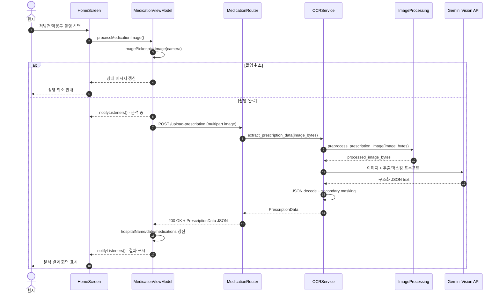
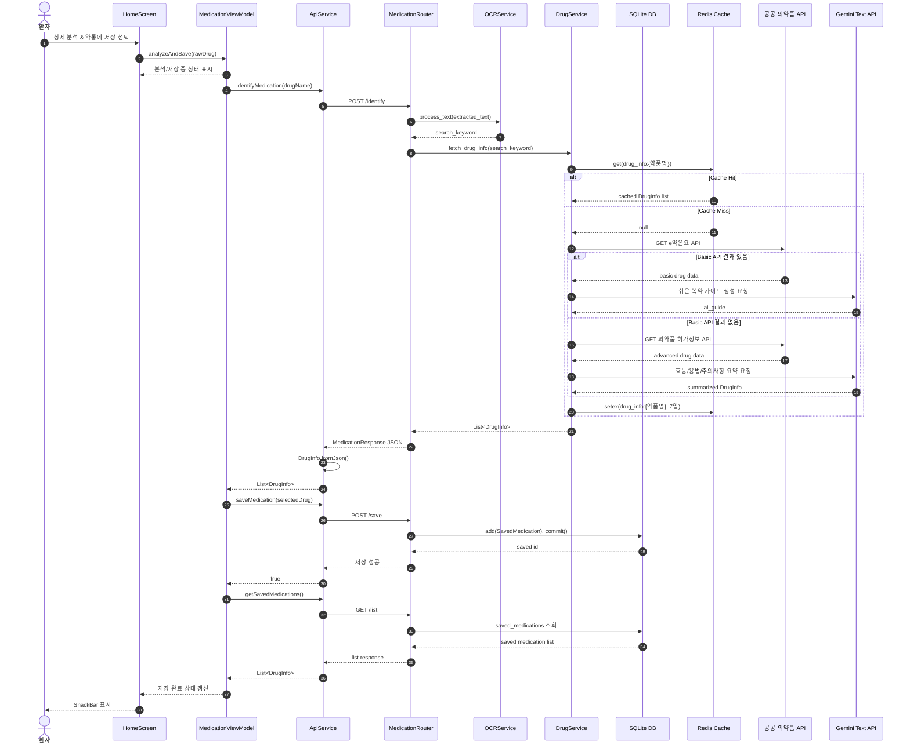
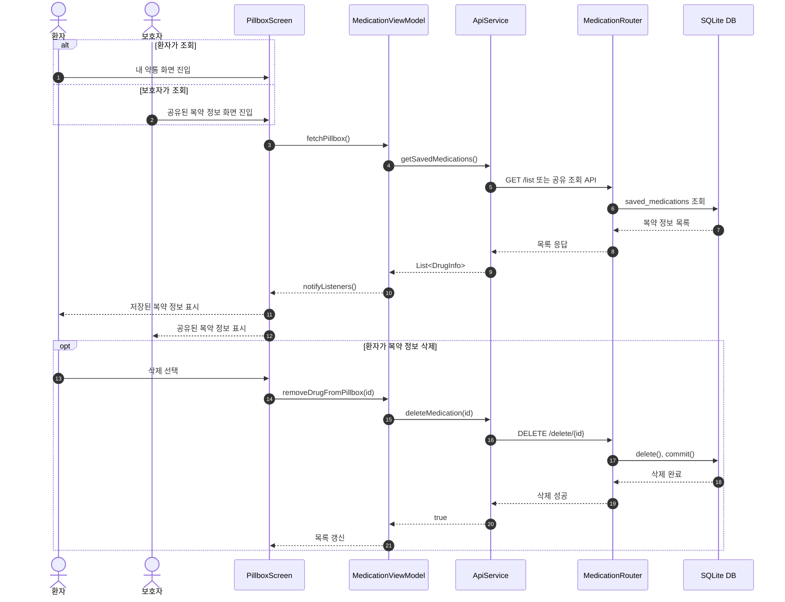
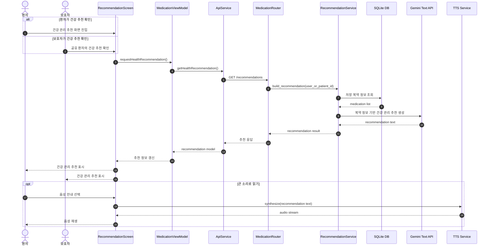
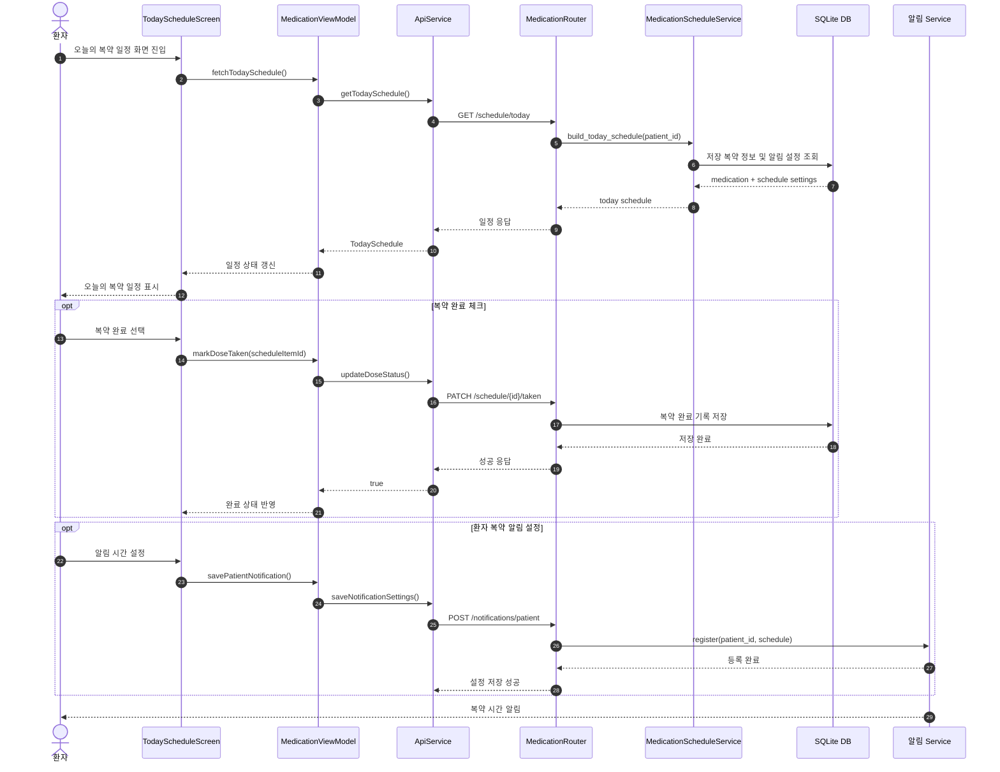
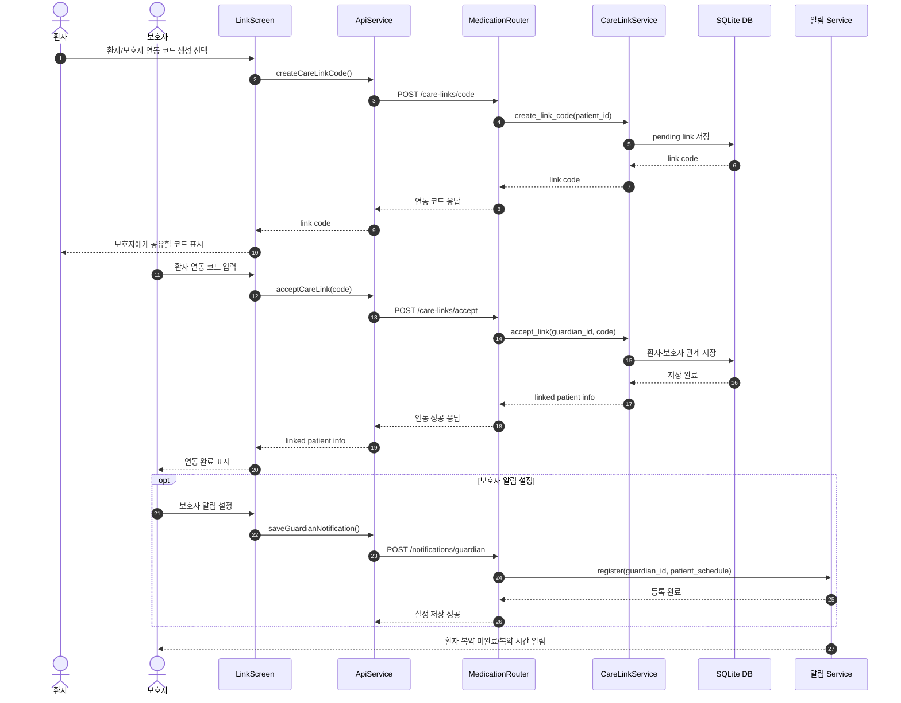

# Sequence Diagram (임시)

## [환자] 약봉투 촬영/분석

```mermaid
%% [환자] 약봉투 촬영/분석
sequenceDiagram
    autonumber
    actor Patient as 환자
    participant View as HomeScreen
    participant VM as MedicationViewModel
    participant Router as MedicationRouter
    participant OCR as OCRService
    participant Img as ImageProcessing
    participant Gemini as Gemini Vision API

    Patient->>View: 처방전/약봉투 촬영 선택
    View->>VM: processMedicationImage()
    VM->>VM: ImagePicker.pickImage(camera)

    alt 촬영 취소
        VM-->>View: 상태 메시지 갱신
        View-->>Patient: 촬영 취소 안내
    else 촬영 완료
        VM-->>View: notifyListeners() - 분석 중
        VM->>Router: POST /upload-prescription (multipart image)
        Router->>OCR: extract_prescription_data(image_bytes)
        OCR->>Img: preprocess_prescription_image(image_bytes)
        Img-->>OCR: processed_image_bytes
        OCR->>Gemini: 이미지 + 추출/마스킹 프롬프트
        Gemini-->>OCR: 구조화 JSON text
        OCR->>OCR: JSON decode + secondary masking
        OCR-->>Router: PrescriptionData
        Router-->>VM: 200 OK + PrescriptionData JSON
        VM->>VM: hospitalName/date/medications 갱신
        VM-->>View: notifyListeners() - 결과 표시
        View-->>Patient: 분석 결과 화면 표시
    end
```

## [환자] 분석 약물 저장

```mermaid
%% [환자] 분석 약물 저장 
sequenceDiagram
    autonumber
    actor Patient as 환자
    participant View as HomeScreen
    participant VM as MedicationViewModel
    participant ApiS as ApiService
    participant Router as MedicationRouter
    participant OCR as OCRService
    participant DrugS as DrugService
    participant DB as SQLite DB
    participant Redis as Redis Cache
    participant PubAPI as 공공 의약품 API
    participant Gemini as Gemini Text API

    Patient->>View: 상세 분석 & 약통에 저장 선택
    View->>VM: analyzeAndSave(rawDrug)
    VM-->>View: 분석/저장 중 상태 표시
    VM->>ApiS: identifyMedication(drugName)
    ApiS->>Router: POST /identify
    Router->>OCR: process_text(extracted_text)
    OCR-->>Router: search_keyword
    Router->>DrugS: fetch_drug_info(search_keyword)

    DrugS->>Redis: get(drug_info:{약품명})
    alt Cache Hit
        Redis-->>DrugS: cached DrugInfo list
    else Cache Miss
        Redis-->>DrugS: null
        DrugS->>PubAPI: GET e약은요 API
        alt Basic API 결과 있음
            PubAPI-->>DrugS: basic drug data
            DrugS->>Gemini: 쉬운 복약 가이드 생성 요청
            Gemini-->>DrugS: ai_guide
        else Basic API 결과 없음
            DrugS->>PubAPI: GET 의약품 허가정보 API
            PubAPI-->>DrugS: advanced drug data
            DrugS->>Gemini: 효능/용법/주의사항 요약 요청
            Gemini-->>DrugS: summarized DrugInfo
        end
        DrugS->>Redis: setex(drug_info:{약품명}, 7일)
    end

    DrugS-->>Router: List<DrugInfo>
    Router-->>ApiS: MedicationResponse JSON
    ApiS->>ApiS: DrugInfo.fromJson()
    ApiS-->>VM: List<DrugInfo>

    VM->>ApiS: saveMedication(selectedDrug)
    ApiS->>Router: POST /save
    Router->>DB: add(SavedMedication), commit()
    DB-->>Router: saved id
    Router-->>ApiS: 저장 성공
    ApiS-->>VM: true

    VM->>ApiS: getSavedMedications()
    ApiS->>Router: GET /list
    Router->>DB: saved_medications 조회
    DB-->>Router: saved medication list
    Router-->>ApiS: list response
    ApiS-->>VM: List<DrugInfo>
    VM-->>View: 저장 완료 상태 갱신
    View-->>Patient: SnackBar 표시
```

## [환자&보호자] 복약 정보 조회 및 편집

```mermaid
%% [환자&보호자] 복약 정보 조회 및 편집
sequenceDiagram
    autonumber
    actor Patient as 환자
    actor Guardian as 보호자
    participant View as PillboxScreen
    participant VM as MedicationViewModel
    participant ApiS as ApiService
    participant Router as MedicationRouter
    participant DB as SQLite DB

    alt 환자가 조회
        Patient->>View: 내 약통 화면 진입
    else 보호자가 조회
        Guardian->>View: 공유된 복약 정보 화면 진입
    end

    View->>VM: fetchPillbox()
    VM->>ApiS: getSavedMedications()
    ApiS->>Router: GET /list 또는 공유 조회 API
    Router->>DB: saved_medications 조회
    DB-->>Router: 복약 정보 목록
    Router-->>ApiS: 목록 응답
    ApiS-->>VM: List<DrugInfo>
    VM-->>View: notifyListeners()
    View-->>Patient: 저장된 복약 정보 표시
    View-->>Guardian: 공유된 복약 정보 표시

    opt 환자가 복약 정보 삭제
        Patient->>View: 삭제 선택
        View->>VM: removeDrugFromPillbox(id)
        VM->>ApiS: deleteMedication(id)
        ApiS->>Router: DELETE /delete/{id}
        Router->>DB: delete(), commit()
        DB-->>Router: 삭제 완료
        Router-->>ApiS: 삭제 성공
        ApiS-->>VM: true
        VM-->>View: 목록 갱신
    end
```

## (구현 여부 불확실) [환자&보호자] 건강 추천 확인

```mermaid
%% (구현 여부 불확실) [환자&보호자] 건강 추천 확인
sequenceDiagram
    autonumber
    actor Patient as 환자
    actor Guardian as 보호자
    participant View as RecommendationScreen
    participant VM as MedicationViewModel
    participant ApiS as ApiService
    participant Router as MedicationRouter
    participant RecS as RecommendationService
    participant DB as SQLite DB
    participant Gemini as Gemini Text API
    participant TTS as TTS Service

    alt 환자가 건강 추천 확인
        Patient->>View: 건강 관리 추천 화면 진입
    else 보호자가 건강 추천 확인
        Guardian->>View: 공유 환자의 건강 추천 확인
    end

    View->>VM: requestHealthRecommendation()
    VM->>ApiS: getHealthRecommendation()
    ApiS->>Router: GET /recommendations
    Router->>RecS: build_recommendation(user_or_patient_id)
    RecS->>DB: 저장 복약 정보 조회
    DB-->>RecS: medication list
    RecS->>Gemini: 복약 정보 기반 건강 관리 추천 생성
    Gemini-->>RecS: recommendation text
    RecS-->>Router: recommendation result
    Router-->>ApiS: 추천 응답
    ApiS-->>VM: recommendation model
    VM-->>View: 추천 정보 갱신
    View-->>Patient: 건강 관리 추천 표시
    View-->>Guardian: 건강 관리 추천 표시

    opt 큰 소리로 읽기
        Patient->>View: 음성 안내 선택
        View->>TTS: synthesize(recommendation text)
        TTS-->>View: audio stream
        View-->>Patient: 음성 재생
    end
```

## [환자] 복약 일정 및 알림 설정

```mermaid
%% [환자] 복약 일정 및 알림 설정
sequenceDiagram
    autonumber
    actor Patient as 환자
    participant View as TodayScheduleScreen
    participant VM as MedicationViewModel
    participant ApiS as ApiService
    participant Router as MedicationRouter
    participant SchedS as MedicationScheduleService
    participant DB as SQLite DB
    participant Notify as 알림 Service

    Patient->>View: 오늘의 복약 일정 화면 진입
    View->>VM: fetchTodaySchedule()
    VM->>ApiS: getTodaySchedule()
    ApiS->>Router: GET /schedule/today
    Router->>SchedS: build_today_schedule(patient_id)
    SchedS->>DB: 저장 복약 정보 및 알림 설정 조회
    DB-->>SchedS: medication + schedule settings
    SchedS-->>Router: today schedule
    Router-->>ApiS: 일정 응답
    ApiS-->>VM: TodaySchedule
    VM-->>View: 일정 상태 갱신
    View-->>Patient: 오늘의 복약 일정 표시

    opt 복약 완료 체크
        Patient->>View: 복약 완료 선택
        View->>VM: markDoseTaken(scheduleItemId)
        VM->>ApiS: updateDoseStatus()
        ApiS->>Router: PATCH /schedule/{id}/taken
        Router->>DB: 복약 완료 기록 저장
        DB-->>Router: 저장 완료
        Router-->>ApiS: 성공 응답
        ApiS-->>VM: true
        VM-->>View: 완료 상태 반영
    end

    opt 환자 복약 알림 설정
        Patient->>View: 알림 시간 설정
        View->>VM: savePatientNotification()
        VM->>ApiS: saveNotificationSettings()
        ApiS->>Router: POST /notifications/patient
        Router->>Notify: register(patient_id, schedule)
        Notify-->>Router: 등록 완료
        Router-->>ApiS: 설정 저장 성공
    end

    Notify-->>Patient: 복약 시간 알림
```

## [환자&보호자] 연동 및 보호자 알림 설정

```mermaid
%% [환자&보호자] 연동 및 보호자 알림 설정
sequenceDiagram
    autonumber
    actor Patient as 환자
    actor Guardian as 보호자
    participant View as LinkScreen
    participant ApiS as ApiService
    participant Router as MedicationRouter
    participant LinkSvc as CareLinkService
    participant DB as SQLite DB
    participant Notify as 알림 Service

    Patient->>View: 환자/보호자 연동 코드 생성 선택
    View->>ApiS: createCareLinkCode()
    ApiS->>Router: POST /care-links/code
    Router->>LinkSvc: create_link_code(patient_id)
    LinkSvc->>DB: pending link 저장
    DB-->>LinkSvc: link code
    LinkSvc-->>Router: link code
    Router-->>ApiS: 연동 코드 응답
    ApiS-->>View: link code
    View-->>Patient: 보호자에게 공유할 코드 표시

    Guardian->>View: 환자 연동 코드 입력
    View->>ApiS: acceptCareLink(code)
    ApiS->>Router: POST /care-links/accept
    Router->>LinkSvc: accept_link(guardian_id, code)
    LinkSvc->>DB: 환자-보호자 관계 저장
    DB-->>LinkSvc: 저장 완료
    LinkSvc-->>Router: linked patient info
    Router-->>ApiS: 연동 성공 응답
    ApiS-->>View: linked patient info
    View-->>Guardian: 연동 완료 표시

    opt 보호자 알림 설정
        Guardian->>View: 보호자 알림 설정
        View->>ApiS: saveGuardianNotification()
        ApiS->>Router: POST /notifications/guardian
        Router->>Notify: register(guardian_id, patient_schedule)
        Notify-->>Router: 등록 완료
        Router-->>ApiS: 설정 저장 성공
    end

    Notify-->>Guardian: 환자 복약 미완료/복약 시간 알림
```
