# MedBuddy Communication Diagrams

---

## UC-1 처방전 이미지 입력 및 개인정보 보호 처리

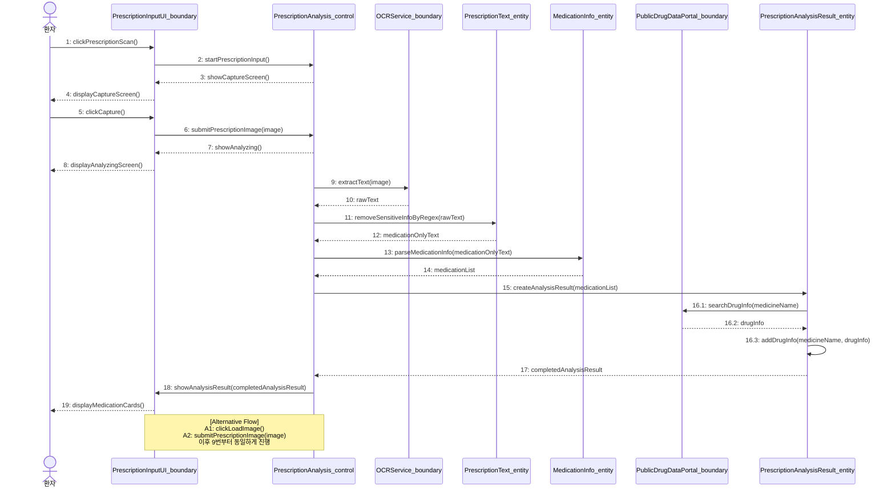

---

## UC-2 OCR 결과 분석 및 약 정보 조회

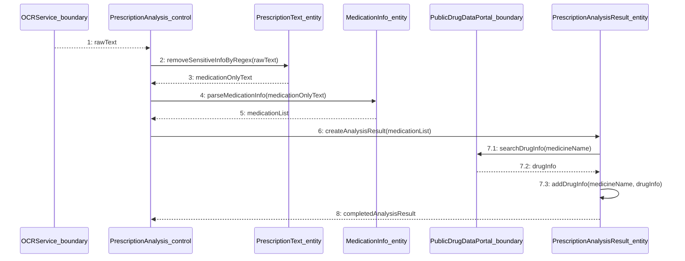

---

## UC-3 오늘의 복약 일정 확인

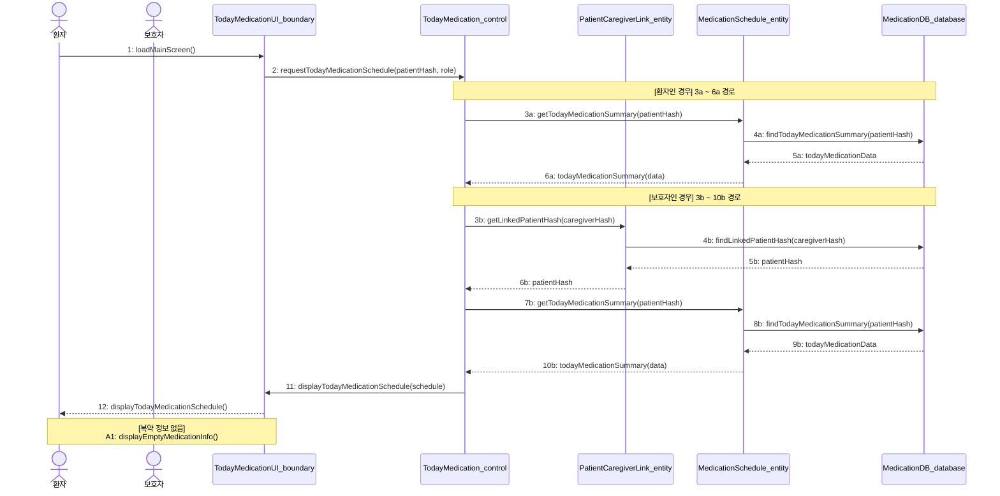

---

## UC-4 저장된 복약 정보 조회

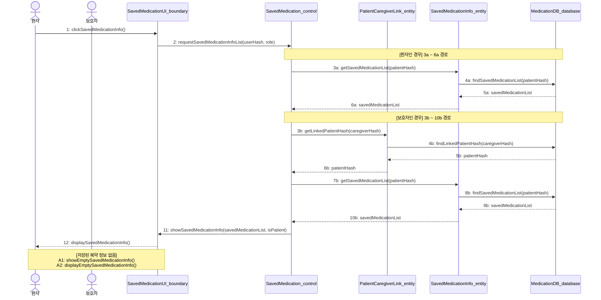

---

## UC-5 복약 정보 수정/삭제

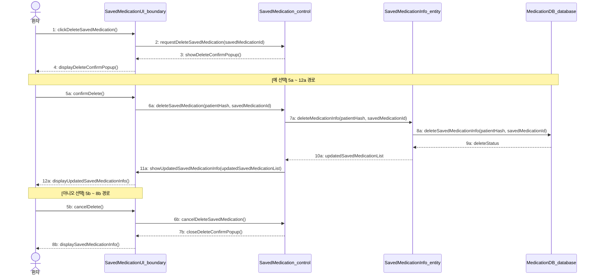

---

## UC-6 환자/보호자 연동

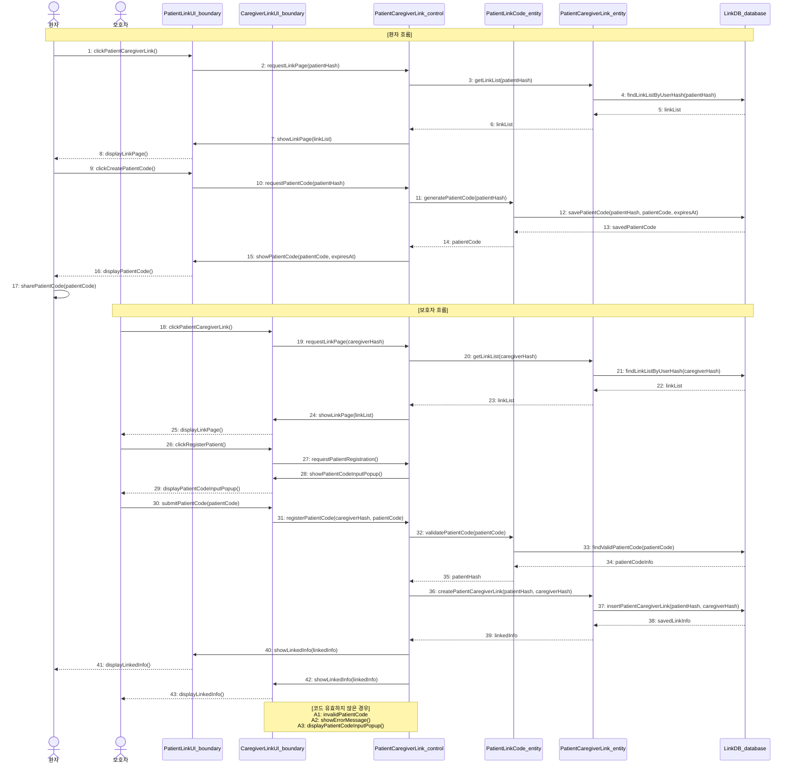

---

## UC-7 환자/보호자 연동 해제

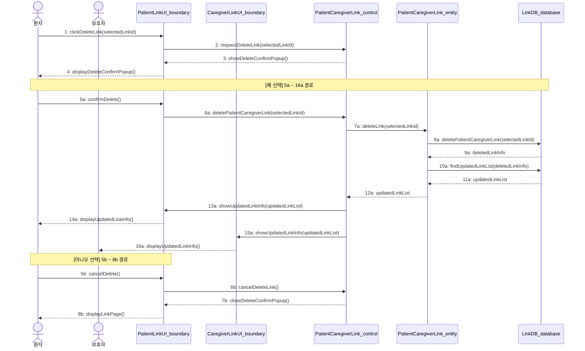

---

## UC-8 복약 완료 체크

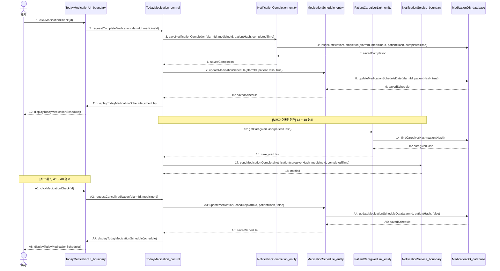

---

## UC-9 약 상세 정보 확인

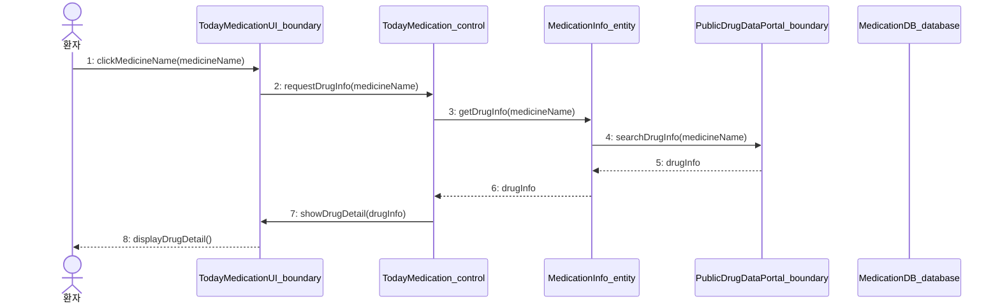

---

## UC-10 건강 관리 추천 확인

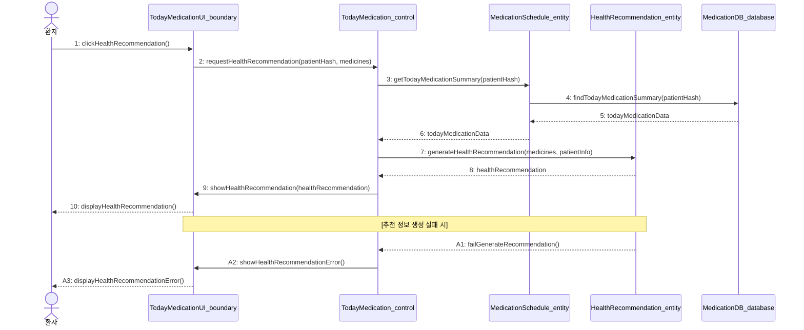

---

## UC-11 음성 안내 제공

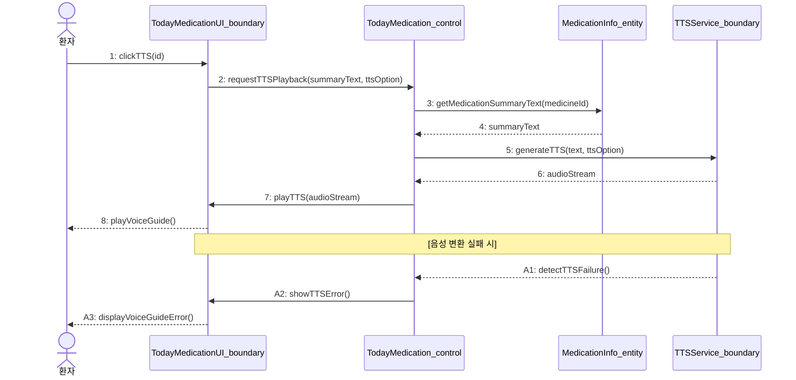

---

## UC-12 복약 알림 설정

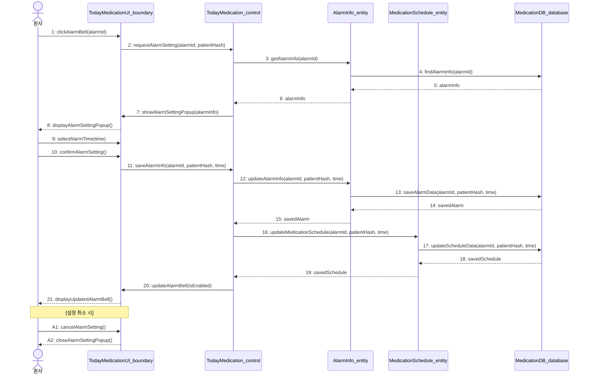

---

## UC-13 보호자 알림 수신

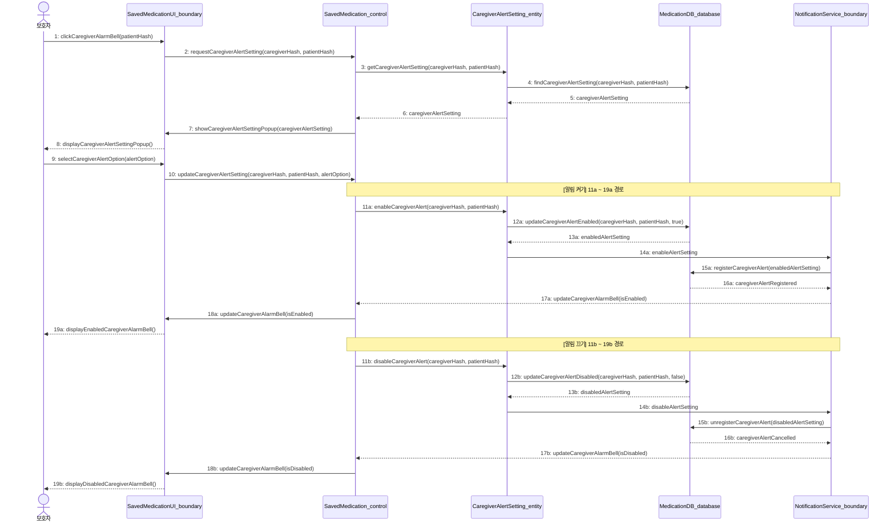

---

## UC-14 사용자 설정

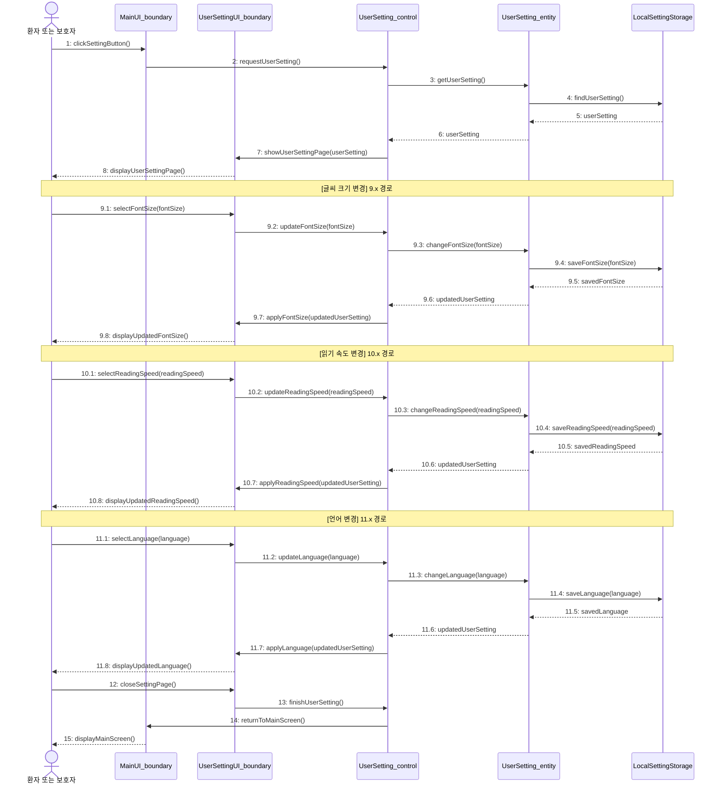
