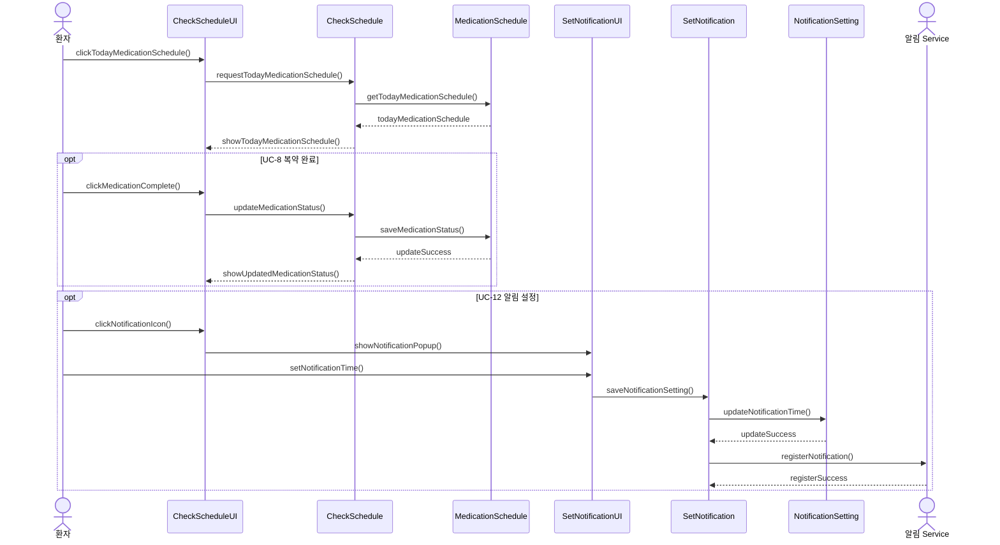
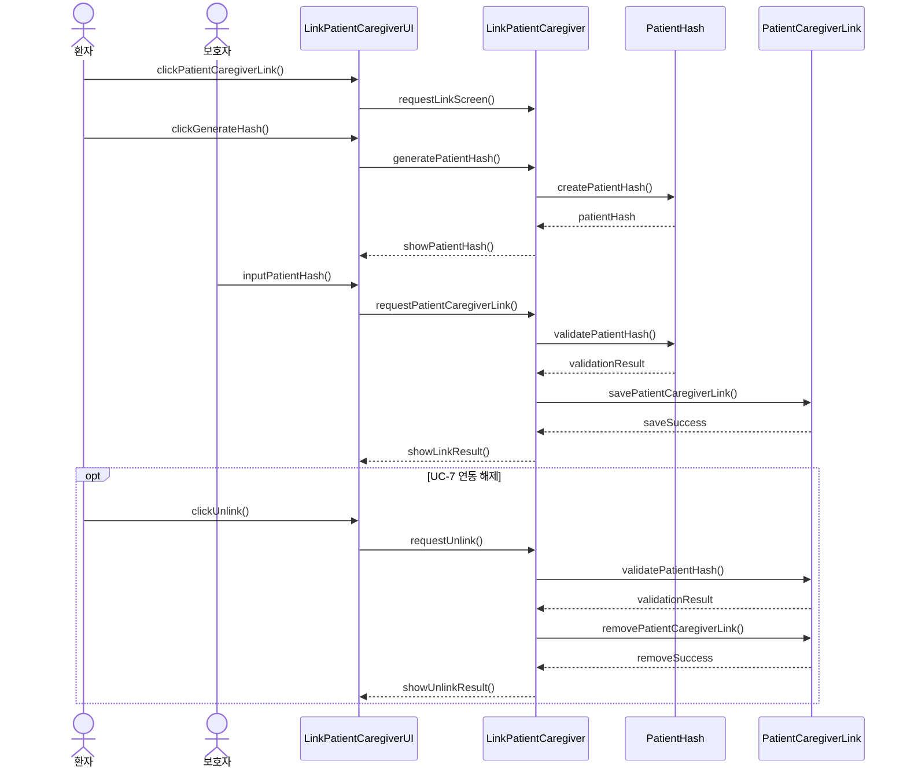

# MedBuddy Sequence Diagrams

---

## UC-3p 오늘의 복약일정 확인(환자용)

```mermaid
sequenceDiagram
    actor 환자
    participant CheckScheduleUI
    participant CheckSchedule
    participant MedicationSchedule
    participant SetNotificationUI
    participant SetNotification
    participant NotificationSetting
    actor NS as 알림 Service

    환자->>CheckScheduleUI: clickTodayMedicationSchedule()
    CheckScheduleUI->>CheckSchedule: requestTodayMedicationSchedule()
    CheckSchedule->>MedicationSchedule: getTodayMedicationSchedule()
    MedicationSchedule-->>CheckSchedule: todayMedicationSchedule
    CheckSchedule-->>CheckScheduleUI: showTodayMedicationSchedule()

    opt UC-8 복약 완료
        환자->>CheckScheduleUI: clickMedicationComplete()
        CheckScheduleUI->>CheckSchedule: updateMedicationStatus()
        CheckSchedule->>MedicationSchedule: saveMedicationStatus()
        MedicationSchedule-->>CheckSchedule: updateSuccess
        CheckSchedule-->>CheckScheduleUI: showUpdatedMedicationStatus()
    end

    opt UC-12 알림 설정
        환자->>CheckScheduleUI: clickNotificationIcon()
        CheckScheduleUI->>SetNotificationUI: showNotificationPopup()

        환자->>SetNotificationUI: setNotificationTime()
        SetNotificationUI->>SetNotification: saveNotificationSetting()

        SetNotification->>NotificationSetting: updateNotificationTime()
        NotificationSetting-->>SetNotification: updateSuccess

        SetNotification->>NS: registerNotification()
        NS-->>SetNotification: registerSuccess
    end
```

---

## UC-6 환자/보호자 연동

```mermaid
sequenceDiagram
    actor 환자
    actor 보호자

    participant LinkPatientCaregiverUI
    participant LinkPatientCaregiver
    participant PatientHash
    participant PatientCaregiverLink

    환자->>LinkPatientCaregiverUI: clickPatientCaregiverLink()
    LinkPatientCaregiverUI->>LinkPatientCaregiver: requestLinkScreen()

    환자->>LinkPatientCaregiverUI: clickGenerateHash()
    LinkPatientCaregiverUI->>LinkPatientCaregiver: generatePatientHash()

    LinkPatientCaregiver->>PatientHash: createPatientHash()
    PatientHash-->>LinkPatientCaregiver: patientHash

    LinkPatientCaregiver-->>LinkPatientCaregiverUI: showPatientHash()

    보호자->>LinkPatientCaregiverUI: inputPatientHash()
    LinkPatientCaregiverUI->>LinkPatientCaregiver: requestPatientCaregiverLink()

    LinkPatientCaregiver->>PatientHash: validatePatientHash()
    PatientHash-->>LinkPatientCaregiver: validationResult

    LinkPatientCaregiver->>PatientCaregiverLink: savePatientCaregiverLink()
    PatientCaregiverLink-->>LinkPatientCaregiver: saveSuccess

    LinkPatientCaregiver-->>LinkPatientCaregiverUI: showLinkResult()

    opt UC-7 연동 해제
        환자->>LinkPatientCaregiverUI: clickUnlink()
        LinkPatientCaregiverUI->>LinkPatientCaregiver: requestUnlink()

        LinkPatientCaregiver->>PatientCaregiverLink: validatePatientHash()
        PatientCaregiverLink-->>LinkPatientCaregiver: validationResult

        LinkPatientCaregiver->>PatientCaregiverLink: removePatientCaregiverLink()
        PatientCaregiverLink-->>LinkPatientCaregiver: removeSuccess

        LinkPatientCaregiver-->>LinkPatientCaregiverUI: showUnlinkResult()
    end
```
